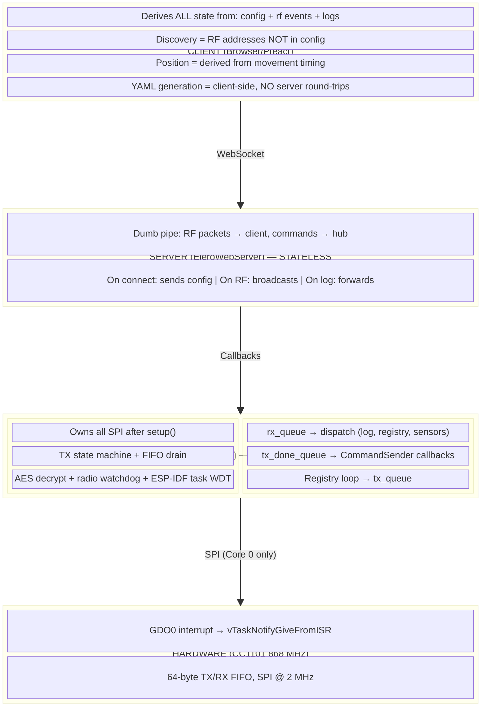
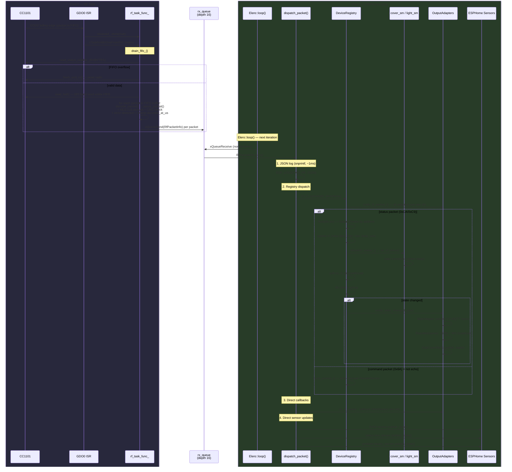
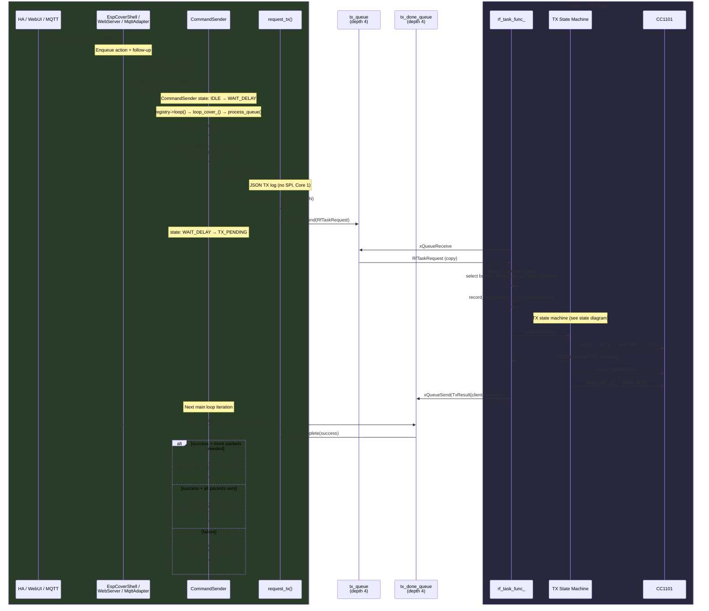
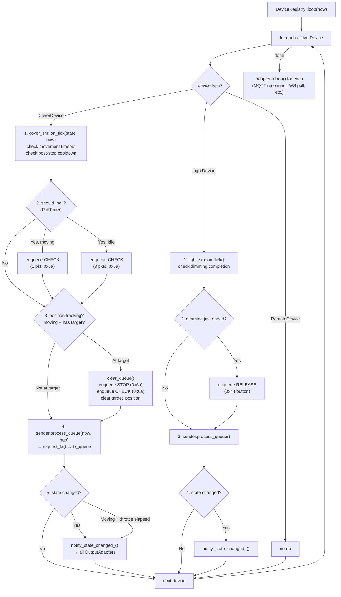
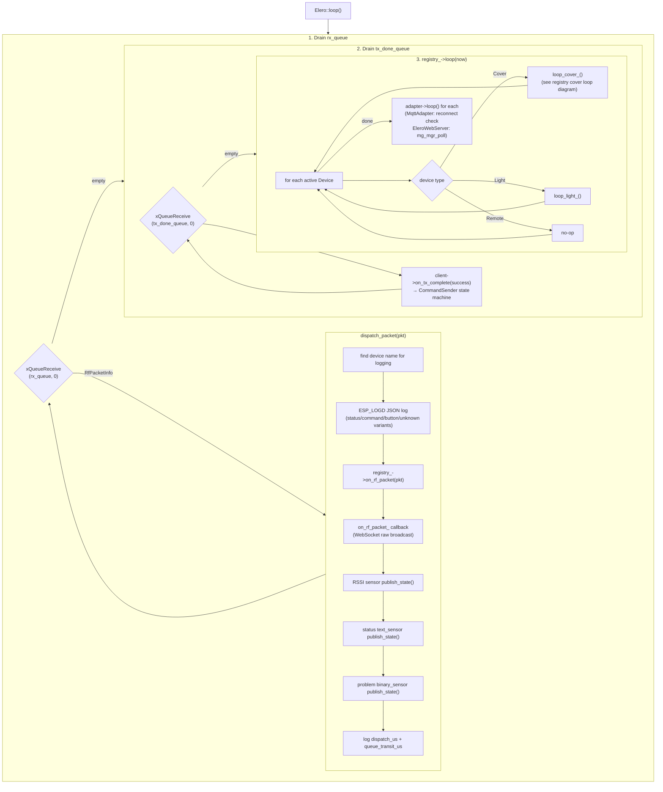

# CLAUDE.md — esphome-elero

This file provides guidance for AI assistants working in this repository. It describes the project structure, key conventions, and development workflows.

---

## Project Overview

`esphome-elero` is a custom **ESPHome external component** that enables Home Assistant to control Elero wireless motor blinds (rollers, shutters, awnings) via a **CC1101 868 MHz (or 433 MHz) RF transceiver** connected to an ESP32 over SPI.

The component is loaded directly from GitHub in an ESPHome YAML configuration:

```yaml
external_components:
  - source: github://manuschillerdev/esphome-elero
```

**Key capabilities:**
- Send open/close/stop/tilt commands to Elero blinds
- Receive status feedback (top, bottom, moving, blocked, overheated, etc.)
- Track cover position based on movement timing
- RSSI signal strength monitoring per blind
- RF discovery scan to find nearby blinds (web UI and log-based)
- Optional web UI served at `http://<device-ip>/elero` for discovery and YAML generation

**Available skills (USE THEM!):**

| Skill | When to use |
|-------|-------------|
| `/elero-protocol` | **Always** when modifying CC1101 TX/RX code, packet encoding/decoding, encryption |
| `/modern-cpp` | **Always** when writing or reviewing C++ code |
| `/esp32-development` | **Always** when writing C++ code (ISRs, memory, FreeRTOS, SPI) |

> **IMPORTANT:** Before writing C++ code, invoke `/modern-cpp` and `/esp32-development` skills.
> Before touching RF protocol code (elero.cpp TX/RX, packet handling), invoke `/elero-protocol`.

---

## Compatibility Matrix

**Supported targets — ESP32 only:**

| Framework | Status | Notes |
|-----------|--------|-------|
| **ESP-IDF** | ✅ Supported | Primary target, recommended |
| **Arduino** | ✅ Supported | Legacy support via ESPHome |

**NOT supported (do not add support for):**

| Target | Reason |
|--------|--------|
| ESP8266 | Insufficient RAM/flash, no SPI DMA |
| RP2040 | No CC1101 driver, different SPI API |
| LibreTiny | Out of scope |
| Host (native) | No hardware access |

The codebase uses Mongoose for HTTP/WebSocket specifically because it provides a unified API across ESP-IDF and Arduino frameworks. Do not introduce framework-specific code paths.

---

## Repository Structure

```
esphome-elero/
├── CLAUDE.md                          # This file
├── README.md                          # Main documentation (German + English)
├── example.yaml                       # Complete ESPHome config example
├── docs/
│   ├── INSTALLATION.md                # Step-by-step hardware and software setup
│   ├── CONFIGURATION.md               # Full parameter reference
│   └── examples/                      # Additional YAML examples
└── components/
    ├── elero/                         # Main hub component
    │   ├── __init__.py                # ESPHome component schema & code-gen (hub)
    │   ├── elero.h                    # C++ hub class header (RF task, FreeRTOS IPC, TX state machine)
    │   ├── elero.cpp                  # C++ RF protocol (Core 0 RF task + Core 1 dispatch)
    │   ├── elero_packet.{h,cpp}       # Packet encoding/decoding, encryption
    │   ├── elero_protocol.h           # Protocol constants (commands, states, timing)
    │   ├── elero_strings.{h,cpp}      # State/command byte string conversions
    │   ├── cc1101.h                   # CC1101 register map & command strobes
    │   ├── device.h                   # Unified Device struct (variant<CoverDevice, LightDevice, RemoteDevice>)
    │   ├── device_type.h              # DeviceType/HubMode enums + string helpers
    │   ├── device_registry.{h,cpp}    # Single source of truth: CRUD, NVS, RF dispatch, adapters
    │   ├── output_adapter.h           # Abstract OutputAdapter interface
    │   ├── cover_sm.{h,cpp}           # Cover FSM (Idle/Opening/Closing/Stopping)
    │   ├── light_sm.{h,cpp}           # Light FSM (Off/On/DimmingUp/DimmingDown)
    │   ├── nvs_config.h               # NvsDeviceConfig (64-byte POD struct for NVS persistence)
    │   ├── command_sender.h           # Non-blocking TX with retries (TxClient interface)
    │   ├── tx_client.h                # TxClient abstract interface for TX callbacks
    │   ├── poll_timer.h               # Poll interval timer helper
    │   ├── time_provider.{h,cpp}      # Time provider abstraction
    │   ├── overloaded.h               # std::visit overload helper
    │   ├── cover/                     # Cover (blind) platform
    │   │   ├── __init__.py            # Cover schema & code-gen
    │   │   └── esp_cover_shell.h      # Thin cover::Cover adapter to Device model
    │   ├── light/                     # Light platform
    │   │   ├── __init__.py            # Light schema & code-gen
    │   │   └── esp_light_shell.h      # Thin light::LightOutput adapter to Device model
    │   ├── sensor/                    # RSSI sensor platform
    │   │   └── __init__.py
    │   └── text_sensor/               # Blind status text sensor platform
    │       └── __init__.py
    ├── elero_mqtt/                     # MQTT mode component (NVS + MQTT HA discovery)
    │   ├── __init__.py                # Schema & codegen (registers MqttAdapter on registry)
    │   ├── mqtt_adapter.{h,cpp}       # MqttAdapter : OutputAdapter (HA discovery + state)
    │   ├── mqtt_context.h             # Shared MQTT context (topics, device block, availability)
    │   ├── mqtt_publisher.h           # Abstract MQTT interface (testable without ESPHome)
    │   └── esphome_mqtt_adapter.h     # Adapts ESPHome MQTT client to MqttPublisher
    ├── elero_nvs/                      # Native+NVS mode component (NVS + ESPHome native API)
    │   └── __init__.py                # Enables NVS on DeviceRegistry (no C++ files)
    ├── elero_matter/                   # Matter output adapter (stub)
    │   ├── __init__.py                # Matter component codegen
    │   └── matter_adapter.h           # MatterAdapter : OutputAdapter (structural stub)
    └── elero_web/                     # Optional web UI component
        ├── __init__.py
        ├── elero_web_server.h
        ├── elero_web_server.cpp       # Mongoose WebSocket server (~300 lines)
        └── elero_web_ui.h             # Inline web UI HTML/JS
```

---

## Architecture

### Core Design Principles

1. **Minimal base state, maximal derivation.** The system stores the smallest possible state (RF config, FSM state, timestamps) and derives everything else — position, brightness, entity status, discovery lists — on demand from `(state, now, config)`. This eliminates an entire class of consistency bugs.

2. **One path, no redundant implementations.** There is exactly one `Device` struct, one `DeviceRegistry`, one set of state machines (`cover_sm`, `light_sm`). Output adapters (MQTT, native API, WebSocket, Matter) are thin translators — they never duplicate logic. If you find yourself writing the same behavior twice, the abstraction is wrong.

3. **Route and fail early.** Data is classified and routed at the earliest possible point — RF packets are decoded on Core 0 (RF task) and dispatched on Core 1 (main loop) via FreeRTOS queues, device type is resolved on upsert, invalid configs are rejected before NVS write. This prevents complexity from compounding downstream.

4. **Solve the state-space explosion.** Three operating modes x three device types x multiple output formats would explode into dozens of classes without discipline. The variant-based `Device` + `OutputAdapter` observer pattern keeps the combinatorial surface flat: adding a new mode or device type is additive (one new adapter or variant arm), not multiplicative.

5. **Clear, unidirectional data flow.** Hardware → RF Task (Core 0) → FreeRTOS Queues → Main Loop (Core 1) → Registry → Adapters. Commands flow the reverse path via `tx_queue`. No lateral coupling between adapters. No circular dependencies. No shared mutable state between cores — only queue-based IPC.

### Layered Architecture (CRITICAL)

The system is split into **four distinct layers** with strict responsibilities. Code MUST live in the correct layer.



### Why This Matters

**Server has NO business logic.** It doesn't:
- Track which blinds are discovered (client derives from RF packets)
- Store blind states (client derives from RF status events)
- Generate YAML (client does this)
- Know anything about "discovery mode" (client filters RF packets)

**Client derives EVERYTHING.** Given:
- `config` event on connect → list of configured blinds from YAML
- `rf` events → every RF packet with addresses, states, RSSI
- `log` events → ESPHome logs

The client can derive:
- **Configured blinds**: directly from config
- **Current states**: latest `rf` event per address with type=0xCA/0xC9 (status)
- **Discovery**: addresses in `rf` events that are NOT in config
- **RSSI**: from `rf` events
- **Logs**: from `log` events

### ESPHome Layer Design

1. **Python layer** (`__init__.py` files) — ESPHome code-generation time
   - Defines and validates YAML configuration schemas using `esphome.config_validation`
   - Generates C++ constructor calls via `esphome.codegen`
   - Declares ESPHome component dependencies (`DEPENDENCIES`, `AUTO_LOAD`)

2. **C++ layer** (`.h`/`.cpp` files) — compiled firmware running on ESP32
   - Implements the actual RF protocol, SPI communication, and entity logic
   - Runs inside the ESPHome `Component` lifecycle (`setup()`, `loop()`)

### Three Operating Modes

The system supports three mutually exclusive operating modes. All modes use the same unified `Device` struct and `DeviceRegistry` — only the **output adapters** differ.

| | Native Mode | MQTT Mode | Native+NVS Mode |
|---|---|---|---|
| **Devices defined in** | YAML (compile-time) | NVS (runtime via CRUD API) | NVS (runtime, reboot to apply) |
| **Home Assistant API** | ESPHome native API | MQTT HA discovery | ESPHome native API |
| **Registry** | `DeviceRegistry` (NVS disabled) | `DeviceRegistry` (NVS enabled) | `DeviceRegistry` (NVS enabled) |
| **Component** | `elero:` only | `elero:` + `elero_mqtt:` | `elero:` + `elero_nvs:` |
| **Output adapters** | `EspCoverShell`, `EspLightShell` | `MqttAdapter` | `EspCoverShell`, `EspLightShell` |

**Unified device model:** All devices are represented by a single `Device` struct containing `NvsDeviceConfig` + `RfMeta` + `variant<CoverDevice, LightDevice, RemoteDevice>` + `CommandSender`. Variant-based state machines (`cover_sm`, `light_sm`) handle all logic. Position and brightness are always **derived** from `(state, now, config)` — never stored. This eliminates duplication and enables host unit testing.

**MQTT mode** enables runtime device management without reflashing:
- Devices stored as `NvsDeviceConfig` (64-byte POD struct) in a unified 48-slot pool
- CRUD operations via WebSocket or programmatic API on `DeviceRegistry`
- `MqttAdapter` (OutputAdapter) publishes/removes MQTT HA discovery topics dynamically
- Remote controls auto-discovered from observed RF command packets

**Native+NVS mode** enables runtime device management with ESPHome native API:
- Same NVS persistence and CRUD as MQTT mode via `DeviceRegistry`
- `EspCoverShell`/`EspLightShell` registered with ESPHome native API during `setup()`
- Post-setup CRUD writes to NVS but changes only apply on reboot (ESPHome can't register new entities after initial connection)
- No MQTT broker required — uses ESPHome's built-in native API

**DeviceRegistry** (`device_registry.h`) is the single source of truth:
- Main loop (Core 1) drains `rx_queue` and calls `registry_->on_rf_packet()` for every decoded packet
- Web server calls `registry->upsert()` / `registry->remove()` for CRUD
- Output adapters observe the registry via `OutputAdapter` interface (`on_device_added()`, `on_state_changed()`, etc.)
- In native mode, NVS is disabled — devices are registered at compile-time from YAML

### Component Hierarchy

```
Elero (hub, SPIDevice + Component — RF task on Core 0, dispatch on Core 1)
├── DeviceRegistry (single source of truth — CRUD, NVS, RF dispatch, adapter notification)
│   ├── Device[] (unified 48-slot pool)
│   │   ├── NvsDeviceConfig (64-byte POD struct — RF params, timing, metadata)
│   │   ├── RfMeta (last_seen, last_rssi, last_state_raw)
│   │   ├── variant<CoverDevice, LightDevice, RemoteDevice>
│   │   │   ├── CoverDevice (cover_sm::State — Idle/Opening/Closing/Stopping)
│   │   │   ├── LightDevice (light_sm::State — Off/On/DimmingUp/DimmingDown)
│   │   │   └── RemoteDevice (passive tracker, last_seen only)
│   │   └── CommandSender (non-blocking TX queue → tx_queue → RF task)
│   └── OutputAdapter[] (registered observers)
│       ├── EspCoverShell (cover::Cover + Component)     ← Native / NVS modes
│       ├── EspLightShell (light::LightOutput + Component) ← Native / NVS modes
│       ├── MqttAdapter (MQTT HA discovery + state)       ← MQTT mode
│       ├── EleroWebServer (WebSocket broadcast)           ← All modes (optional)
│       └── MatterAdapter (structural stub)                ← Future
├── sensor::Sensor (RSSI, registered per blind address)
├── text_sensor::TextSensor (status, registered per blind address)
└── EleroWebSwitch (switch::Switch + Component)
```

The `Device` struct is the single entity representation across all modes. Output adapters are stateless translators that observe the registry and map device events to their respective APIs.

### Core Data Flow

`Elero::setup()` configures CC1101 registers over SPI, attaches the GDO0 interrupt, creates 3 FreeRTOS queues, and spawns the RF task on Core 0. After setup, **Core 0 exclusively owns all SPI** — Core 1 never touches hardware again.

**RX path** — packet reception (ISR → Core 0 → queue → Core 1 → adapters):



**TX path** — command transmission (user action → Core 1 → queue → Core 0 → SPI → completion):



**Registry cover loop** — per-device processing each main loop iteration:



**Key properties:**
- Core 0 (RF task) and Core 1 (ESPHome loop) never share mutable state — only FreeRTOS queues (copy semantics).
- The RF task drains the CC1101 FIFO within 1ms of a packet arrival regardless of how busy the main loop is.
- `dispatch_packet()` runs ~13ms (JSON log + MQTT + WS + sensors). During this time, the RF task continues to service the radio independently.
- Cover commands auto-append CHECK (0x6a) to get "moving" status. Light commands use RELEASE (0x44) to stop dimming (sent by `loop_light_` on completion).

### Device Lifecycle (NVS modes)

Devices are managed via `DeviceRegistry::upsert()` / `DeviceRegistry::remove()`:
- `upsert()`: finds existing device by address+type or allocates a free slot, writes `NvsDeviceConfig` to NVS, notifies adapters via `on_device_added()` or `on_config_changed()`
- `remove()`: clears NVS slot, notifies adapters via `on_device_removed()`, resets slot
- `restore_all()`: on boot, iterates all 48 NVS slots, restores active devices, notifies adapters
- Remote controls are auto-discovered from RF command packets and tracked as `RemoteDevice` variant

### Observer Pattern

Output adapters observe the registry via the `OutputAdapter` interface:

```cpp
// Registry notifies adapters on device events
class OutputAdapter {
 public:
  virtual void setup() {}
  virtual void loop() {}
  virtual void on_device_added(const Device &dev) {}
  virtual void on_device_removed(uint32_t address, DeviceType type) {}
  virtual void on_state_changed(const Device &dev) {}
  virtual void on_config_changed(const Device &dev) {}
  virtual void on_rf_packet(const RfPacketInfo &pkt) {}
};
```

The hub sets the registry via `Elero::set_registry(DeviceRegistry*)`. This keeps the hub independent of output adapters and mode-specific logic.

---

## Key Classes and Files

### `components/elero/elero.h` / `elero.cpp`

**Class:** `Elero : public spi::SPIDevice<...>, public Component`
**Namespace:** `esphome::elero`

**Dual-core architecture:** After `setup()`, all SPI/CC1101 access runs on a dedicated FreeRTOS task (Core 0, priority 5, registered with ESP-IDF task watchdog). The ESPHome main loop (Core 1) handles dispatch and entity management. Communication is via 3 FreeRTOS queues (rx depth 16, tx depth 4, tx_done depth 4) — no shared mutable state.

IPC structs (defined in `elero.h`):
- `RfTaskRequest` — main loop → RF task (TX commands, frequency reinit)
- `TxResult` — RF task → main loop (TX completion notifications)
- `RfPacketInfo` — RF task → main loop (decoded RX packets)

Critical public API:
- `set_registry(DeviceRegistry*)` — connect the unified device registry
- `request_tx(TxClient*, const EleroCommand&)` — posts TX command to RF task queue (non-blocking, returns true if queued)
- `send_raw_command(...)` — fire-and-forget TX for WebSocket debugging
- `dispatch_packet(const RfPacketInfo&)` — slow-path dispatch (logging, registry) — Core 1 only
- `interrupt(Elero *arg)` — static ISR, sets `received_` flag + wakes RF task via `vTaskNotifyGiveFromISR`

RF task loop (`rf_task_func_`, Core 0) — all SPI access is here:

```mermaid
flowchart TD
    SLEEP["ulTaskNotifyTake(pdTRUE, 1ms)<br/>woken by: ISR notification OR timeout"] --> TX_IDLE{tx_ctx_.state<br/>== IDLE?}

    TX_IDLE -->|Yes| DEQUEUE{"xQueueReceive<br/>(tx_queue, 0)"}
    TX_IDLE -->|No| PROGRESS

    DEQUEUE -->|TX request| BUILD["build_tx_packet_(cmd)<br/>→ select 0x44 button or 0x6a command builder<br/>→ AES-128 encrypt → write to msg_tx_[]"]
    BUILD --> RECORD["record_tx_(counter)<br/>→ push to 16-entry echo ring"]
    RECORD --> START["start_transmit()<br/>→ state = PREPARE"]
    START --> OWN["tx_owner_ = client"]

    DEQUEUE -->|REINIT_FREQ| ABORT_PENDING{"tx_owner_<br/>!= nullptr?"}
    ABORT_PENDING -->|Yes| ABORT_NOTIFY["xQueueSend(tx_done_queue,<br/>{owner, false})<br/>tx_owner_ = nullptr"]
    ABORT_PENDING -->|No| REINIT_DO
    ABORT_NOTIFY --> REINIT_DO["received_ = false<br/>freq_ = {f2,f1,f0}<br/>reset() → init()<br/>(SPI: 30+ register writes)"]

    DEQUEUE -->|Empty| RX_CHECK

    OWN --> PROGRESS
    REINIT_DO --> RX_CHECK

    PROGRESS["handle_tx_state_(now)<br/>→ PREPARE is synchronous (~1ms),<br/>WAIT_TX polls, RECOVER resets"]
    PROGRESS --> DONE{tx_ctx_.state == IDLE<br/>AND tx_owner_ != nullptr?}
    DONE -->|Yes| POST_RESULT["xQueueSend(tx_done_queue,<br/>{owner, tx_pending_success_})<br/>tx_owner_ = nullptr"]
    DONE -->|No| RX_CHECK

    POST_RESULT --> RX_CHECK

    RX_CHECK{"received_<br/>.exchange(false)"} -->|true| DRAIN
    RX_CHECK -->|false| HEALTH

    subgraph DRAIN [drain_fifo_]
        D1["read_status_reliable_(RXBYTES)<br/>double-read errata workaround"]
        D1 --> D2{overflow bit?}
        D2 -->|Yes| D3["flush_and_rx()<br/>SIDLE → 100µs → SFRX → SFTX → SRX"]
        D2 -->|No| D4["read_buf(RXFIFO, fifo_count)<br/>single SPI burst"]
        D4 --> D5["loop: decode_packet() per frame<br/>parse_packet → AES decrypt → CRC<br/>→ is_own_echo_ check<br/>→ stamp decoded_at_us"]
        D5 --> D6["xQueueSend(rx_queue, &pkt)<br/>or drop + warn if full"]
    end

    D3 --> HEALTH
    D6 --> HEALTH

    HEALTH{idle AND<br/>5s elapsed?}
    HEALTH -->|Yes| HCHECK["read_status(MARCSTATE)<br/>detect: overflow → flush<br/>stuck IDLE → SRX strobe<br/>unexpected → flush_and_rx"]
    HEALTH -->|No| STACK_CHECK
    HCHECK --> STACK_CHECK

    STACK_CHECK{"30s elapsed?"} -->|Yes| HWM["log uxTaskGetStackHighWaterMark()"]
    STACK_CHECK -->|No| WDT
    HWM --> WDT

    WDT["esp_task_wdt_reset()<br/>(feed ESP-IDF watchdog)"] --> SLEEP
```



TX state machine (`handle_tx_state_`, runs on Core 0, 4 states):

```mermaid
stateDiagram-v2
    [*] --> IDLE

    IDLE --> PREPARE : start_transmit()

    state PREPARE {
        [*] --> sidle : write_cmd(SIDLE)
        sidle --> poll_idle : poll MARCSTATE × 20<br/>(50µs gaps, max 1ms)
        poll_idle --> sftx : MARCSTATE == IDLE<br/>write_cmd(SFTX)
        sftx --> load_fifo : esp_rom_delay_us(100)<br/>write_burst(TXFIFO, msg_tx_)
        load_fifo --> clear_rx : received_ = false
        clear_rx --> stx : write_cmd(STX)
        stx --> poll_tx : poll MARCSTATE × 20<br/>(50µs gaps, max 1ms)
    }
    PREPARE --> WAIT_TX : MARCSTATE == TX
    PREPARE --> RECOVER : any failure<br/>(SIDLE timeout, FIFO write fail, STX fail)

    state WAIT_TX {
        [*] --> check_gdo0 : received_.load()?
        check_gdo0 --> verify_fifo : true (GDO0 fired)
        check_gdo0 --> check_marc : false
        check_marc --> verify_fifo : MARCSTATE == IDLE/RX<br/>(fallback: GDO0 missed)
        verify_fifo --> complete : TXBYTES == 0
        verify_fifo --> grace : TXBYTES > 0<br/>esp_rom_delay_us(100)
        grace --> complete : TXBYTES == 0
    }
    WAIT_TX --> IDLE : TX complete<br/>flush_and_rx(), tx_pending_success_ = true
    WAIT_TX --> RECOVER : timeout 50ms<br/>OR FIFO not empty after grace

    state RECOVER {
        [*] --> flush : flush_and_rx()
        flush --> check : MARCSTATE == RX?
        check --> done : yes
        check --> reset_chip : no<br/>reset() + init()
        reset_chip --> verify : read VERSION register
        verify --> done : VERSION valid (SPI alive)
        verify --> log_error : VERSION 0x00/0xFF
    }
    RECOVER --> IDLE : tx_pending_success_ = false

    note right of IDLE : rf_task_func_ detects completion:<br/>posts TxResult to tx_done_queue
    note right of RECOVER : recover_radio_(): no rate-limiting,<br/>immediate reset if flush fails
```

Main loop (`Elero::loop()`, Core 1) — no SPI, pure dispatch:



Key protocol constants are in `elero_protocol.h`.

### `components/elero/device.h`

**Struct:** `Device` — unified representation for all device types

Contains:
- `NvsDeviceConfig cfg` — 64-byte POD struct with RF parameters, timing, metadata
- `RfMeta rf_meta` — last_seen_ms, last_rssi, last_state_raw
- `DeviceLogic logic` — `variant<CoverDevice, LightDevice, RemoteDevice>`
- `CommandSender sender` — non-blocking TX queue (lives on Device directly because TxClient is non-movable)

`CoverDevice` holds `cover_sm::State` (variant FSM). `LightDevice` holds `light_sm::State`. `RemoteDevice` is a passive tracker.

### `components/elero/device_registry.h` / `device_registry.cpp`

**Class:** `DeviceRegistry`

Single source of truth replacing the old `IDeviceManager` hierarchy:
- Unified 48-slot pool (`MAX_DEVICES = 48`) for all device types
- `upsert()` / `remove()` — CRUD with NVS persistence
- `on_rf_packet()` — dispatches RF packets to matching devices, updates state machines, notifies adapters
- `restore_all()` — restores devices from NVS on boot
- `add_adapter()` — registers `OutputAdapter` observers
- `loop()` — processes command queues, timers, adapter loops
- NVS preference hash: `fnv1_hash("elero_device") + slot_index`

### `components/elero/cover_sm.h` / `light_sm.h`

**Cover FSM states:** `cover_sm::Idle`, `cover_sm::Opening`, `cover_sm::Closing`, `cover_sm::Stopping`
**Light FSM states:** `light_sm::Off`, `light_sm::On`, `light_sm::DimmingUp`, `light_sm::DimmingDown`

Pure C++ state machines with no ESPHome dependencies. Position/brightness always derived from `(state, now, config)`.

### `components/elero/cover/esp_cover_shell.h` / `light/esp_light_shell.h`

**Class:** `EspCoverShell : public cover::Cover, public Component`
**Class:** `EspLightShell : public light::LightOutput, public Component`

Thin ESPHome adapters that bridge a `Device*` to ESPHome's entity APIs. Used in Native and Native+NVS modes. No business logic — delegates everything to the `Device` and its state machine.

### `components/elero_mqtt/mqtt_adapter.h` / `mqtt_adapter.cpp`

**Class:** `MqttAdapter : public OutputAdapter`

Replaces the old `MqttDeviceManager`. Key behaviors:
- Implements `OutputAdapter` interface — observes `DeviceRegistry` for device events
- On `on_device_added()`: publishes MQTT HA discovery config topics
- On `on_state_changed()`: publishes state updates to MQTT
- On `on_device_removed()`: removes MQTT discovery topics
- On MQTT (re)connection: republishes all active device discoveries
- Receives commands from MQTT subscriptions and routes to `DeviceRegistry`

### `components/elero_web/elero_web_server.h` / `elero_web_server.cpp`

**Class:** `EleroWebServer : public Component`
**Optional sub-platform:** `EleroWebSwitch : public switch::Switch, public Component`

**CRITICAL: This class is a STATELESS pipe.** It does NOT:
- Track discovered blinds (client derives from RF packets)
- Store blind states (client derives from RF events)
- Generate YAML (client does this)
- Implement "scan mode" (client filters RF packets)

Key behaviors:
- Uses **Mongoose** HTTP/WebSocket library for cross-framework compatibility (Arduino + ESP-IDF)
- On connect: sends `config` event with blinds array, mode (`native`/`mqtt`), and CRUD capability
- On RF packet (via callback from hub): broadcasts `rf` event to all clients
- On log (via ESPHome logger callback): broadcasts `log` event to clients
- On `cmd` message: routes command to hub's `send_command()`
- On `raw` message: routes to hub's `send_raw_command()`
- In NVS modes: handles `upsert_device`/`remove_device` via `DeviceRegistry`
- Receives CRUD event broadcasts from `DeviceRegistry` via adapter callbacks

### Why Mongoose?

ESPHome's built-in `web_server_base` uses different implementations depending on the framework:
- **Arduino**: AsyncTCP + ESPAsyncWebServer
- **ESP-IDF**: esp_http_server

These have incompatible APIs for WebSocket handling. Mongoose provides a single, unified API that works identically on both frameworks.

### WebSocket Protocol

The web UI communicates exclusively via WebSocket at `/elero/ws`. See `docs/ARCHITECTURE.md` for the complete protocol specification.

**Server → Client Events:**

| Event | Description |
|-------|-------------|
| `config` | Sent on connect: device info, configured blinds/lights, frequency, mode |
| `rf` | Every decoded RF packet: addresses, state, RSSI, raw bytes |
| `log` | ESPHome log entries with `elero.*` tags |
| `device_upserted` | NVS modes: device was created or updated (address, type) |
| `device_removed` | NVS modes: device was removed (address) |

**Client → Server Messages:**

| Type | Description |
|------|-------------|
| `cmd` | Send command to blind/light: `{"type":"cmd", "address":"0xADDRESS", "action":"up"}` |
| `raw` | Send raw RF packet for testing: `{"type":"raw", "dst_address":"0x...", "channel":5, ...}` |
| `upsert_device` | NVS modes: create or update device from NvsDeviceConfig fields |
| `remove_device` | NVS modes: remove device by `dst_address` + `device_type` |

### HTTP Endpoints

| Endpoint | Method | Description |
|---|---|---|
| `/` | GET | Redirect to `/elero` |
| `/elero` | GET | HTML web UI (static, bundled) |
| `/elero/ws` | WS | WebSocket endpoint for real-time communication |

---

## Naming Conventions

| Item | Convention | Example |
|---|---|---|
| C++ classes | PascalCase | `DeviceRegistry`, `EspCoverShell`, `MqttAdapter` |
| C++ namespaces | lowercase | `esphome::elero` |
| C++ constants | `UPPER_SNAKE_CASE` with `ELERO_` prefix | `ELERO_COMMAND_COVER_UP` |
| C++ private members | trailing underscore | `gdo0_pin_`, `scan_mode_` |
| Python config keys | `snake_case` string constants | `"blind_address"`, `"gdo0_pin"` |
| YAML keys | `snake_case` | `blind_address`, `open_duration` |

---

## ESPHome Platform Conventions

When adding a new platform sub-component (e.g., a new sensor type):

1. Create `components/elero/<platform>/__init__.py` with:
   - `DEPENDENCIES = ["elero"]`
   - A `CONFIG_SCHEMA` using the appropriate platform schema builder
   - An `async def to_code(config)` that registers the component and connects it to the parent `Elero` hub
2. Create the corresponding `.h` and `.cpp` files in the same directory.
3. Add a `register_<platform>()` method to `Elero` in `elero.h` / `elero.cpp` if the hub needs to dispatch data to it.

The `CONF_ELERO_ID` pattern is used throughout to resolve the parent hub:
```python
cv.GenerateID(CONF_ELERO_ID): cv.use_id(elero),
```
```python
parent = await cg.get_variable(config[CONF_ELERO_ID])
cg.add(var.set_elero_parent(parent))
```

---

## Configuration Reference (Summary)

### Hub (`elero:`)

```yaml
elero:
  cs_pin: GPIO5          # SPI chip select (required)
  gdo0_pin: GPIO26       # CC1101 GDO0 interrupt pin (required)
  freq0: 0x7a            # CC1101 FREQ0 register (optional, default 868.35 MHz)
  freq1: 0x71            # CC1101 FREQ1 register
  freq2: 0x21            # CC1101 FREQ2 register
```

Default frequency registers (`freq2=0x21, freq1=0x71, freq0=0x7a`) correspond to **868.35 MHz**. Use `freq0=0xc0` for 868.95 MHz variants.

SPI bus must be declared separately:
```yaml
spi:
  clk_pin: GPIO18
  mosi_pin: GPIO23
  miso_pin: GPIO19
```

### Cover (`cover: platform: elero`)

Required parameters:
- `dst_address` — 3-byte hex destination address of the motor (e.g., `0xa831e5`)
- `channel` — RF channel number of the blind
- `src_address` — 3-byte hex source address of the remote control paired with the blind

Optional parameters (with defaults):
- `poll_interval` (default `5min`, or `never`) — how often to query blind status
- `open_duration` / `close_duration` (default `0s`) — enables position tracking
- `supports_tilt` (default `false`)
- `auto_sensors` (default `true`) — auto-generate RSSI and status text sensors for this cover
- `payload_1` (default `0x00`), `payload_2` (default `0x04`)
- `type` (default `0x6a`), `type2` (default `0x00`)
- `hop` (default `0x0a`)
- `command_up/down/stop/check/tilt` — override RF command bytes if non-standard

### Light (`light: platform: elero`)

Required parameters:
- `dst_address` — 3-byte hex destination address of the light receiver (e.g., `0xc41a2b`)
- `channel` — RF channel number of the light
- `src_address` — 3-byte hex source address of the remote control paired with the light

Optional parameters (with defaults):
- `dim_duration` (default `0s`) — time for dimming from 0% to 100%; `0s` = on/off only, `>0` = brightness control
- `payload_1` (default `0x00`), `payload_2` (default `0x04`)
- `type` (default `0x6a`), `type2` (default `0x00`)
- `hop` (default `0x0a`)
- `command_on/off/dim_up/dim_down/stop/check` — override RF command bytes if non-standard

### Sensors

Sensors (RSSI, status, problem, command_source, problem_type) are auto-created by each cover/light block when `auto_sensors: true` (the default). Standalone sensor platforms (`sensor: platform: elero`, `text_sensor: platform: elero`) have been removed.

### MQTT Mode (`elero_mqtt`)

Enables runtime device management via NVS persistence and MQTT HA discovery. Requires `mqtt:` component. Registers a `MqttAdapter` on the unified `DeviceRegistry`.

```yaml
elero_mqtt:
  topic_prefix: elero              # MQTT topic prefix (default: "elero")
  discovery_prefix: homeassistant  # HA discovery prefix (default: "homeassistant")
  device_name: "Elero Gateway"     # HA device name (default: "Elero Gateway")
```

When `elero_mqtt` is present, no covers/lights should be defined in YAML — devices are added at runtime via the web UI or MQTT API and persisted in NVS (unified 48-slot pool in `DeviceRegistry`).

### Native+NVS Mode (`elero_nvs`)

Enables runtime device management via NVS persistence with ESPHome native API (no MQTT broker required). Simply enables NVS on the `DeviceRegistry`.

```yaml
elero_nvs:
```

No configuration keys — just including the component enables NVS persistence. Devices are added via the web UI CRUD API and persisted in NVS. On boot, active devices are registered with ESPHome's native API via `EspCoverShell`/`EspLightShell`. Post-boot CRUD writes to NVS but new entities only appear after a reboot.

### Web UI (`elero_web`)

```yaml
# Use web_server_base (not web_server) to keep only the /elero UI
# web_server_base is auto-loaded by elero_web, but you can declare it
# explicitly to configure the port:
web_server_base:
  port: 80

elero_web:
  id: elero_web_ui   # Optional ID
```

Navigating to `http://<device-ip>/` will redirect to `/elero` automatically.

### Web UI Switch (`switch: platform: elero_web`)

Optional runtime control to enable/disable the web UI:

```yaml
switch:
  - platform: elero_web
    name: "Elero Web UI"
    restore_mode: RESTORE_DEFAULT_ON
```

When the switch is OFF, all `/elero` endpoints return HTTP 503 (Service Unavailable).

---

## Development Workflow

### Prerequisites

- ESPHome installed (`pip install esphome`)
- An ESP32 with a CC1101 module wired to SPI pins + GDO0 GPIO
- An existing Elero wireless blind system nearby for testing

### Local development

Since this is an external component consumed from GitHub, local iteration requires pointing ESPHome at a local path:

```yaml
external_components:
  - source:
      type: local
      path: /path/to/esphome-elero
```

### Building and flashing

```bash
# Validate config
esphome config my_device.yaml

# Compile only
esphome compile my_device.yaml

# Compile and flash via USB
esphome run my_device.yaml

# Stream logs over serial
esphome logs my_device.yaml

# Stream logs over Wi-Fi (OTA)
esphome logs --device <ip-address> my_device.yaml
```

### Finding blind addresses

The typical workflow for a new installation:

1. Add `elero_web` to your configuration
2. Flash the device
3. Open `http://<device-ip>/elero`
4. Operate each blind with its original remote
5. RF packets appear in the web UI — addresses not in config are "discovered"
6. Add the discovered addresses to your YAML config

---

## Testing

### Unit tests (host)

Pure C++ core logic is tested with GoogleTest on the host machine:

```bash
cd tests/unit && cmake -B build && cmake --build build && ctest --test-dir build
```

Tests cover `cover_sm` (position tracking, state transitions, polling) and `light_sm` (brightness, dimming, state transitions).

### Compile tests

```bash
esphome compile tests/test.esp32-minimal.yaml   # Native mode
esphome compile tests/test.esp32-mqtt.yaml       # MQTT mode
esphome compile tests/test.esp32-nvs.yaml        # Native+NVS mode
```

### Hardware validation

1. Flash the firmware and verify the CC1101 initialises (check `esphome logs` for `[I][elero:...]` messages)
2. Open the web UI and verify RF packets appear when using the remote
3. Test each cover entity (open, close, stop) from Home Assistant
4. Verify RSSI and status text sensors update correctly

---

## Common Pitfalls

- **Wrong frequency**: Most European Elero motors use 868.35 MHz (`freq0=0x7a`). Some use 868.95 MHz (`freq0=0xc0`). If discovery finds nothing, try the alternate frequency.
- **SPI conflicts**: The CC1101 CS pin must not be shared with any other SPI device.
- **Using `web_server:` instead of `web_server_base:`**: Adding `web_server:` to your YAML re-enables the default ESPHome entity UI at `/`. Use `web_server_base:` (or rely on its auto-load via `elero_web`) to serve only the Elero UI at `/elero`. Navigating to `/` will redirect automatically to `/elero`.
- **Position tracking**: Leave `open_duration` and `close_duration` at `0s` if you only need open/close without position — setting incorrect durations causes wrong position estimates.
- **Poll interval `never`**: Set `poll_interval: never` for blinds that reliably push state updates (avoids unnecessary RF traffic). Internally this maps to `uint32_t` max (4 294 967 295 ms).

---

## Contributing

- Follow the existing naming conventions for C++ and Python code.
- Keep output adapters thin — business logic belongs in state machines and `DeviceRegistry`, not in adapters.
- Test changes on real hardware before opening a pull request.
- Document new configuration parameters in both `README.md` and `docs/CONFIGURATION.md`.
- The primary development branch convention used by automation is `claude/<session-id>`.
