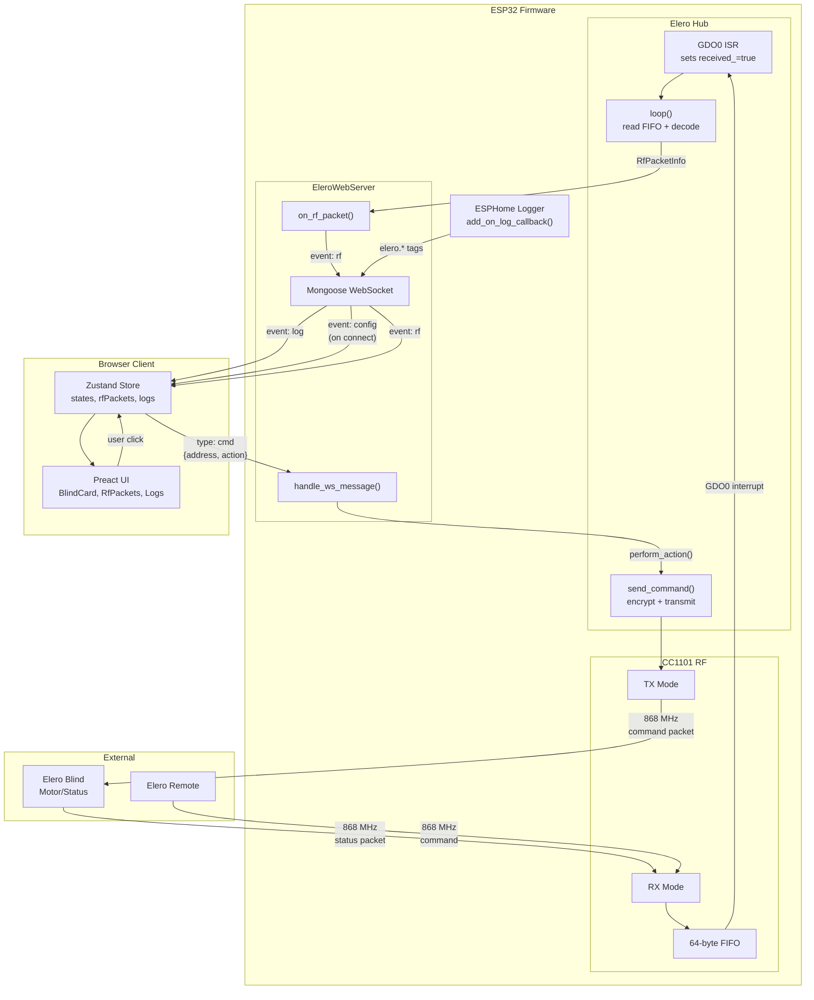

# Architecture

This document describes the data flow architecture of the `elero_web` component.

## Why Mongoose?

The web server uses **Mongoose** instead of ESPHome's built-in `web_server_base` for cross-framework compatibility.

ESPHome supports two frameworks:
- **Arduino**: Uses AsyncTCP + ESPAsyncWebServer
- **ESP-IDF**: Uses esp_http_server

These have incompatible WebSocket APIs. Mongoose provides a single, unified HTTP/WebSocket implementation that works identically on both frameworks, eliminating the need for framework-specific code paths.

Key benefits:
- Single codebase for Arduino and ESP-IDF builds
- Well-tested WebSocket implementation with proper frame handling
- Built-in HTTP routing and static file serving

## Data Flow Diagram



## Data Flow Summary

| Direction | Path | Data |
|-----------|------|------|
| **RF → Client** | CC1101 → ISR → loop() → on_rf_packet() → WS broadcast | `RfPacketInfo` as JSON |
| **Log → Client** | Logger callback → WS broadcast | `{t, level, tag, msg}` |
| **Connect** | Client connects → WS | `config` with blinds, lights, freq |
| **Client → RF** | UI → WS message → handle_ws_message() → send_command() → CC1101 | `{type:"cmd", address, action}` |
| **Raw TX** | WS message → handle_ws_message() → send_raw_command() → CC1101 | `{type:"raw", blind_address, ...}` |

## WebSocket Protocol

All messages are JSON-encoded. Server→client messages are wrapped in `{event, data}`. Client→server messages include a `type` field.

### Server → Client Events

| Event | Trigger | Description |
|-------|---------|-------------|
| `config` | On WebSocket connect | Device configuration and configured blinds/lights |
| `rf` | Every decoded RF packet | Decoded RF packet with addresses, state, RSSI |
| `log` | ESPHome log with `elero.*` tag | Log entry from ESPHome logger |

#### `config` Payload

Sent once when a client connects to provide initial state.

```json
{
  "event": "config",
  "data": {
    "device": "elero-bridge",
    "freq": {
      "freq2": "0x21",
      "freq1": "0x71",
      "freq0": "0x7a"
    },
    "blinds": [
      {
        "address": "0xa831e5",
        "name": "Living Room",
        "channel": 5,
        "remote": "0x123456",
        "open_ms": 25000,
        "close_ms": 22000,
        "poll_ms": 300000,
        "tilt": false
      }
    ],
    "lights": [
      {
        "address": "0xc41a2b"
      }
    ]
  }
}
```

#### `rf` Payload

Sent for every RF packet received by the CC1101.

```json
{
  "event": "rf",
  "data": {
    "t": 123456,
    "src": "0xa831e5",
    "dst": "0x123456",
    "ch": 5,
    "type": "0x6a",
    "cmd": "0x20",
    "state": "0x00",
    "rssi": -45.5,
    "hop": "0x0a",
    "raw": "aa bb cc dd ..."
  }
}
```

| Field | Type | Description |
|-------|------|-------------|
| `t` | number | Timestamp in milliseconds since boot |
| `src` | string | Source address (hex) - blind or remote |
| `dst` | string | Destination address (hex) |
| `ch` | number | RF channel |
| `type` | string | Packet type: `0x6a` = command, `0xca` = status |
| `cmd` | string | Command byte (for command packets) |
| `state` | string | State byte (for status packets) |
| `rssi` | number | Signal strength in dBm |
| `hop` | string | Hop counter byte |
| `raw` | string | Raw packet bytes (hex, space-separated) |

#### `log` Payload

Forwarded ESPHome log entries (filtered to `elero.*` tags only).

```json
{
  "event": "log",
  "data": {
    "t": 123456,
    "level": 3,
    "tag": "elero",
    "msg": "Received status from 0xa831e5: TOP"
  }
}
```

| Field | Type | Description |
|-------|------|-------------|
| `t` | number | Timestamp in milliseconds since boot |
| `level` | number | Log level: 1=error, 2=warning, 3=info, 4=debug, 5=verbose |
| `tag` | string | ESPHome log tag (e.g., `elero`, `elero.web`, `elero.cover`) |
| `msg` | string | Log message |

### Client → Server Messages

| Type | Trigger | Description |
|------|---------|-------------|
| `cmd` | User clicks Open/Stop/Close/Tilt | Send command to a blind or light |
| `raw` | Debug/testing UI | Send raw RF command with full protocol control |

#### `cmd` Payload

```json
{
  "type": "cmd",
  "address": "0xa831e5",
  "action": "up"
}
```

| Field | Type | Description |
|-------|------|-------------|
| `type` | string | Always `"cmd"` |
| `address` | string | Target blind/light address (hex) |
| `action` | string | One of: `up`, `down`, `stop`, `tilt` |

#### `raw` Payload

Send a raw RF command for testing/debugging. Field names match the YAML cover config.

```json
{
  "type": "raw",
  "blind_address": "0xa831e5",
  "channel": 5,
  "remote_address": "0x123456",
  "command": "0x20"
}
```

| Field | Type | Required | Default | Description |
|-------|------|----------|---------|-------------|
| `type` | string | yes | | Always `"raw"` |
| `blind_address` | string | yes | | Target blind address (hex) |
| `channel` | number | yes | | RF channel |
| `remote_address` | string | yes | | Source remote address (hex) |
| `command` | string | yes | | Command byte (hex): `0x20`=up, `0x40`=down, `0x10`=stop, `0x24`=tilt |
| `payload_1` | string | no | `0x00` | Payload byte 1 |
| `payload_2` | string | no | `0x04` | Payload byte 2 |
| `pck_inf1` | string | no | `0x6a` | Packet info byte 1 |
| `pck_inf2` | string | no | `0x00` | Packet info byte 2 |
| `hop` | string | no | `0x0a` | Hop counter |

## Design Principles

1. **Stateless Server**: The web server is a dumb pipe. It forwards RF packets and logs to clients, and routes commands back to the hub. No state management on the server.

2. **Client-Side State**: The browser maintains all state using Zustand. Discovery is derived from RF packets (addresses not in config). YAML generation happens client-side.

3. **Minimal Protocol**: Only 5 message types total (3 server→client, 2 client→server). Previous architecture had 18 message types.

4. **ESPHome Integration**: Uses existing ESPHome logger callback system rather than custom log capture infrastructure.
