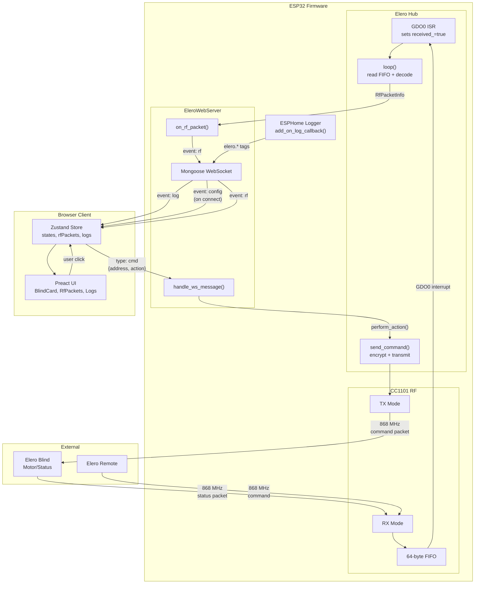

# Architecture

> **Golden Rule:** Radio packets + YAML config are the only sources of truth. Everything else—device states, discovery, positions—is derived. No extra state anywhere.

This document describes the data flow architecture of the `elero_web` component and the three operating modes.

---

## Operating Modes Overview

```
┌──────────────────────────────────────────────────────────────────────────────┐
│                          esphome-elero                                       │
│                                                                              │
│  ┌─────────────┐    ┌──────────────────┐    ┌─────────────────────┐         │
│  │ Native Mode │    │    MQTT Mode     │    │  Native+NVS Mode   │         │
│  │             │    │                  │    │                     │         │
│  │ Devices in  │    │ Devices in NVS   │    │  Devices in NVS    │         │
│  │ YAML        │    │ (runtime CRUD)   │    │  (runtime CRUD)    │         │
│  │             │    │                  │    │                     │         │
│  │ ESPHome     │    │ MQTT HA          │    │  ESPHome native    │         │
│  │ native API  │    │ discovery        │    │  API               │         │
│  └─────────────┘    └──────────────────┘    └─────────────────────┘         │
│                                                                              │
│  Component:         Component:              Component:                      │
│  elero: only        elero: + elero_mqtt:    elero: + elero_nvs:            │
│                                                                              │
│  Device Manager:    Device Manager:         Device Manager:                 │
│  NativeDeviceManager MqttDeviceManager     NativeNvsDeviceManager          │
│  (no-op)            (NvsDeviceManagerBase)  (own implementation)            │
└──────────────────────────────────────────────────────────────────────────────┘
```

---

## Entity Class Hierarchy

Each mode uses different entity classes, but all share the same pure C++ core logic:

```
                    ┌──────────────┐
                    │  CoverCore   │ Pure C++ — position tracking,
                    │  LightCore   │ state mapping, no ESPHome deps
                    └──────┬───────┘
                           │ composed by
          ┌────────────────┼────────────────┐
          ▼                ▼                ▼
  ┌───────────────┐ ┌──────────────┐ ┌──────────────┐
  │  EleroCover   │ │EleroDynamic- │ │ NativeNvs-   │
  │  EleroLight   │ │Cover/Light   │ │ Cover/Light  │
  │               │ │              │ │              │
  │ cover::Cover  │ │ EleroBlind-  │ │ cover::Cover │
  │ light::Light- │ │ Base +       │ │ light::Light-│
  │ Output +      │ │ DynamicEn-   │ │ Output +     │
  │ Component     │ │ tityBase     │ │ Component +  │
  │               │ │              │ │ DynamicEn-   │
  │               │ │ No ESPHome   │ │ tityBase     │
  │               │ │ entity base  │ │              │
  └───────────────┘ └──────────────┘ └──────────────┘
    Native Mode       MQTT Mode       Native+NVS Mode
```

---

## Boot Sequence — Native Mode

Devices are defined in YAML at compile time. The simplest mode.

```
                        ESPHome Boot
                            │
                            ▼
                   ┌─────────────────┐
                   │  Elero::setup() │
                   │  (hub)          │
                   │                 │
                   │ • Init CC1101   │
                   │   SPI + GPIO    │
                   │ • Attach GDO0   │
                   │   interrupt     │
                   └────────┬────────┘
                            │
                  ┌─────────┴─────────┐
                  ▼                   ▼
         ┌────────────────┐  ┌────────────────┐
         │EleroCover::    │  │EleroLight::    │
         │setup()         │  │setup()         │
         │                │  │                │
         │• register_     │  │• register_     │
         │  cover(this)   │  │  light(this)   │
         │  with hub      │  │  with hub      │
         │• Restore state │  │                │
         │  from flash    │  │                │
         └────────┬───────┘  └────────┬───────┘
                  │                   │
                  └─────────┬─────────┘
                            ▼
               ┌───────────────────────┐
               │ ESPHome native API    │
               │ auto-discovers all    │
               │ registered covers &   │
               │ lights                │
               │                       │
               │ → Home Assistant sees │
               │   entities via API    │
               └───────────────────────┘
                            │
                            ▼
                   ┌─────────────────┐
                   │  Elero::loop()  │
                   │                 │
                   │ • RX interrupt  │
                   │   → decode pkt  │
                   │   → dispatch to │
                   │     matching    │
                   │     cover/light │
                   │     via set_rx_ │
                   │     state()     │
                   └─────────────────┘
```

**Key characteristics:**
- No `IDeviceManager` — hub's `device_manager_` is `nullptr`
- Entity registration via `register_cover()` / `register_light()` during `setup()`
- HA discovers entities automatically via ESPHome native API connection
- No runtime CRUD — devices are fixed at compile time

---

## Boot Sequence — MQTT Mode

Devices stored in NVS, published to HA via MQTT discovery topics.

```
                        ESPHome Boot
                            │
                            ▼
                   ┌─────────────────┐
                   │  Elero::setup() │
                   │  (hub)          │
                   │                 │
                   │ • Init CC1101   │
                   │ • No covers or  │
                   │   lights from   │
                   │   YAML          │
                   └────────┬────────┘
                            │
                            ▼
              ┌──────────────────────────┐
              │ MqttDeviceManager::      │
              │ setup()                  │
              │ (extends NvsDevice-      │
              │  ManagerBase)            │
              │                          │
              │ 1. hub->set_device_      │
              │    manager(this)         │
              │                          │
              │ 2. init_slot_            │
              │    preferences_()        │
              │    Hash keys per slot:   │
              │    fnv1("elero_cover")+i │
              │    fnv1("elero_light")+i │
              │    fnv1("elero_remote")+i│
              └────────────┬─────────────┘
                           │
              ┌────────────┼──────────────────┐
              ▼            ▼                  ▼
     ┌──────────────┐ ┌──────────────┐ ┌───────────────┐
     │ For each     │ │ For each     │ │ For each      │
     │ cover slot   │ │ light slot   │ │ remote slot   │
     │ (0..max):    │ │ (0..max):    │ │ (0..max):     │
     │              │ │              │ │               │
     │ • restore()  │ │ • restore()  │ │ • restore()   │
     │   from NVS   │ │   from NVS   │ │   from NVS    │
     │              │ │              │ │               │
     │ • set_state_ │ │ • set_state_ │ │ • set_state_  │
     │   callback   │ │   callback   │ │   callback    │
     │   (MQTT      │ │   (MQTT      │ │   (MQTT       │
     │   publish)   │ │   publish)   │ │   publish)    │
     │              │ │              │ │               │
     │ • activate() │ │ • activate() │ │ • activate()  │
     │   registers  │ │   registers  │ │               │
     │   with hub   │ │   with hub   │ │               │
     │              │ │              │ │               │
     │ • sync_      │ │ • sync_      │ │               │
     │   config_to_ │ │   config_to_ │ │               │
     │   core()     │ │   core()     │ │               │
     │              │ │              │ │               │
     │ • on_cover_  │ │ • on_light_  │ │ • on_remote_  │
     │   activated_ │ │   activated_ │ │   activated_  │
     │   (publish   │ │   (publish   │ │   (publish    │
     │   discovery) │ │   discovery) │ │   discovery)  │
     └──────────────┘ └──────────────┘ └───────────────┘
                           │
                           ▼
              ┌──────────────────────────┐
              │ MQTT Connected?          │
              │                          │
              │ YES → publish_all_       │
              │   discoveries_()         │
              │                          │
              │ For each active cover:   │
              │ • publish discovery to   │
              │   homeassistant/cover/   │
              │   {device}_{addr}/config │
              │ • subscribe to           │
              │   elero/cover/{addr}/set │
              │                          │
              │ For each active light:   │
              │ • publish discovery to   │
              │   homeassistant/light/   │
              │   {device}_{addr}/config │
              │ • subscribe to           │
              │   elero/light/{addr}/set │
              │                          │
              │ For each active remote:  │
              │ • publish discovery to   │
              │   homeassistant/sensor/  │
              │   {device}_remote_{addr} │
              │   /config                │
              └────────────┬─────────────┘
                           │
                           ▼
              ┌──────────────────────────┐
              │ NvsDeviceManagerBase::   │
              │ loop()                   │
              │                          │
              │ • loop_hook_():          │
              │   detect MQTT reconnect  │
              │   → re-publish all       │
              │   discoveries            │
              │                          │
              │ • For each active cover: │
              │   cover.loop(now)        │
              │   → sender.process_     │
              │     queue()              │
              │   → position tracking   │
              │   → state_callback_()   │
              │     → publish_cover_    │
              │       state_() via MQTT │
              │                          │
              │ • For each active light: │
              │   light.loop(now)        │
              │   → dimming logic       │
              │   → state_callback_()   │
              │     → publish_light_    │
              │       state_() via MQTT │
              └──────────────────────────┘
```

**State publishing flow (MQTT mode):**

```
  RF packet received by CC1101
          │
          ▼
  Elero::loop() decodes packet
          │
          ├──► status packet (0xCA/0xC9)
          │         │
          │         ▼
          │    Dispatch to matching
          │    EleroDynamicCover/Light
          │    via set_rx_state()
          │         │
          │         ▼
          │    CoverCore::on_rx_state()
          │    or LightCore::on_rx_state()
          │         │
          │         ▼
          │    state_callback_(this)
          │         │
          │         ▼
          │    MqttDeviceManager::
          │    publish_cover_state_()
          │    or publish_light_state_()
          │         │
          │         ▼
          │    MQTT publish to
          │    elero/cover/{addr}/state
          │    {"state":"open","position":100}
          │
          └──► command packet (0x6A/0x69)
                    │
                    ▼
               device_manager_->
               on_rf_packet()
                    │
                    ▼
               track_remote_()
               auto-discover new
               remotes from src_addr
```

**Runtime CRUD flow (MQTT mode):**

```
  WebSocket: {"type":"upsert_device", ...}
          │
          ▼
  EleroWebServer routes to
  device_manager_->upsert_device(config)
          │
          ▼
  NvsDeviceManagerBase::upsert_device()
          │
          ├── Existing device? → update_config()
          │   → on_cover_updated_() → remove old MQTT discovery
          │   → on_cover_activated_() → publish new discovery + subscribe
          │
          └── New device? → find_free_slot()
              → set_state_callback()
              → activate(config, hub)
              → save_config() to NVS
              → on_cover_activated_() → publish discovery + subscribe
          │
          ▼
  notify_crud_("device_upserted", ...)
          │
          ▼
  CrudEventCallback → WS broadcast
  to all connected web UI clients
```

---

## Boot Sequence — Native+NVS Mode

Devices stored in NVS like MQTT mode, but registered with ESPHome native API like Native mode.

```
                        ESPHome Boot
                            │
                            ▼
                   ┌─────────────────┐
                   │  Elero::setup() │
                   │  (hub)          │
                   │                 │
                   │ • Init CC1101   │
                   │ • No covers or  │
                   │   lights from   │
                   │   YAML          │
                   └────────┬────────┘
                            │
                            ▼
              ┌──────────────────────────┐
              │ NativeNvsDeviceManager:: │
              │ setup()                  │
              │                          │
              │ 1. hub->set_device_      │
              │    manager(this)         │
              │                          │
              │ 2. init_slot_            │
              │    preferences_()        │
              │    Hash keys per slot:   │
              │    fnv1("elero_nvs_      │
              │      cover") + i         │
              │    fnv1("elero_nvs_      │
              │      light") + i         │
              │    fnv1("elero_nvs_      │
              │      remote") + i        │
              └────────────┬─────────────┘
                           │
              ┌────────────┼──────────────────┐
              ▼            ▼                  ▼
     ┌──────────────┐ ┌──────────────┐ ┌───────────────┐
     │ For each     │ │ For each     │ │ For each      │
     │ cover slot:  │ │ light slot:  │ │ remote slot:  │
     │              │ │              │ │               │
     │ • restore()  │ │ • restore()  │ │ • restore()   │
     │   from NVS   │ │   from NVS   │ │   from NVS    │
     │              │ │              │ │               │
     │ • activate() │ │ • activate() │ │ • activate()  │
     │   registers  │ │   registers  │ │               │
     │   with hub   │ │   with hub   │ │               │
     │              │ │              │ │               │
     │ • sync_      │ │ • sync_      │ │               │
     │   config_to_ │ │   config_to_ │ │               │
     │   core()     │ │   core()     │ │               │
     │              │ │              │ │               │
     │ • apply_name │ │ • Create     │ │               │
     │   _from_     │ │   LightState │ │               │
     │   config()   │ │   wrapper    │ │               │
     │              │ │              │ │               │
     │ ┌──────────┐ │ │ ┌──────────┐ │ │               │
     │ │App.      │ │ │ │App.      │ │ │               │
     │ │register_ │ │ │ │register_ │ │ │               │
     │ │cover()   │ │ │ │light()   │ │ │               │
     │ │register_ │ │ │ │register_ │ │ │               │
     │ │component │ │ │ │component │ │ │               │
     │ │()        │ │ │ │()        │ │ │               │
     │ └──────────┘ │ │ └──────────┘ │ │               │
     └──────────────┘ └──────────────┘ └───────────────┘
                           │
                           ▼
                    setup_done_ = true
                           │
                           ▼
              ┌──────────────────────────┐
              │ ESPHome native API       │
              │ auto-discovers all       │
              │ registered covers &      │
              │ lights                   │
              │                          │
              │ → Home Assistant sees    │
              │   entities via API       │
              │                          │
              │ NativeNvsCover IS a      │
              │ cover::Cover → ESPHome   │
              │ handles state publish    │
              │ automatically            │
              │                          │
              │ NativeNvsLight IS a      │
              │ light::LightOutput →     │
              │ ESPHome handles state    │
              │ publish via LightState   │
              └──────────────────────────┘
```

**Key difference from MQTT mode:**

```
  MQTT Mode:                           Native+NVS Mode:
  ─────────                            ────────────────
  EleroDynamicCover                    NativeNvsCover
  • NOT a cover::Cover                 • IS a cover::Cover
  • State via callback → MQTT          • State via this->publish_state()
  • loop() called by manager           • loop() called by ESPHome
  • Needs MQTT broker                  • Uses native API (no broker)

  EleroDynamicLight                    NativeNvsLight
  • NOT a light::LightOutput           • IS a light::LightOutput
  • State via callback → MQTT          • State via LightState::publish_state()
  • loop() called by manager           • loop() called by ESPHome
  • Needs MQTT broker                  • Uses native API (no broker)
```

**Post-setup CRUD limitation (Native+NVS only):**

```
  Post-setup CRUD request
  (via WebSocket)
          │
          ▼
  NativeNvsDeviceManager::
  upsert_device()
          │
          ├── setup_done_ == false?
          │   → Normal: activate + App.register_*()
          │   → Entity appears in HA immediately
          │
          └── setup_done_ == true?
              → activate + save to NVS
              → Log: "Reboot required to register
                with native API"
              → Entity only appears after reboot
              (ESPHome can't register new entities
               after initial API connection)
```

---

## State Publishing Comparison

| Event | Native Mode | MQTT Mode | Native+NVS Mode |
|-------|------------|-----------|-----------------|
| Cover position change | `cover::Cover::publish_state()` via native API | `state_callback_` → `publish_cover_state_()` → MQTT topic | `cover::Cover::publish_state()` via native API |
| Light on/off | `LightState::publish_state()` via native API | `state_callback_` → `publish_light_state_()` → MQTT topic | `LightState::publish_state()` via native API |
| Position during movement | `publish_state(false)` every 1s | `state_callback_` every 1s | `publish_state(false)` every 1s |
| Brightness during dimming | `LightState::publish_state()` every 1s | `state_callback_` every 1s | `LightState::publish_state()` every 1s |
| Remote activity | N/A | `state_callback_` → `publish_remote_state_()` → MQTT topic | N/A (remotes tracked but not published) |
| HA discovery | Automatic via native API connection | MQTT discovery topics (`homeassistant/cover/...`) | Automatic via native API connection |

---

## Device Manager Interface

All modes communicate through the `IDeviceManager` interface:

```
  ┌────────────────────────────────────────┐
  │           IDeviceManager               │
  │                                        │
  │  setup()                               │
  │  loop()                                │
  │  on_rf_packet(pkt)                     │
  │  mode() → HubMode                     │
  │  supports_crud() → bool               │
  │  upsert_device(config) → bool         │
  │  remove_device(type, addr) → bool     │
  │  set_crud_callback(cb)                 │
  └───────────┬────────────────────────────┘
              │
    ┌─────────┼───────────┐
    ▼         ▼           ▼
┌────────┐ ┌──────────┐ ┌──────────────┐
│Native  │ │NvsDevice-│ │NativeNvs-    │
│Device  │ │Manager-  │ │DeviceManager │
│Manager │ │Base      │ │              │
│        │ │          │ │ (own impl,   │
│ no-op  │ │ ┌──────┐ │ │  uses        │
│ impl   │ │ │Mqtt- │ │ │  NativeNvs-  │
│        │ │ │Device│ │ │  Cover/Light │
│        │ │ │Mgr   │ │ │  slots)      │
│        │ │ └──────┘ │ │              │
└────────┘ └──────────┘ └──────────────┘
  NATIVE      MQTT         NATIVE_NVS
```

The hub holds `IDeviceManager*`:
- `nullptr` → Native mode (no manager needed)
- `MqttDeviceManager*` → MQTT mode
- `NativeNvsDeviceManager*` → Native+NVS mode

The web server queries `device_manager_->mode()` and `supports_crud()` to determine what UI capabilities to expose.

---

## NVS Persistence

Both NVS-backed modes use the same `NvsDeviceConfig` struct (60 bytes, version 2):

```
  NvsDeviceConfig (60 bytes)
  ┌──────────────────────────────────────────┐
  │ Header (4 bytes)                         │
  │   version, type, flags, reserved         │
  ├──────────────────────────────────────────┤
  │ RF Addressing (16 bytes)                 │
  │   dst_address, src_address, channel,     │
  │   hop, payload_1, payload_2,             │
  │   type_byte, type2, supports_tilt        │
  ├──────────────────────────────────────────┤
  │ Timing (16 bytes)                        │
  │   open_duration_ms, close_duration_ms,   │
  │   poll_interval_ms, dim_duration_ms      │
  ├──────────────────────────────────────────┤
  │ Name (24 bytes)                          │
  │   char[24] null-terminated               │
  └──────────────────────────────────────────┘
```

Stored via ESPHome Preferences API with unique hash keys per mode:
- MQTT: `fnv1_hash("elero_cover") + slot_index`
- NVS: `fnv1_hash("elero_nvs_cover") + slot_index`

This prevents hash collisions if both modes are ever used on the same device.

---

## Why Mongoose?

The web server uses **Mongoose** instead of ESPHome's built-in `web_server_base` for cross-framework compatibility.

ESPHome supports two frameworks:
- **Arduino**: Uses AsyncTCP + ESPAsyncWebServer
- **ESP-IDF**: Uses esp_http_server

These have incompatible WebSocket APIs. Mongoose provides a single, unified HTTP/WebSocket implementation that works identically on both frameworks, eliminating the need for framework-specific code paths.

Key benefits:
- Single codebase for Arduino and ESP-IDF builds
- Well-tested WebSocket implementation with proper frame handling
- Built-in HTTP routing and static file serving

## Web UI Data Flow


```mermaid
flowchart TB
    subgraph ESP32["ESP32 Firmware"]
        subgraph Hub["Elero Hub"]
            ISR["GDO0 ISR<br/>sets received_=true"]
            Loop["loop()<br/>read FIFO + decode"]
            Send["send_command()<br/>encrypt + transmit"]
        end

        subgraph CC1101["CC1101 RF"]
            RX["RX Mode"]
            TX["TX Mode"]
            FIFO["64-byte FIFO"]
        end

        subgraph WebServer["EleroWebServer"]
            WS["Mongoose WebSocket"]
            OnRF["on_rf_packet()"]
            HandleMsg["handle_ws_message()"]
        end

        Logger["ESPHome Logger<br/>add_on_log_callback()"]
    end

    subgraph Client["Browser Client"]
        Store["Zustand Store<br/>states, rfPackets, logs"]
        UI["Preact UI<br/>BlindCard, RfPackets, Logs"]
    end

    subgraph External["External"]
        Blind["Elero Blind<br/>Motor/Status"]
        Remote["Elero Remote"]
    end

    %% RF Reception Path
    Blind -->|"868 MHz<br/>status packet"| RX
    Remote -->|"868 MHz<br/>command"| RX
    RX --> FIFO
    FIFO -->|"GDO0 interrupt"| ISR
    ISR --> Loop
    Loop -->|"RfPacketInfo"| OnRF
    OnRF -->|"event: rf"| WS

    %% Logger Path
    Logger -->|"elero.* tags"| WS
    WS -->|"event: log"| Store

    %% WebSocket to Client
    WS -->|"event: config<br/>(on connect)"| Store
    WS -->|"event: rf"| Store
    Store --> UI

    %% Command Path (reverse)
    UI -->|"user click"| Store
    Store -->|"type: cmd<br/>{address, action}"| HandleMsg
    HandleMsg -->|"perform_action()"| Send
    Send --> TX
    TX -->|"868 MHz<br/>command packet"| Blind
```

## Data Flow Summary

| Direction | Path | Data |
|-----------|------|------|
| **RF → Client** | CC1101 → ISR → loop() → on_rf_packet() → WS broadcast | `RfPacketInfo` as JSON |
| **Log → Client** | Logger callback → WS broadcast | `{t, level, tag, msg}` |
| **Connect** | Client connects → WS | `config` with blinds, lights, freq |
| **Client → RF** | UI → WS message → handle_ws_message() → send_command() → CC1101 | `{type:"cmd", address, action}` |
| **Raw TX** | WS message → handle_ws_message() → send_raw_command() → CC1101 | `{type:"raw", blind_address, ...}` |

## WebSocket Protocol

All messages are JSON-encoded. Server→client messages are wrapped in `{event, data}`. Client→server messages include a `type` field.

### Server → Client Events

| Event | Trigger | Description |
|-------|---------|-------------|
| `config` | On WebSocket connect | Device configuration and configured blinds/lights |
| `rf` | Every decoded RF packet | Decoded RF packet with addresses, state, RSSI |
| `log` | ESPHome log with `elero.*` tag | Log entry from ESPHome logger |
| `device_upserted` | NVS modes: device created or updated | Address and type of the affected device |
| `device_removed` | NVS modes: device removed | Address of the removed device |

#### `config` Payload

Sent once when a client connects to provide initial state.

```json
{
  "event": "config",
  "data": {
    "device": "elero-bridge",
    "freq": {
      "freq2": "0x21",
      "freq1": "0x71",
      "freq0": "0x7a"
    },
    "mode": "native",
    "crud": false,
    "blinds": [
      {
        "address": "0xa831e5",
        "name": "Living Room",
        "channel": 5,
        "remote": "0x123456",
        "open_ms": 25000,
        "close_ms": 22000,
        "poll_ms": 300000,
        "tilt": false
      }
    ],
    "lights": [
      {
        "address": "0xc41a2b"
      }
    ]
  }
}
```

#### `rf` Payload

Sent for every RF packet received by the CC1101.

```json
{
  "event": "rf",
  "data": {
    "t": 123456,
    "src": "0xa831e5",
    "dst": "0x123456",
    "ch": 5,
    "type": "0x6a",
    "cmd": "0x20",
    "state": "0x00",
    "rssi": -45.5,
    "hop": "0x0a",
    "raw": "aa bb cc dd ..."
  }
}
```

| Field | Type | Description |
|-------|------|-------------|
| `t` | number | Timestamp in milliseconds since boot |
| `src` | string | Source address (hex) - blind or remote |
| `dst` | string | Destination address (hex) |
| `ch` | number | RF channel |
| `type` | string | Packet type: `0x6a` = command, `0xca` = status |
| `cmd` | string | Command byte (for command packets) |
| `state` | string | State byte (for status packets) |
| `rssi` | number | Signal strength in dBm |
| `hop` | string | Hop counter byte |
| `raw` | string | Raw packet bytes (hex, space-separated) |

#### `log` Payload

Forwarded ESPHome log entries (filtered to `elero.*` tags only).

```json
{
  "event": "log",
  "data": {
    "t": 123456,
    "level": 3,
    "tag": "elero",
    "msg": "Received status from 0xa831e5: TOP"
  }
}
```

| Field | Type | Description |
|-------|------|-------------|
| `t` | number | Timestamp in milliseconds since boot |
| `level` | number | Log level: 1=error, 2=warning, 3=info, 4=debug, 5=verbose |
| `tag` | string | ESPHome log tag (e.g., `elero`, `elero.web`, `elero.cover`) |
| `msg` | string | Log message |

### Client → Server Messages

| Type | Trigger | Description |
|------|---------|-------------|
| `cmd` | User clicks Open/Stop/Close/Tilt | Send command to a blind or light |
| `raw` | Debug/testing UI | Send raw RF command with full protocol control |
| `upsert_device` | NVS modes: add or update device | Create or update a device in NVS |
| `remove_device` | NVS modes: remove device | Remove a device from NVS |

#### `cmd` Payload

```json
{
  "type": "cmd",
  "address": "0xa831e5",
  "action": "up"
}
```

| Field | Type | Description |
|-------|------|-------------|
| `type` | string | Always `"cmd"` |
| `address` | string | Target blind/light address (hex) |
| `action` | string | One of: `up`, `down`, `stop`, `tilt`, `on`, `off`, `dim_up`, `dim_down`, `check` |

#### `raw` Payload

Send a raw RF command for testing/debugging. Field names match the YAML cover config.

```json
{
  "type": "raw",
  "blind_address": "0xa831e5",
  "channel": 5,
  "remote_address": "0x123456",
  "command": "0x20"
}
```

| Field | Type | Required | Default | Description |
|-------|------|----------|---------|-------------|
| `type` | string | yes | | Always `"raw"` |
| `blind_address` | string | yes | | Target blind address (hex) |
| `channel` | number | yes | | RF channel |
| `remote_address` | string | yes | | Source remote address (hex) |
| `command` | string | yes | | Command byte (hex): `0x20`=up, `0x40`=down, `0x10`=stop, `0x24`=tilt |
| `payload_1` | string | no | `0x00` | Payload byte 1 |
| `payload_2` | string | no | `0x04` | Payload byte 2 |
| `pck_inf1` | string | no | `0x6a` | Packet info byte 1 |
| `pck_inf2` | string | no | `0x00` | Packet info byte 2 |
| `hop` | string | no | `0x0a` | Hop counter |

## Design Principles

1. **Stateless Server**: The web server is a dumb pipe. It forwards RF packets and logs to clients, and routes commands back to the hub. No state management on the server.

2. **Client-Side State**: The browser maintains all state using Zustand. Discovery is derived from RF packets (addresses not in config). YAML generation happens client-side.

3. **Minimal Protocol**: Only a handful of message types. Server→client: `config`, `rf`, `log`, `device_upserted`, `device_removed`. Client→server: `cmd`, `raw`, `upsert_device`, `remove_device`.

4. **ESPHome Integration**: Uses existing ESPHome logger callback system rather than custom log capture infrastructure.

5. **Core Logic Extraction**: All RF/device logic lives in `CoverCore` and `LightCore` — pure C++ classes with zero ESPHome dependencies, composed by all three entity types, unit-testable on the host.

6. **Mode Decoupling**: The hub communicates with mode-specific logic exclusively through the `IDeviceManager` interface. Adding a new mode means implementing `IDeviceManager` — no hub changes needed.
