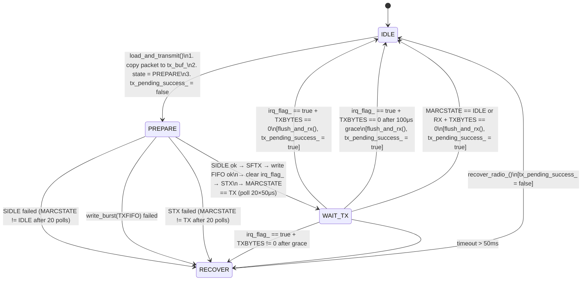

# State Machine Documentation

This document describes the state machines in esphome-elero. Each state, transition, guard condition, and error handling path is documented to match the implementation and test cases.

---

## Overview

| State Machine | Location | States | Purpose |
|---------------|----------|--------|---------|
| Hub TX | `cc1101_driver.h` / `cc1101_driver.cpp` | 4 | Low-level CC1101 RF transmission |
| CommandSender | `command_sender.h` | 3 | Command queuing, retries, packet sequencing |

---

## 1. Hub TX State Machine

Manages the CC1101 transceiver during packet transmission. Runs entirely on Core 0 in the RF task. The `poll_tx()` method (line 76 of `cc1101_driver.cpp`) is the entry point, called by the RF task loop each iteration. It delegates to `handle_tx_state_(millis())`.

### States

| State | Value | Description |
|-------|-------|-------------|
| `IDLE` | 0 | Not transmitting, radio in RX mode |
| `PREPARE` | 1 | Synchronous pre-TX sequence: SIDLE -> poll IDLE -> SFTX -> load FIFO -> STX -> poll TX (~1ms) |
| `WAIT_TX` | 2 | Waiting for GDO0 interrupt or MARCSTATE==IDLE/RX fallback (50ms timeout) |
| `RECOVER` | 3 | Flush FIFOs -> check MARCSTATE -> reset+init if stuck -> verify radio alive |

### TxContext

```cpp
struct TxContext {
  TxState state{TxState::IDLE};
  uint32_t state_enter_time{0};

  static constexpr uint32_t STATE_TIMEOUT_MS = 50;
};
```

Two fields only: current state and the time it was entered. No defer count, no backoff tracking.

### State Diagram



### State Transition Table

| Current State | Event/Condition | Next State | Action | Error Handling |
|---------------|-----------------|------------|--------|----------------|
| `IDLE` | `load_and_transmit()` called | `PREPARE` | Copy packet to tx_buf_, set tx_pending_success_ = false | If already transmitting: return false, stay IDLE |
| `PREPARE` | MARCSTATE == IDLE (within 20 polls) | (continues) | Flush TX FIFO (SFTX), 100us settle | - |
| `PREPARE` | MARCSTATE != IDLE after 20 polls | `RECOVER` | Log warning with MARCSTATE | - |
| `PREPARE` | FIFO write succeeds | (continues) | Clear irq_flag_, send STX strobe | - |
| `PREPARE` | FIFO write fails | `RECOVER` | Log "FIFO write failed" | - |
| `PREPARE` | MARCSTATE == TX (within 20 polls) | `WAIT_TX` | Record state_enter_time | - |
| `PREPARE` | MARCSTATE != TX after 20 polls | `RECOVER` | Log "STX failed" with MARCSTATE | - |
| `WAIT_TX` | irq_flag_ == true + TXBYTES == 0 | `IDLE` | flush_and_rx(), tx_pending_success_ = true | - |
| `WAIT_TX` | irq_flag_ == true + TXBYTES > 0 | (grace) | 100us delay, re-check TXBYTES | - |
| `WAIT_TX` | TXBYTES == 0 after grace | `IDLE` | flush_and_rx(), tx_pending_success_ = true | - |
| `WAIT_TX` | TXBYTES != 0 after grace | `RECOVER` | Log "FIFO not empty after TX interrupt" | - |
| `WAIT_TX` | MARCSTATE == IDLE or RX + TXBYTES == 0 | `IDLE` | flush_and_rx(), tx_pending_success_ = true | GDO0 missed fallback |
| `WAIT_TX` | elapsed > 50ms | `RECOVER` | Log "TX timeout in WAIT_TX" | - |
| `RECOVER` | (immediate) | `IDLE` | recover_radio_(), tx_pending_success_ = false | See recovery section |

### Error Recovery: `recover_radio_()`

Called from the RECOVER state. Performs:
1. Increment `stat_tx_recover_` counter
2. Call `flush_and_rx()` (flush FIFOs, enter RX mode)
3. Read MARCSTATE — if not RX:
   - `reset()` + `init_registers()` (full chip reinit)
   - Verify radio alive by reading VERSION register
   - If VERSION == 0x00 or 0xFF: log error (radio dead)
4. Set `tx_ctx_.state = IDLE`
5. Set `tx_pending_success_ = false`

No rate limiting on chip resets. No retry counters. If flush fails, reset happens immediately.

### FIFO Recovery: `flush_and_rx()`

Called to return radio to clean RX state. Performs:
1. Force IDLE: `write_cmd(SIDLE)`
2. 100us delay (settling)
3. Clear `irq_flag_` (safe: no GDO0 edges in IDLE)
4. Flush RX FIFO: `write_cmd(SFRX)`
5. Flush TX FIFO: `write_cmd(SFTX)`
6. Enable RX: `write_cmd(SRX)`
7. Verify MARCSTATE == RX — warn if not (but caller `recover_radio_()` handles escalation)

No RX data rescue. No bounded wait for IDLE. Simplified to a fixed sequence.

### `poll_tx()` Return Values

The RF task calls `poll_tx()` each iteration after `load_and_transmit()`:

| Return | Meaning | Hub Action |
|--------|---------|------------|
| `TxPollResult::PENDING` | TX still in progress | Continue polling |
| `TxPollResult::SUCCESS` | TX completed, FIFO empty | Post `TxResult{client, true}` to tx_done_queue |
| `TxPollResult::FAILED` | TX failed or recovered | Post `TxResult{client, false}` to tx_done_queue |

### `abort_tx()`

Thin public wrapper that calls `recover_radio_()`. Used by the hub when processing REINIT_FREQ requests to cancel any in-progress TX.

### Constants

```cpp
static constexpr uint32_t STATE_TIMEOUT_MS = 50;  // Per-state timeout (WAIT_TX)
```

### MARCSTATE Values

| Value | Name | Meaning |
|-------|------|---------|
| 0x01 | IDLE | Ready for commands |
| 0x03-0x0C | (various) | Transient calibration/settling states |
| 0x0D | RX | Receiving packet |
| 0x0E | RX_END | End of received packet |
| 0x0F | RX_RST | RX FIFO reset |
| 0x12 | FSTXON | Fast TX ready |
| 0x13 | TX | Transmitting |
| 0x14 | TX_END | End of transmitted packet |
| 0x11 | RXFIFO_OFLOW | RX FIFO overflow |
| 0x16 | TXFIFO_UFLOW | TX FIFO underflow |
| 0x00 | SLEEP | Sleep mode (suspicious during active TX) |
| 0x1F | - | SPI failure indicator |

---

## 2. CommandSender State Machine

Manages command queuing, multi-packet transmission, and retry logic. One instance per device (embedded in the `Device` struct via `CommandSender sender`).

### States

| State | Value | Description |
|-------|-------|-------------|
| `IDLE` | 0 | No pending commands |
| `WAIT_DELAY` | 1 | Waiting for inter-packet delay (10ms base, exponential on retry) |
| `TX_PENDING` | 2 | Waiting for hub TX completion callback |

### State Diagram


### State Transition Table

| Current State | Event/Condition | Next State | Action |
|---------------|-----------------|------------|--------|
| `IDLE` | `enqueue()` called | `WAIT_DELAY` | Add command to queue (collapse duplicates) |
| `IDLE` | `process_queue()` && queue empty | `IDLE` | Return immediately |
| `WAIT_DELAY` | elapsed < required delay | `WAIT_DELAY` | Return (waiting) |
| `WAIT_DELAY` | queue empty | `IDLE` | Clear cancelled_ flag |
| `WAIT_DELAY` | delay elapsed && `request_tx()` succeeds | `TX_PENDING` | Record tx_start_time_ |
| `WAIT_DELAY` | delay elapsed && `request_tx()` fails | `WAIT_DELAY` | Radio busy, retry next loop |
| `TX_PENDING` | `on_tx_complete(true)` && send_packets < 3 | `WAIT_DELAY` | Increment send_packets_ |
| `TX_PENDING` | `on_tx_complete(true)` && send_packets == 3 | -> `advance_queue_()` | Reset counters, pop queue |
| `TX_PENDING` | `on_tx_complete(false)` && retries < 3 | `WAIT_DELAY` | Increment retries, **exponential backoff** |
| `TX_PENDING` | `on_tx_complete(false)` && retries >= 3 | -> `advance_queue_()` | Log error, drop command |
| `TX_PENDING` | cancelled_ == true | `IDLE` | Clear cancelled_, reset counters |
| `TX_PENDING` | timeout (500ms) && retries < 3 | `WAIT_DELAY` | Increment retries, **exponential backoff** |
| `TX_PENDING` | timeout (500ms) && retries >= 3 | -> `advance_queue_()` | Log error, drop command |
| `TX_PENDING` | stale callback (state != TX_PENDING) | (ignored) | Return immediately |

### Command Collapsing (`enqueue`)

Duplicate consecutive commands (same `cmd` AND `type`) are collapsed to prevent queue saturation from button mashing:

```cpp
[[nodiscard]] bool enqueue(uint8_t cmd_byte,
                           uint8_t packets = packet::button::PACKETS,   // 3
                           uint8_t type = packet::msg_type::BUTTON) {   // 0x44
  // Collapse consecutive duplicates (same cmd AND type)
  if (!command_queue_.empty() &&
      command_queue_.back().cmd == cmd_byte &&
      command_queue_.back().type == type) {
    return true;
  }
  if (command_queue_.size() >= packet::limits::MAX_COMMAND_QUEUE) {
    return false;
  }
  command_queue_.push({cmd_byte, packets, type});
  // ...
}
```

The `type` parameter controls which packet builder the hub uses: `0x44` (BUTTON) for press/release dimming, `0x6a` (COMMAND) for targeted commands. This also affects `type2` and `hop` fields set in `process_queue()`.

### Exponential Backoff on Retry

On TX failure or timeout, delay scales exponentially from the 10ms base:

```cpp
// backoff = 10ms << retries, capped at 400ms
// Retry 1: 20ms
// Retry 2: 40ms
// Retry 3: 80ms
uint8_t shift = (send_retries_ < 4) ? send_retries_ : 3;
uint32_t backoff_ms = packet::button::INTER_PACKET_MS << shift;  // 10 << shift
if (backoff_ms > packet::timing::MAX_BACKOFF_MS) backoff_ms = packet::timing::MAX_BACKOFF_MS;  // 400
```

The backoff is applied by adjusting `last_tx_time_` forward: `last_tx_time_ = now + backoff_ms - INTER_PACKET_MS`, so the standard inter-packet delay check in WAIT_DELAY naturally enforces the full backoff period.

### `advance_queue_()` Helper

Called when a command completes (success or max retries). Performs:
1. Pop command from queue (if not empty)
2. Reset `send_packets_ = 0`
3. Reset `send_retries_ = 0`
4. Increment message counter (wraps 255 -> 1, skips 0)
5. Set state to `IDLE` if queue empty, else `WAIT_DELAY`

### `clear_queue()` Operation

Called to cancel all pending commands (e.g., STOP supersedes movement):
1. Clear queue
2. Reset `send_packets_ = 0`
3. Reset `send_retries_ = 0`
4. Reset `last_tx_time_ = 0`
5. If state == `TX_PENDING`: set `cancelled_ = true` (TX in flight, can't abort from Core 1)
6. Else: set state = `IDLE`

### Constants

```cpp
// From command_sender.h — references packet constants in elero_packet.h
TX_PENDING_TIMEOUT_MS = packet::timing::TX_PENDING_TIMEOUT  // 500ms — watchdog for hub callback

// From elero_packet.h — actual values used by CommandSender
packet::button::PACKETS = 3            // Packets per button command (enqueue default)
packet::button::INTER_PACKET_MS = 10   // Inter-packet delay (ms), base for backoff
packet::limits::SEND_RETRIES = 3       // Max retry attempts
packet::limits::MAX_COMMAND_QUEUE = 10  // Queue overflow protection
packet::timing::MAX_BACKOFF_MS = 400    // Max single backoff delay (ms)
```

**Note:** The constants `packet::limits::SEND_PACKETS = 2` and `packet::timing::DELAY_SEND_PACKETS = 50` exist in `elero_packet.h` but are NOT used by CommandSender's active code path. CommandSender defaults to `packet::button::PACKETS = 3` and uses `packet::button::INTER_PACKET_MS = 10` for both the inter-packet delay check and the backoff base.

---

## 3. Edge Cases and Error Handling

### Hub TX Edge Cases

| Edge Case | Handling | Recovery |
|-----------|----------|----------|
| TX requested while busy | `load_and_transmit()` returns false | CommandSender retries next loop |
| GDO0 interrupt never fires | MARCSTATE polling fallback in WAIT_TX | If MARCSTATE==IDLE/RX + TXBYTES==0: success |
| GDO0 fired but FIFO not empty | 100us grace period, re-check | If still not empty: RECOVER |
| SIDLE timeout (20 polls) | PREPARE -> RECOVER | recover_radio_() |
| STX did not reach TX state | PREPARE -> RECOVER | recover_radio_() |
| FIFO write failure | PREPARE -> RECOVER | recover_radio_() |
| 50ms timeout in WAIT_TX | WAIT_TX -> RECOVER | recover_radio_() |
| Radio not in RX after flush | recover_radio_() escalates | Full reset() + init_registers() |
| SPI dead (VERSION 0x00/0xFF) | Logged after reset attempt | No further escalation |

### CommandSender Edge Cases

| Edge Case | Handling | Test |
|-----------|----------|------|
| Queue full (10 commands) | `enqueue()` returns false | `EnqueueRejectsWhenFull` |
| Duplicate consecutive command | Collapsed (skip enqueue) | `CollapsesDuplicateCommands` |
| Radio busy | Stay in WAIT_DELAY, retry next loop | `RetriesWhenRadioBusy` |
| TX failure | Retry with exponential backoff | `ExponentialBackoffOnRetry` |
| Max retries exceeded | Drop command, advance queue | `DropsCommandAfterMaxRetries` |
| Cancel during TX | Set cancelled_, ignore callback | `ClearQueueDuringTx` |
| Cancel + timeout race | Empty queue check in WAIT_DELAY | `ClearQueueDuringTx_TimeoutRecovery` |
| Stale callback after timeout | State guard rejects | `StaleCallbackAfterTimeoutIsIgnored` |
| Hub never calls back | 500ms timeout watchdog | `TimeoutInTxPending_TriggersRetry` |
| Timeout + max retries | Drop command | `TimeoutInTxPending_DropsAfterMaxRetries` |

---

## 4. Sequence: Normal Command Flow

Shows a single command (e.g., CMD_UP) transmitted as 3 packets with 10ms inter-packet delay.

```
CommandSender                    Hub (Elero)                    CC1101 Driver
     |                              |                              |
     |-- enqueue(CMD_UP) ---------> |                              |
     |   state = WAIT_DELAY         |                              |
     |                              |                              |
     |-- process_queue() ---------> |                              |
     |   (10ms elapsed)             |                              |
     |-- request_tx() ------------> |                              |
     |   state = TX_PENDING         |-- load_and_transmit() -----> |
     |                              |   (copies packet to tx_buf_)  |
     |                              |                              |
     |                              |-- poll_tx() --------------> |
     |                              |   state = PREPARE            |
     |                              |                              |
     |                              |   SIDLE → poll 20×50μs      |
     |                              |<-- MARCSTATE_IDLE ---------- |
     |                              |   SFTX → 100μs settle       |
     |                              |   write TXFIFO              |
     |                              |   clear irq_flag_ → STX    |
     |                              |   poll 20×50μs              |
     |                              |<-- MARCSTATE_TX ------------ |
     |                              |   state = WAIT_TX            |
     |                              |                              |
     |                              |-- poll_tx() --------------> |
     |                              |<-- irq_flag_ == true ------- |
     |                              |   TXBYTES == 0               |
     |                              |   flush_and_rx()             |
     |                              |   state = IDLE               |
     |                              |   tx_pending_success_ = true |
     |                              |                              |
     |                              |<-- poll_tx() returns SUCCESS |
     |                              |-- post TxResult{true} -----> tx_done_queue
     |                              |                              |
     |<-- on_tx_complete(true) ---- |                              |
     |   send_packets = 1           |                              |
     |   state = WAIT_DELAY         |                              |
     |                              |                              |
     |   ... (10ms delay, repeat for packet 2) ...                 |
     |                              |                              |
     |<-- on_tx_complete(true) ---- |                              |
     |   send_packets = 2           |                              |
     |   state = WAIT_DELAY         |                              |
     |                              |                              |
     |   ... (10ms delay, repeat for packet 3) ...                 |
     |                              |                              |
     |<-- on_tx_complete(true) ---- |                              |
     |   send_packets = 3           |                              |
     |   advance_queue_()           |                              |
     |   counter++                  |                              |
     |   state = IDLE               |                              |
```

---

## 5. Test Coverage Matrix

### CommandSender Tests

| Test Name | States Covered | Transitions Tested |
|-----------|----------------|-------------------|
| `InitialState` | IDLE | - |
| `EnqueueTransitionsToWaitDelay` | IDLE -> WAIT_DELAY | enqueue |
| `EnqueueRejectsWhenFull` | WAIT_DELAY | queue overflow |
| `CollapsesDuplicateCommands` | IDLE/WAIT_DELAY | duplicate collapse |
| `WaitsForDelayBeforeTx` | WAIT_DELAY | delay not elapsed |
| `SendsMultiplePacketsPerCommand` | WAIT_DELAY -> TX_PENDING -> WAIT_DELAY | full command cycle |
| `RetriesOnFailure` | TX_PENDING -> WAIT_DELAY | failure retry |
| `ExponentialBackoffOnRetry` | TX_PENDING -> WAIT_DELAY | backoff timing |
| `DropsCommandAfterMaxRetries` | TX_PENDING -> IDLE | max retries |
| `ClearQueueWhileIdle` | IDLE | clear_queue |
| `ClearQueueDuringTx` | TX_PENDING -> IDLE | cancel + callback |
| `ClearQueueDuringTx_FailureIgnored` | TX_PENDING -> IDLE | cancel + failure |
| `ClearQueueDuringTx_TimeoutRecovery` | TX_PENDING -> WAIT_DELAY -> IDLE | cancel + timeout + empty queue |
| `RetriesWhenRadioBusy` | WAIT_DELAY | request_tx fails |
| `TimeoutInTxPending_TriggersRetry` | TX_PENDING -> WAIT_DELAY | timeout watchdog |
| `TimeoutInTxPending_DropsAfterMaxRetries` | TX_PENDING -> IDLE | timeout + max retries |
| `NoTimeoutIfCallbackArrives` | TX_PENDING -> WAIT_DELAY | normal callback |
| `StaleCallbackAfterTimeoutIsIgnored` | TX_PENDING -> WAIT_DELAY | stale callback guard |
| `ProcessesMultipleCommandsInOrder` | full cycle | queue ordering |
| `CounterIncrementsAfterCommand` | full cycle | counter logic |
| `CounterWrapsFrom255To1` | full cycle | counter wrap |
| `PartialCompletion_Packet1Success_Packet2Failure` | TX_PENDING | mixed results |
| `QueueAllTenCommands` | WAIT_DELAY | queue capacity |

### Hub TX Tests

Tested via integration (firmware compile + manual hardware test). The `RadioDriver` interface (`radio_driver.h`) enables future unit testing via a mock driver.

---

## 6. Implementation References

| Component | File | Description |
|-----------|------|-------------|
| TxState enum | `cc1101_driver.h:38-43` | 4-state TX state machine |
| TxContext struct | `cc1101_driver.h:45-50` | TX context (state + enter time) |
| RadioDriver interface | `radio_driver.h` | Abstract driver interface (TxPollResult, RadioHealth) |
| load_and_transmit() | `cc1101_driver.cpp:56-74` | TX request, packet copy, start PREPARE |
| poll_tx() | `cc1101_driver.cpp:76-87` | Entry point: calls handle_tx_state_() |
| handle_tx_state_() | `cc1101_driver.cpp:252-383` | TX state machine driver (PREPARE/WAIT_TX/RECOVER) |
| recover_radio_() | `cc1101_driver.cpp:385-411` | Error recovery (flush, reset, verify) |
| abort_tx() | `cc1101_driver.cpp:89-91` | Public wrapper for recover_radio_() |
| flush_and_rx() | `cc1101_driver.cpp:415-440` | FIFO recovery (SIDLE, flush, SRX) |
| CommandSender::State | `command_sender.h:24-28` | Sender states (IDLE/WAIT_DELAY/TX_PENDING) |
| CommandSender::process_queue() | `command_sender.h:35-98` | Main loop driver |
| CommandSender::on_tx_complete() | `command_sender.h:100-149` | Callback with backoff |
| CommandSender::enqueue() | `command_sender.h:160-179` | Queue with duplicate collapse |
| CommandSender::advance_queue_() | `command_sender.h:208-216` | Queue advancement |
| CommandSender::clear_queue() | `command_sender.h:181-192` | Cancellation |
| CommandSender::calculate_backoff_ms_() | `command_sender.h:202-206` | Exponential backoff (10ms base) |
