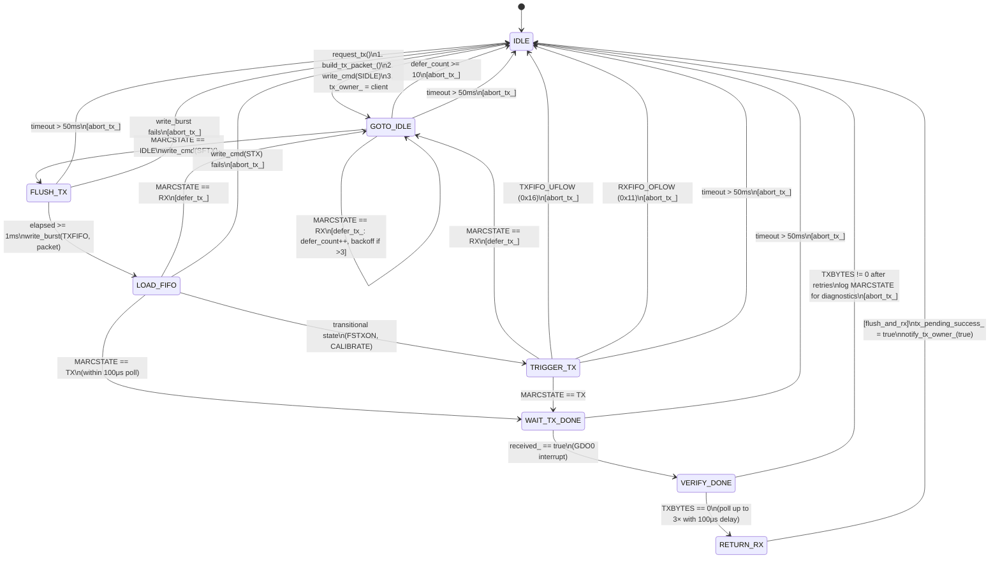
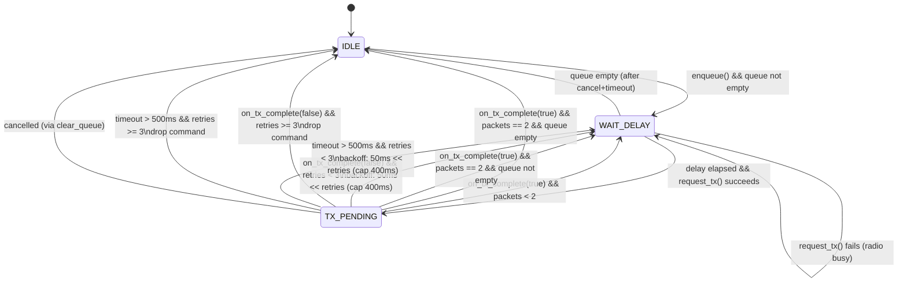

# State Machine Documentation

This document describes the state machines in esphome-elero. Each state, transition, guard condition, and error handling path is documented to match the implementation and test cases.

---

## Overview

| State Machine | Location | States | Purpose |
|---------------|----------|--------|---------|
| Hub TX | `elero.cpp` | 8 | Low-level CC1101 RF transmission |
| CommandSender | `command_sender.h` | 3 | Command queuing, retries, packet sequencing |

---

## 1. Hub TX State Machine

Manages the CC1101 transceiver during packet transmission. Non-blocking, driven by `loop()`.

### States

| State | Value | Description |
|-------|-------|-------------|
| `IDLE` | 0 | Not transmitting, radio in RX mode |
| `GOTO_IDLE` | 1 | Sent SIDLE strobe, waiting for MARCSTATE_IDLE |
| `FLUSH_TX` | 2 | Sent SFTX strobe, brief settling time |
| `LOAD_FIFO` | 3 | Loading packet into TX FIFO |
| `TRIGGER_TX` | 4 | Sent STX strobe, waiting for MARCSTATE_TX |
| `WAIT_TX_DONE` | 5 | TX in progress, waiting for GDO0 interrupt |
| `VERIFY_DONE` | 6 | Polling TXBYTES (up to 3 retries) |
| `RETURN_RX` | 7 | Returning to RX mode |

### State Diagram



### State Transition Table

| Current State | Event/Condition | Next State | Action | Error Handling |
|---------------|-----------------|------------|--------|----------------|
| `IDLE` | `request_tx()` called | `GOTO_IDLE` | Send SIDLE strobe, record owner | If SIDLE fails: abort, stay IDLE |
| `GOTO_IDLE` | `now < backoff_until` | `GOTO_IDLE` | Wait (defer backoff active) | - |
| `GOTO_IDLE` | `defer_count >= 10` | `IDLE` | Log "channel busy" | `abort_tx_()` |
| `GOTO_IDLE` | MARCSTATE == IDLE | `FLUSH_TX` | Send SFTX strobe | - |
| `GOTO_IDLE` | MARCSTATE == RX | `GOTO_IDLE` | `defer_tx_()`: increment defer, apply backoff if >3 | - |
| `GOTO_IDLE` | elapsed > 50ms | `IDLE` | Log error | `abort_tx_()` |
| `FLUSH_TX` | elapsed > 50ms | `IDLE` | Log error | `abort_tx_()` |
| `FLUSH_TX` | elapsed >= 1ms | `LOAD_FIFO` | Write packet to TXFIFO | If write_burst fails: `abort_tx_()` |
| `LOAD_FIFO` | MARCSTATE == TX (poll) | `WAIT_TX_DONE` | - | - |
| `LOAD_FIFO` | MARCSTATE == RX | `GOTO_IDLE` | `defer_tx_()` | - |
| `LOAD_FIFO` | transitional state | `TRIGGER_TX` | Continue via state machine | - |
| `TRIGGER_TX` | MARCSTATE == TX | `WAIT_TX_DONE` | - | - |
| `TRIGGER_TX` | MARCSTATE == RX | `GOTO_IDLE` | `defer_tx_()` | - |
| `TRIGGER_TX` | MARCSTATE == TXFIFO_UFLOW | `IDLE` | Log "TX FIFO underflow" | `abort_tx_()` |
| `TRIGGER_TX` | MARCSTATE == RXFIFO_OFLOW | `IDLE` | Log "RX FIFO overflow" | `abort_tx_()` |
| `TRIGGER_TX` | elapsed > 50ms | `IDLE` | Log timeout with MARCSTATE | `abort_tx_()` |
| `WAIT_TX_DONE` | received_ == true (GDO0) | `VERIFY_DONE` | - | - |
| `WAIT_TX_DONE` | elapsed > 50ms | `IDLE` | Log timeout | `abort_tx_()` |
| `VERIFY_DONE` | TXBYTES == 0 (poll 3×100μs) | `RETURN_RX` | - | - |
| `VERIFY_DONE` | TXBYTES != 0 after retries | `IDLE` | Log MARCSTATE + TXBYTES | `abort_tx_()` |
| `RETURN_RX` | (immediate) | `IDLE` | `flush_and_rx()`, notify owner(true) | - |

### Defer Mechanism (`defer_tx_`)

Called when MARCSTATE == RX during TX setup (radio received a packet instead of transmitting).

```cpp
void defer_tx_(uint32_t now) {
  defer_count++;

  if (defer_count > DEFER_BACKOFF_THRESHOLD) {  // 3
    // Random backoff: scale with defer count (exponential-ish)
    uint32_t backoff_ms = (random % BACKOFF_MAX_MS) + 1;  // 1-50ms
    backoff_ms *= (defer_count - DEFER_BACKOFF_THRESHOLD);
    backoff_ms = min(backoff_ms, 150);  // Cap at 150ms
    backoff_until = now + backoff_ms;
  }

  write_cmd(SIDLE);
  state = GOTO_IDLE;
}
```

### Error Recovery: `abort_tx_()`

Called on any error condition. Performs:
1. Log warning with current state and MARCSTATE
2. **Zombie state detection**: If MARCSTATE == 0x00 or 0x1F:
   - Retry read 2× to filter transient SPI noise
   - If confirmed: rate-limited chip reset (max 1 per 10s)
3. Set `tx_ctx_.state = IDLE`
4. Reset `tx_ctx_` (defer_count, backoff_until)
5. Set `tx_pending_success_ = false`
6. Call `flush_and_rx()` (flush FIFOs, enter RX mode)
7. Call `notify_tx_owner_(false)` (callback to CommandSender)

### FIFO Recovery: `flush_and_rx()`

Called to return radio to clean RX state. Performs:
1. **Rescue valid RX data** (if RXBYTES > 0 and no overflow):
   - Read FIFO, process packet via `interpret_msg()`
2. Force IDLE: `write_cmd(SIDLE)`
3. **Bounded wait for IDLE** (max 50ms, log on timeout)
4. **Clear `received_` flag** (safe: no GDO0 edges in IDLE)
5. Flush RX FIFO: `write_cmd(SFRX)`
6. Flush TX FIFO: `write_cmd(SFTX)`
7. Enable RX: `write_cmd(SRX)`

### Constants

```cpp
static constexpr uint32_t STATE_TIMEOUT_MS = 50;        // Per-state timeout
static constexpr uint8_t DEFER_BACKOFF_THRESHOLD = 3;   // Defers before backoff
static constexpr uint8_t DEFER_MAX = 10;                // Abort after N defers
static constexpr uint32_t BACKOFF_MAX_MS = 50;          // Max single backoff
```

### MARCSTATE Values

| Value | Name | Meaning |
|-------|------|---------|
| 0x01 | IDLE | Ready for commands |
| 0x08 | CALIBRATE | Frequency calibration |
| 0x0D | RX | Receiving packet |
| 0x12 | FSTXON | Fast TX ready |
| 0x13 | TX | Transmitting |
| 0x11 | RXFIFO_OFLOW | RX FIFO overflow |
| 0x16 | TXFIFO_UFLOW | TX FIFO underflow |
| 0x00 | SLEEP | Sleep mode (suspicious during active TX) |
| 0x1F | - | SPI failure indicator |

---

## 2. CommandSender State Machine

Manages command queuing, multi-packet transmission, and retry logic. One instance per cover/light.

### States

| State | Value | Description |
|-------|-------|-------------|
| `IDLE` | 0 | No pending commands |
| `WAIT_DELAY` | 1 | Waiting for inter-packet delay (50ms base, exponential on retry) |
| `TX_PENDING` | 2 | Waiting for hub TX completion callback |

### State Diagram



### State Transition Table

| Current State | Event/Condition | Next State | Action |
|---------------|-----------------|------------|--------|
| `IDLE` | `enqueue()` called | `WAIT_DELAY` | Add command to queue (collapse duplicates) |
| `IDLE` | `process_queue()` && queue empty | `IDLE` | Return immediately |
| `WAIT_DELAY` | elapsed < required delay | `WAIT_DELAY` | Return (waiting) |
| `WAIT_DELAY` | queue empty | `IDLE` | Clear cancelled_ flag |
| `WAIT_DELAY` | delay elapsed && `request_tx()` succeeds | `TX_PENDING` | Record tx_start_time_ |
| `WAIT_DELAY` | delay elapsed && `request_tx()` fails | `WAIT_DELAY` | Radio busy, retry next loop |
| `TX_PENDING` | `on_tx_complete(true)` && send_packets < 2 | `WAIT_DELAY` | Increment send_packets_ |
| `TX_PENDING` | `on_tx_complete(true)` && send_packets == 2 | → `advance_queue_()` | Reset counters, pop queue |
| `TX_PENDING` | `on_tx_complete(false)` && retries < 3 | `WAIT_DELAY` | Increment retries, **exponential backoff** |
| `TX_PENDING` | `on_tx_complete(false)` && retries >= 3 | → `advance_queue_()` | Log error, drop command |
| `TX_PENDING` | cancelled_ == true | `IDLE` | Clear cancelled_, reset counters |
| `TX_PENDING` | timeout (500ms) && retries < 3 | `WAIT_DELAY` | Increment retries, **exponential backoff** |
| `TX_PENDING` | timeout (500ms) && retries >= 3 | → `advance_queue_()` | Log error, drop command |
| `TX_PENDING` | stale callback (state != TX_PENDING) | (ignored) | Return immediately |

### Command Collapsing (`enqueue`)

Duplicate consecutive commands are collapsed to prevent queue saturation from button mashing:

```cpp
// packets defaults to SEND_PACKETS (2). Movement polls use 1 for less TX load.
bool enqueue(uint8_t cmd_byte, uint8_t packets = SEND_PACKETS) {
  // Collapse duplicate consecutive commands
  if (!command_queue_.empty() && command_queue_.back().cmd == cmd_byte) {
    return true;  // Already queued, skip duplicate
  }
  if (command_queue_.size() >= MAX_COMMAND_QUEUE) {
    return false;
  }
  command_queue_.push({cmd_byte, packets});
  // ...
}
```

### Exponential Backoff on Retry

On TX failure or timeout, delay scales exponentially:

```cpp
// backoff = 50ms << retries, capped at 400ms
// Retry 1: 100ms
// Retry 2: 200ms
// Retry 3: 400ms
uint8_t shift = (send_retries_ < 4) ? send_retries_ : 3;
uint32_t backoff_ms = DELAY_SEND_PACKETS << shift;
if (backoff_ms > 400) backoff_ms = 400;
```

This improves 868MHz duty cycle compliance under persistent interference.

### `advance_queue_()` Helper

Called when a command completes (success or max retries). Performs:
1. Pop command from queue (if not empty)
2. Reset `send_packets_ = 0`
3. Reset `send_retries_ = 0`
4. Increment message counter (wraps 255 → 1)
5. Set state to `IDLE` if queue empty, else `WAIT_DELAY`

### `clear_queue()` Operation

Called to cancel all pending commands (e.g., STOP supersedes movement):
1. Clear queue
2. Reset `send_packets_ = 0`
3. Reset `send_retries_ = 0`
4. If state == `TX_PENDING`: set `cancelled_ = true` (TX in flight, can't abort)
5. Else: set state = `IDLE`

### Constants

```cpp
static constexpr uint32_t TX_PENDING_TIMEOUT_MS = 500;  // Watchdog for hub callback
static constexpr uint8_t SEND_PACKETS = 2;              // Packets per command
static constexpr uint8_t SEND_RETRIES = 3;              // Max retry attempts
static constexpr uint32_t DELAY_SEND_PACKETS = 50;      // Base inter-packet delay (ms)
static constexpr uint8_t MAX_COMMAND_QUEUE = 10;        // Queue overflow protection
```

---

## 3. Edge Cases and Error Handling

### Hub TX Edge Cases

| Edge Case | Handling | Recovery |
|-----------|----------|----------|
| TX requested while busy | `request_tx()` returns false | CommandSender retries |
| GDO0 interrupt never fires | 50ms timeout in WAIT_TX_DONE | `abort_tx_()` |
| TXFIFO underflow | Explicit MARCSTATE check | `abort_tx_()` |
| RXFIFO overflow during TX | Explicit MARCSTATE check | `abort_tx_()` |
| SPI write failure | Return value checked | `abort_tx_()` |
| Radio in RX during TX setup | Defer mechanism (up to 10×) | Backoff + retry |
| Zombie state (MARCSTATE 0x00/0x1F) | Retry read + rate-limited reset | Chip reinit |
| TXBYTES not empty after GDO0 | Poll 3× with 100μs delay | `abort_tx_()` |
| `flush_and_rx` wait_idle timeout | Bounded 50ms wait | Continue best-effort |

### CommandSender Edge Cases

| Edge Case | Handling | Test |
|-----------|----------|------|
| Queue full (10 commands) | `enqueue()` returns false | `EnqueueRejectsWhenFull` |
| Duplicate consecutive command | Collapsed (skip enqueue) | `CollapsesDuplicateCommands` |
| Radio busy | Stay in WAIT_DELAY, retry next loop | `RetriesWhenRadioBusy` |
| TX failure | Retry with exponential backoff | `ExponentialBackoffOnRetry` |
| Max retries exceeded | Drop command, advance queue | `DropsCommandAfterMaxRetries` |
| Cancel during TX | Set cancelled_, ignore callback | `ClearQueueDuringTx` |
| Cancel + timeout race | Empty queue check in WAIT_DELAY | `ClearQueueDuringTx_TimeoutRecovery` |
| Stale callback after timeout | State guard rejects | `StaleCallbackAfterTimeoutIsIgnored` |
| Hub never calls back | 500ms timeout watchdog | `TimeoutInTxPending_TriggersRetry` |
| Timeout + max retries | Drop command | `TimeoutInTxPending_DropsAfterMaxRetries` |

---

## 4. Sequence: Normal Command Flow

```
CommandSender                    Hub (Elero)                    CC1101
     |                              |                              |
     |-- enqueue(CMD_UP) ---------> |                              |
     |   state = WAIT_DELAY         |                              |
     |                              |                              |
     |-- process_queue() ---------> |                              |
     |   (50ms elapsed)             |                              |
     |-- request_tx() ------------> |                              |
     |   state = TX_PENDING         |-- SIDLE ------------------> |
     |                              |   state = GOTO_IDLE          |
     |                              |<-- MARCSTATE_IDLE ---------- |
     |                              |-- SFTX -------------------> |
     |                              |   state = FLUSH_TX           |
     |                              |   (1ms settling)             |
     |                              |-- write TXFIFO -----------> |
     |                              |   state = LOAD_FIFO          |
     |                              |-- SIDLE + STX ------------> |
     |                              |   (poll 20×5μs)              |
     |                              |<-- MARCSTATE_TX ------------ |
     |                              |   state = WAIT_TX_DONE       |
     |                              |                              |
     |                              |<-- GDO0 interrupt ---------- |
     |                              |   state = VERIFY_DONE        |
     |                              |<-- TXBYTES == 0 (poll 3×) -- |
     |                              |   state = RETURN_RX          |
     |                              |-- flush_and_rx() ----------> |
     |                              |   SIDLE, wait, clear flag    |
     |                              |   SFRX, SFTX, SRX            |
     |                              |   state = IDLE               |
     |<-- on_tx_complete(true) ---- |                              |
     |   send_packets = 1           |                              |
     |   state = WAIT_DELAY         |                              |
     |                              |                              |
     |   ... (repeat for packet 2) ...                             |
     |                              |                              |
     |<-- on_tx_complete(true) ---- |                              |
     |   send_packets = 2           |                              |
     |   advance_queue_()           |                              |
     |   state = IDLE               |                              |
```

---

## 5. Test Coverage Matrix

### CommandSender Tests

| Test Name | States Covered | Transitions Tested |
|-----------|----------------|-------------------|
| `InitialState` | IDLE | - |
| `EnqueueTransitionsToWaitDelay` | IDLE → WAIT_DELAY | enqueue |
| `EnqueueRejectsWhenFull` | WAIT_DELAY | queue overflow |
| `CollapsesDuplicateCommands` | IDLE/WAIT_DELAY | duplicate collapse |
| `WaitsForDelayBeforeTx` | WAIT_DELAY | delay not elapsed |
| `SendsMultiplePacketsPerCommand` | WAIT_DELAY → TX_PENDING → WAIT_DELAY | full command cycle |
| `RetriesOnFailure` | TX_PENDING → WAIT_DELAY | failure retry |
| `ExponentialBackoffOnRetry` | TX_PENDING → WAIT_DELAY | backoff timing |
| `DropsCommandAfterMaxRetries` | TX_PENDING → IDLE | max retries |
| `ClearQueueWhileIdle` | IDLE | clear_queue |
| `ClearQueueDuringTx` | TX_PENDING → IDLE | cancel + callback |
| `ClearQueueDuringTx_FailureIgnored` | TX_PENDING → IDLE | cancel + failure |
| `ClearQueueDuringTx_TimeoutRecovery` | TX_PENDING → WAIT_DELAY → IDLE | cancel + timeout + empty queue |
| `RetriesWhenRadioBusy` | WAIT_DELAY | request_tx fails |
| `TimeoutInTxPending_TriggersRetry` | TX_PENDING → WAIT_DELAY | timeout watchdog |
| `TimeoutInTxPending_DropsAfterMaxRetries` | TX_PENDING → IDLE | timeout + max retries |
| `NoTimeoutIfCallbackArrives` | TX_PENDING → WAIT_DELAY | normal callback |
| `StaleCallbackAfterTimeoutIsIgnored` | TX_PENDING → WAIT_DELAY | stale callback guard |
| `ProcessesMultipleCommandsInOrder` | full cycle | queue ordering |
| `CounterIncrementsAfterCommand` | full cycle | counter logic |
| `CounterWrapsFrom255To1` | full cycle | counter wrap |
| `PartialCompletion_Packet1Success_Packet2Failure` | TX_PENDING | mixed results |
| `QueueAllTenCommands` | WAIT_DELAY | queue capacity |

### Hub TX Tests

Tested via integration (firmware compile + manual hardware test). Unit testing requires CC1101 hardware abstraction.

---

## 6. Implementation References

| Component | File | Description |
|-----------|------|-------------|
| TxState enum | `elero.h:36-45` | TX state machine states |
| TxContext struct | `elero.h:47-62` | TX context with defer/backoff |
| handle_tx_state_() | `elero.cpp` | TX state machine driver |
| defer_tx_() | `elero.cpp` | Defer with exponential backoff |
| abort_tx_() | `elero.cpp` | Error recovery with zombie detection |
| flush_and_rx() | `elero.cpp` | FIFO recovery with bounded wait |
| request_tx() | `elero.cpp` | TX request API |
| CommandSender::State | `command_sender.h:36-40` | Sender states |
| CommandSender::process_queue() | `command_sender.h` | Main loop driver |
| CommandSender::on_tx_complete() | `command_sender.h` | Callback with backoff |
| CommandSender::enqueue() | `command_sender.h` | Queue with duplicate collapse |
| CommandSender::advance_queue_() | `command_sender.h` | Queue advancement |
| CommandSender::clear_queue() | `command_sender.h` | Cancellation |
