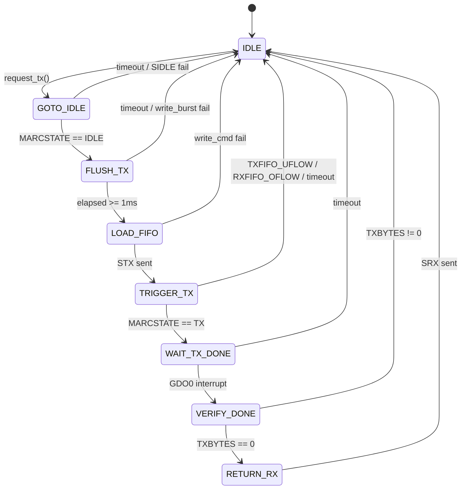
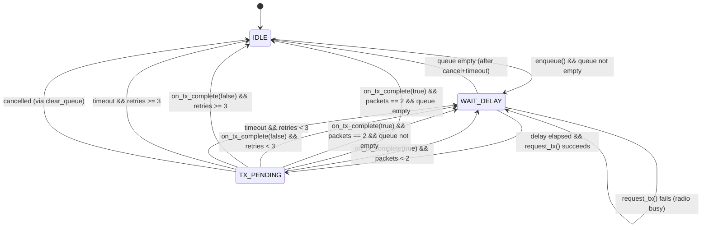

# State Machine Documentation

This document describes the state machines in esphome-elero. Each state, transition, guard condition, and error handling path is documented to match the implementation and test cases.

---

## Overview

| State Machine | Location | States | Purpose |
|---------------|----------|--------|---------|
| Hub TX | `elero.cpp` | 8 | Low-level CC1101 RF transmission |
| CommandSender | `command_sender.h` | 3 | Command queuing, retries, packet sequencing |

---

## 1. Hub TX State Machine

Manages the CC1101 transceiver during packet transmission. Non-blocking, driven by `loop()`.

### States

| State | Value | Description |
|-------|-------|-------------|
| `IDLE` | 0 | Not transmitting, radio in RX mode |
| `GOTO_IDLE` | 1 | Sent SIDLE strobe, waiting for MARCSTATE_IDLE |
| `FLUSH_TX` | 2 | Sent SFTX strobe, brief settling time |
| `LOAD_FIFO` | 3 | Loading packet into TX FIFO |
| `TRIGGER_TX` | 4 | Sent STX strobe, waiting for MARCSTATE_TX |
| `WAIT_TX_DONE` | 5 | TX in progress, waiting for GDO0 interrupt |
| `VERIFY_DONE` | 6 | Checking TXBYTES == 0 |
| `RETURN_RX` | 7 | Returning to RX mode |

### State Diagram



### State Transition Table

| Current State | Event/Condition | Next State | Action | Error Handling |
|---------------|-----------------|------------|--------|----------------|
| `IDLE` | `request_tx()` called | `GOTO_IDLE` | Send SIDLE strobe, record owner | If SIDLE fails: abort, stay IDLE |
| `GOTO_IDLE` | MARCSTATE == IDLE | `FLUSH_TX` | Send SFTX strobe | - |
| `GOTO_IDLE` | elapsed > 50ms | `IDLE` | Log error | `abort_tx_()`: flush FIFOs, notify owner(false) |
| `GOTO_IDLE` | SIDLE write fails | `IDLE` | Log error | `abort_tx_()` |
| `FLUSH_TX` | elapsed > 50ms | `IDLE` | Log error | `abort_tx_()` |
| `FLUSH_TX` | elapsed >= 1ms | `LOAD_FIFO` | Write packet to TXFIFO | If write_burst fails: `abort_tx_()` |
| `LOAD_FIFO` | (immediate) | `TRIGGER_TX` | Clear received_ flag, send STX | If write_cmd fails: `abort_tx_()` |
| `TRIGGER_TX` | MARCSTATE == TX | `WAIT_TX_DONE` | - | - |
| `TRIGGER_TX` | MARCSTATE == TXFIFO_UFLOW | `IDLE` | Log "TX FIFO underflow" | `abort_tx_()` |
| `TRIGGER_TX` | MARCSTATE == RXFIFO_OFLOW | `IDLE` | Log "RX FIFO overflow" | `abort_tx_()` |
| `TRIGGER_TX` | elapsed > 50ms | `IDLE` | Log timeout with MARCSTATE | `abort_tx_()` |
| `WAIT_TX_DONE` | received_ == true (GDO0) | `VERIFY_DONE` | - | - |
| `WAIT_TX_DONE` | elapsed > 50ms | `IDLE` | Log timeout | `abort_tx_()` |
| `VERIFY_DONE` | TXBYTES == 0 | `RETURN_RX` | - | - |
| `VERIFY_DONE` | TXBYTES != 0 | `IDLE` | Log error | `abort_tx_()` |
| `RETURN_RX` | (immediate) | `IDLE` | Send SRX, notify owner(true) | - |

### Error Recovery: `abort_tx_()`

Called on any error condition. Performs:
1. Log warning with current state
2. Set `tx_ctx_.state = IDLE`
3. Set `tx_pending_success_ = false`
4. Call `flush_and_rx()` (flush FIFOs, enter RX mode)
5. Call `notify_tx_owner_(false)` (callback to CommandSender)

### Timeout Constant

```cpp
static constexpr uint32_t STATE_TIMEOUT_MS = 50;
```

---

## 2. CommandSender State Machine

Manages command queuing, multi-packet transmission, and retry logic. One instance per cover/light.

### States

| State | Value | Description |
|-------|-------|-------------|
| `IDLE` | 0 | No pending commands |
| `WAIT_DELAY` | 1 | Waiting for inter-packet delay (50ms) |
| `TX_PENDING` | 2 | Waiting for hub TX completion callback |

### State Diagram



### State Transition Table

| Current State | Event/Condition | Next State | Action |
|---------------|-----------------|------------|--------|
| `IDLE` | `enqueue()` called | `WAIT_DELAY` | Add command to queue |
| `IDLE` | `process_queue()` && queue empty | `IDLE` | Return immediately |
| `WAIT_DELAY` | elapsed < 50ms | `WAIT_DELAY` | Return (waiting) |
| `WAIT_DELAY` | queue empty | `IDLE` | Clear cancelled_ flag |
| `WAIT_DELAY` | elapsed >= 50ms && `request_tx()` succeeds | `TX_PENDING` | Record tx_start_time_ |
| `WAIT_DELAY` | elapsed >= 50ms && `request_tx()` fails | `WAIT_DELAY` | Radio busy, retry next loop |
| `TX_PENDING` | `on_tx_complete(true)` && send_packets < 2 | `WAIT_DELAY` | Increment send_packets_ |
| `TX_PENDING` | `on_tx_complete(true)` && send_packets == 2 | → `advance_queue_()` | Reset counters, pop queue |
| `TX_PENDING` | `on_tx_complete(false)` && retries < 3 | `WAIT_DELAY` | Increment send_retries_ |
| `TX_PENDING` | `on_tx_complete(false)` && retries >= 3 | → `advance_queue_()` | Log error, drop command |
| `TX_PENDING` | cancelled_ == true | `IDLE` | Clear cancelled_, reset counters |
| `TX_PENDING` | timeout (500ms) && retries < 3 | `WAIT_DELAY` | Increment send_retries_, log warning |
| `TX_PENDING` | timeout (500ms) && retries >= 3 | → `advance_queue_()` | Log error, drop command |
| `TX_PENDING` | stale callback (state != TX_PENDING) | (ignored) | Return immediately |

### `advance_queue_()` Helper

Called when a command completes (success or max retries). Performs:
1. Pop command from queue (if not empty)
2. Reset `send_packets_ = 0`
3. Reset `send_retries_ = 0`
4. Increment message counter (wraps 255 → 1)
5. Set state to `IDLE` if queue empty, else `WAIT_DELAY`

### `clear_queue()` Operation

Called to cancel all pending commands (e.g., new command supersedes old):
1. Clear queue
2. Reset `send_packets_ = 0`
3. Reset `send_retries_ = 0`
4. If state == `TX_PENDING`: set `cancelled_ = true` (TX in flight, can't abort)
5. Else: set state = `IDLE`

### Constants

```cpp
static constexpr uint32_t TX_PENDING_TIMEOUT_MS = 500;  // Watchdog for hub callback
static constexpr uint8_t ELERO_SEND_PACKETS = 2;        // Packets per command
static constexpr uint8_t ELERO_SEND_RETRIES = 3;        // Max retry attempts
static constexpr uint32_t ELERO_DELAY_SEND_PACKETS = 50; // Inter-packet delay (ms)
static constexpr uint8_t ELERO_MAX_COMMAND_QUEUE = 10;  // Queue overflow protection
```

---

## 3. Edge Cases and Error Handling

### Hub TX Edge Cases

| Edge Case | Handling | Test Coverage |
|-----------|----------|---------------|
| TX requested while busy | `request_tx()` returns false | CommandSender retries |
| GDO0 interrupt never fires | 50ms timeout in WAIT_TX_DONE | `abort_tx_()` |
| TXFIFO underflow | Explicit MARCSTATE check | `abort_tx_()` |
| RXFIFO overflow during TX | Explicit MARCSTATE check | `abort_tx_()` |
| SPI write failure | Return value checked | `abort_tx_()` |
| Packet received during TX | RX processing skipped | Packet lost (half-duplex) |

### CommandSender Edge Cases

| Edge Case | Handling | Test |
|-----------|----------|------|
| Queue full (10 commands) | `enqueue()` returns false | `EnqueueRejectsWhenFull` |
| Radio busy | Stay in WAIT_DELAY, retry next loop | `RetriesWhenRadioBusy` |
| TX failure | Retry up to 3 times | `RetriesOnFailure` |
| Max retries exceeded | Drop command, advance queue | `DropsCommandAfterMaxRetries` |
| Cancel during TX | Set cancelled_, ignore callback | `ClearQueueDuringTx` |
| Cancel + timeout race | Empty queue check in WAIT_DELAY | `ClearQueueDuringTx_TimeoutRecovery` |
| Stale callback after timeout | State guard rejects | `StaleCallbackAfterTimeoutIsIgnored` |
| Hub never calls back | 500ms timeout watchdog | `TimeoutInTxPending_TriggersRetry` |
| Timeout + max retries | Drop command | `TimeoutInTxPending_DropsAfterMaxRetries` |

---

## 4. Sequence: Normal Command Flow

```
CommandSender                    Hub (Elero)                    CC1101
     |                              |                              |
     |-- enqueue(CMD_UP) ---------> |                              |
     |   state = WAIT_DELAY         |                              |
     |                              |                              |
     |-- process_queue() ---------> |                              |
     |   (50ms elapsed)             |                              |
     |-- request_tx() ------------> |                              |
     |   state = TX_PENDING         |-- SIDLE ------------------> |
     |                              |   state = GOTO_IDLE          |
     |                              |<-- MARCSTATE_IDLE ---------- |
     |                              |-- SFTX -------------------> |
     |                              |   state = FLUSH_TX           |
     |                              |   (1ms settling)             |
     |                              |-- write TXFIFO -----------> |
     |                              |   state = LOAD_FIFO          |
     |                              |-- STX --------------------> |
     |                              |   state = TRIGGER_TX         |
     |                              |<-- MARCSTATE_TX ------------ |
     |                              |   state = WAIT_TX_DONE       |
     |                              |                              |
     |                              |<-- GDO0 interrupt ---------- |
     |                              |   state = VERIFY_DONE        |
     |                              |<-- TXBYTES == 0 ------------ |
     |                              |   state = RETURN_RX          |
     |                              |-- SRX --------------------> |
     |                              |   state = IDLE               |
     |<-- on_tx_complete(true) ---- |                              |
     |   send_packets = 1           |                              |
     |   state = WAIT_DELAY         |                              |
     |                              |                              |
     |   ... (repeat for packet 2) ...                             |
     |                              |                              |
     |<-- on_tx_complete(true) ---- |                              |
     |   send_packets = 2           |                              |
     |   advance_queue_()           |                              |
     |   state = IDLE               |                              |
```

---

## 5. Test Coverage Matrix

### CommandSender Tests (21 tests)

| Test Name | States Covered | Transitions Tested |
|-----------|----------------|-------------------|
| `InitialState` | IDLE | - |
| `EnqueueTransitionsToWaitDelay` | IDLE → WAIT_DELAY | enqueue |
| `EnqueueRejectsWhenFull` | WAIT_DELAY | queue overflow |
| `WaitsForDelayBeforeTx` | WAIT_DELAY | delay not elapsed |
| `SendsMultiplePacketsPerCommand` | WAIT_DELAY → TX_PENDING → WAIT_DELAY | full command cycle |
| `RetriesOnFailure` | TX_PENDING → WAIT_DELAY | failure retry |
| `DropsCommandAfterMaxRetries` | TX_PENDING → IDLE | max retries |
| `ClearQueueWhileIdle` | IDLE | clear_queue |
| `ClearQueueDuringTx` | TX_PENDING → IDLE | cancel + callback |
| `ClearQueueDuringTx_FailureIgnored` | TX_PENDING → IDLE | cancel + failure |
| `ClearQueueDuringTx_TimeoutRecovery` | TX_PENDING → WAIT_DELAY → IDLE | cancel + timeout + empty queue |
| `RetriesWhenRadioBusy` | WAIT_DELAY | request_tx fails |
| `TimeoutInTxPending_TriggersRetry` | TX_PENDING → WAIT_DELAY | timeout watchdog |
| `TimeoutInTxPending_DropsAfterMaxRetries` | TX_PENDING → IDLE | timeout + max retries |
| `NoTimeoutIfCallbackArrives` | TX_PENDING → WAIT_DELAY | normal callback |
| `StaleCallbackAfterTimeoutIsIgnored` | TX_PENDING → WAIT_DELAY | stale callback guard |
| `ProcessesMultipleCommandsInOrder` | full cycle | queue ordering |
| `CounterIncrementsAfterCommand` | full cycle | counter logic |
| `CounterWrapsFrom255To1` | full cycle | counter wrap |
| `PartialCompletion_Packet1Success_Packet2Failure` | TX_PENDING | mixed results |
| `QueueAllTenCommands` | WAIT_DELAY | queue capacity |

### Hub TX Tests

Currently tested via integration (firmware compile + manual hardware test). Unit testing requires CC1101 hardware abstraction, which adds runtime overhead not justified for this codebase.

---

## 6. Implementation References

| Component | File | Lines |
|-----------|------|-------|
| TxState enum | `elero.h` | 111-120 |
| TxContext struct | `elero.h` | 122-129 |
| handle_tx_state_() | `elero.cpp` | 509-620 |
| abort_tx_() | `elero.cpp` | 406-414 |
| request_tx() | `elero.cpp` | 455-479 |
| CommandSender::State | `command_sender.h` | 36-40 |
| CommandSender::process_queue() | `command_sender.h` | 60-114 |
| CommandSender::on_tx_complete() | `command_sender.h` | 123-174 |
| CommandSender::advance_queue_() | `command_sender.h` | 232-248 |
| CommandSender::clear_queue() | `command_sender.h` | 199-212 |
