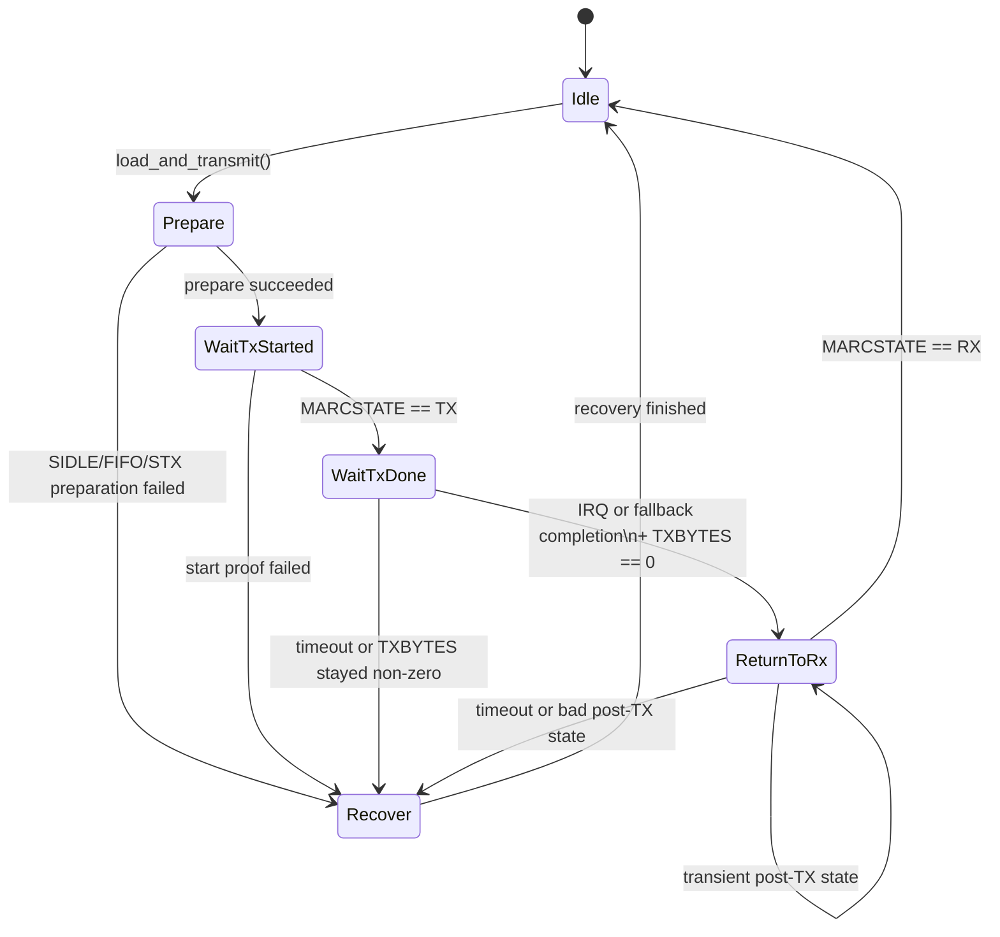
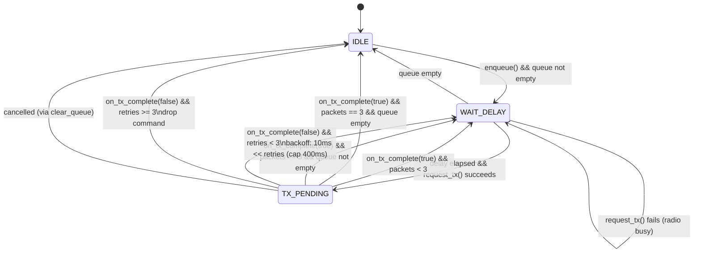

<!-- See RADIO_FRAMING.md for current shared Semtech TX sequencing and RX framing. -->
# State Machine Documentation

This document describes the state machines in esphome-elero. Each state, transition, guard condition, and error handling path is documented to match the implementation and test cases.

---

## Overview

| State Machine | Location | States | Purpose |
|---------------|----------|--------|---------|
| Hub TX | `cc1101_tx_fsm.h` / `cc1101_tx_fsm.cpp` + `cc1101_driver.cpp` | 6 | Low-level CC1101 RF transmission |
| CommandSender | `command_sender.h` | 3 | Command queuing, retries, packet sequencing |

---

## 1. Hub TX State Machine

Manages the CC1101 transmit path. Control flow lives in `Cc1101TxFsm`; hardware policy stays in `CC1101Driver`. Runs entirely on Core 0 in the RF task. The RF task calls `poll_tx()` each iteration; that delegates to `tx_fsm_.Poll(millis())` until the FSM returns to `Idle`.

### States

| State | Description |
|-------|-------------|
| `Idle` | No TX in progress. Terminal TX result is available. |
| `Prepare` | Force IDLE, flush TX FIFO, load FIFO, clear TX-done flag, issue `STX`. |
| `WaitTxStarted` | Poll for proof that the radio actually entered TX. |
| `WaitTxDone` | Wait for TX completion via IRQ or MARCSTATE fallback; success still requires `TXBYTES == 0`. |
| `ReturnToRx` | Verify post-TX state has returned to RX, preserve valid RX bytes, clean only on overflow. |
| `Recover` | Flush/recover the radio, escalating to reset/reinit after repeated failures. |

### Runtime Data

Mutable TX bookkeeping remains on `CC1101Driver`:

- `tx_fsm_`
- `tx_terminal_result_`
- `tx_state_enter_time_`
- `tx_verify_retry_count_`
- `tx_buf_` / `tx_len_`
- recovery escalation counters

### State Diagram


```mermaid
stateDiagram-v2
    [*] --> Idle

    Idle --> Prepare: load_and_transmit()
    Prepare --> WaitTxStarted: prepare succeeded
    Prepare --> Recover: SIDLE/FIFO/STX preparation failed

    WaitTxStarted --> WaitTxDone: MARCSTATE == TX
    WaitTxStarted --> Recover: start proof failed

    WaitTxDone --> ReturnToRx: IRQ or fallback completion\n+ TXBYTES == 0
    WaitTxDone --> Recover: timeout or TXBYTES stayed non-zero

    ReturnToRx --> Idle: MARCSTATE == RX
    ReturnToRx --> ReturnToRx: transient post-TX state
    ReturnToRx --> Recover: timeout or bad post-TX state

    Recover --> Idle: recovery finished
```

### State Transition Table

| Current State | Event/Condition | Next State | Action |
|---------------|-----------------|------------|--------|
| `Idle` | `load_and_transmit()` called | `Prepare` | Copy packet into `tx_buf_`, set mode `TX`, clear terminal result |
| `Prepare` | `tx_prepare_for_fsm()` succeeds | `WaitTxStarted` | `SIDLE` -> poll for `IDLE` -> `SFTX` -> write FIFO -> clear `tx_done_` -> `STX` |
| `Prepare` | `tx_prepare_for_fsm()` fails | `Recover` | Log and recover |
| `WaitTxStarted` | `tx_wait_started_for_fsm()` returns `Succeeded` | `WaitTxDone` | TX has definitely started |
| `WaitTxStarted` | `tx_wait_started_for_fsm()` returns `Failed` | `Recover` | Log and recover |
| `WaitTxDone` | IRQ path or MARCSTATE fallback proves completion and `TXBYTES == 0` | `ReturnToRx` | Strict TX success proof; switch IRQ routing back to `RX` immediately |
| `WaitTxDone` | IRQ path leaves `TXBYTES > 0`, or timeout | `Recover` | Log and recover |
| `ReturnToRx` | radio is `RX`, RX FIFO preserved or clean | `Idle` | Keep any post-TX RX bytes for normal drain, set mode `RX`, terminal result `Success` |
| `ReturnToRx` | transient MARCSTATE and timeout not elapsed | `ReturnToRx` | Wait for actual RX |
| `ReturnToRx` | timeout elapsed or bad MARCSTATE after TX | `Recover` | Log and recover |
| `Recover` | recovery complete | `Idle` | terminal result `Failed` |

### TX Completion Semantics

TX is considered successful only if all of these are true:

1. prepare succeeded
2. TX actually started
3. completion was observed by IRQ or MARCSTATE fallback
4. `TXBYTES == 0`
5. post-TX state returned to `RX`

Transient post-TX MARCSTATE values are pending states, not success. They must settle to `RX` before the bounded RX-ready timeout elapses.

### Recovery: `tx_recover_for_fsm()`

Called from the `Recover` state. Performs:
1. Increment `stat_tx_recover_`
2. Track recovery frequency in a rolling time window
3. `flush_and_rx()`
4. If MARCSTATE is still not `RX` or transient after repeated failures:
   - `reset()` + `init_registers()`
   - after too many resets in the window, mark the driver failed

### FIFO Recovery: `flush_and_rx()`

Returns the chip to a clean receive state:
1. `SIDLE`
2. clear `rx_ready_` and `tx_done_`
3. `SFRX`
4. `SFTX`
5. set mode `RX`
6. `SRX`
7. warn if MARCSTATE is neither `RX` nor transient

### `poll_tx()` Return Values

The RF task calls `poll_tx()` each iteration after `load_and_transmit()`:

| Return | Meaning | Hub Action |
|--------|---------|------------|
| `TxPollResult::PENDING` | TX still in progress | Continue polling |
| `TxPollResult::SUCCESS` | TX completed, FIFO empty | Post `TxResult{client, true}` to tx_done_queue |
| `TxPollResult::FAILED` | TX failed or recovered | Post `TxResult{client, false}` to tx_done_queue |

### `abort_tx()`

Thin public wrapper that calls `tx_fsm_.Abort(millis())`. Abort is synchronous: it routes active TX through `Recover` immediately and leaves the driver in `Idle` with terminal result `Failed`.

### Constants

```cpp
static constexpr uint8_t TX_START_PROOF_POLLS = 20;
static constexpr uint32_t TX_DONE_TIMEOUT_MS = 50;
static constexpr uint32_t RX_READY_TIMEOUT_MS = 25;
static constexpr uint32_t RECOVERY_WINDOW_MS = 60000;
static constexpr uint8_t RECOVERIES_BEFORE_RESET = 3;
static constexpr uint8_t RESETS_BEFORE_FAILED = 3;
```

### MARCSTATE Values

| Value | Name | Meaning |
|-------|------|---------|
| 0x01 | IDLE | Ready for commands |
| 0x03-0x0C | (various) | Transient calibration/settling states |
| 0x0D | RX | Receiving packet |
| 0x0E | RX_END | End of received packet (transient) |
| 0x0F | RX_RST | RX FIFO reset (transient) |
| 0x12 | FSTXON | Fast TX ready |
| 0x13 | TX | Transmitting |
| 0x14 | TX_END | End of transmitted packet (transient) |
| 0x15 | RXTX_SWITCH | TX -> RX turn-around (transient) |
| 0x11 | RXFIFO_OFLOW | RX FIFO overflow |
| 0x16 | TXFIFO_UFLOW | TX FIFO underflow |
| 0x00 | SLEEP | Sleep mode (suspicious during active TX) |
| 0x1F | - | SPI failure indicator |

---

## 2. CommandSender State Machine

Manages command queuing, multi-packet transmission, and retry logic. One instance per device (embedded in the `Device` struct via `CommandSender sender`).

### States

| State | Value | Description |
|-------|-------|-------------|
| `IDLE` | 0 | No pending commands |
| `WAIT_DELAY` | 1 | Waiting for inter-packet delay (10ms base, exponential on retry) |
| `TX_PENDING` | 2 | Waiting for hub TX completion callback |

### State Diagram


```mermaid
stateDiagram-v2
    [*] --> IDLE

    %% ─── IDLE ───────────────────────────────────────────────────────────────────
    IDLE --> WAIT_DELAY: enqueue() && queue not empty

    %% ─── WAIT_DELAY ─────────────────────────────────────────────────────────────
    WAIT_DELAY --> WAIT_DELAY: delay not elapsed
    WAIT_DELAY --> TX_PENDING: delay elapsed && request_tx() succeeds
    WAIT_DELAY --> WAIT_DELAY: request_tx() fails (radio busy)
    WAIT_DELAY --> IDLE: queue empty

    %% ─── TX_PENDING ─────────────────────────────────────────────────────────────
    %% Success paths
    TX_PENDING --> WAIT_DELAY: on_tx_complete(true) && packets < 3
    TX_PENDING --> IDLE: on_tx_complete(true) && packets == 3 && queue empty
    TX_PENDING --> WAIT_DELAY: on_tx_complete(true) && packets == 3 && queue not empty

    %% Failure paths with exponential backoff
    TX_PENDING --> WAIT_DELAY: on_tx_complete(false) && retries < 3\nbackoff: 10ms << retries (cap 400ms)
    TX_PENDING --> IDLE: on_tx_complete(false) && retries >= 3\ndrop command


    %% Cancellation
    TX_PENDING --> IDLE: cancelled (via clear_queue)
```

### State Transition Table

| Current State | Event/Condition | Next State | Action |
|---------------|-----------------|------------|--------|
| `IDLE` | `enqueue()` called | `WAIT_DELAY` | Add command to queue (collapse duplicates) |
| `IDLE` | `process_queue()` && queue empty | `IDLE` | Return immediately |
| `WAIT_DELAY` | elapsed < required delay | `WAIT_DELAY` | Return (waiting) |
| `WAIT_DELAY` | queue empty | `IDLE` | No work remains |
| `WAIT_DELAY` | delay elapsed && `request_tx()` succeeds | `TX_PENDING` | Wait for transport completion |
| `WAIT_DELAY` | delay elapsed && `request_tx()` fails | `WAIT_DELAY` | Radio busy, retry next loop |
| `TX_PENDING` | `on_tx_complete(true)` && send_packets < 3 | `WAIT_DELAY` | Increment send_packets_ |
| `TX_PENDING` | `on_tx_complete(true)` && send_packets == 3 | -> `advance_queue_()` | Reset counters, pop queue |
| `TX_PENDING` | `on_tx_complete(false)` && retries < 3 | `WAIT_DELAY` | Increment retries, **exponential backoff** |
| `TX_PENDING` | `on_tx_complete(false)` && retries >= 3 | -> `advance_queue_()` | Log error, drop command |
| Any | `clear_queue()` | `IDLE` | Invalidate attempt, clear queue and counters |
| Any | stale/duplicate attempt ID | (ignored) | Reject before callback |

### Command Collapsing (`enqueue`)

Duplicate consecutive commands (same `cmd` AND `type`) are collapsed to prevent queue saturation from button mashing:

```cpp
[[nodiscard]] bool enqueue(uint8_t cmd_byte,
                           uint8_t packets = packet::button::PACKETS,   // 3
                           uint8_t type = packet::msg_type::BUTTON) {   // 0x44
  // Collapse consecutive duplicates (same cmd AND type)
  if (!command_queue_.empty() &&
      command_queue_.back().cmd == cmd_byte &&
      command_queue_.back().type == type) {
    return true;
  }
  if (command_queue_.size() >= packet::limits::MAX_COMMAND_QUEUE) {
    return false;
  }
  command_queue_.push({cmd_byte, packets, type});
  // ...
}
```

The `type` parameter controls which packet builder the hub uses: `0x44` (BUTTON) for press/release dimming, `0x6a` (COMMAND) for targeted commands. This also affects `type2` and `hop` fields set in `process_queue()`.

### Exponential Backoff on Retry

On TX failure or timeout, delay scales exponentially from the 10ms base:

```cpp
// backoff = 10ms << retries, capped at 400ms
// Retry 1: 20ms
// Retry 2: 40ms
// Retry 3: 80ms
uint8_t shift = (send_retries_ < 4) ? send_retries_ : 3;
uint32_t backoff_ms = packet::button::INTER_PACKET_MS << shift;  // 10 << shift
if (backoff_ms > packet::timing::MAX_BACKOFF_MS) backoff_ms = packet::timing::MAX_BACKOFF_MS;  // 400
```

The sender sets `next_attempt_ms_ = now + backoff_ms`; WAIT_DELAY waits until that deadline. Queue waiting itself consumes no retries. Hardware timeouts arrive through failed driver completions.

### `advance_queue_()` Helper

Called when a command completes (success or max retries). Performs:
1. Pop command from queue (if not empty)
2. Reset `send_packets_ = 0`
3. Reset `send_retries_ = 0`
4. Increment message counter (wraps 255 -> 1, skips 0)
5. Set state to `IDLE` if queue empty, else `WAIT_DELAY`

### `clear_queue()` Operation

Called to cancel all pending commands (e.g., STOP supersedes movement):
1. Clear queue
2. Reset `send_packets_ = 0`
3. Reset `send_retries_ = 0`
4. Reset `last_tx_time_ = 0`
5. If state == `TX_PENDING`, advance the message counter
6. Invalidate the attempt ID and set state = `IDLE`; queued RF work may still finish, but its callback cannot affect a replacement command

### Constants

```cpp
// From command_sender.h — references packet constants in elero_packet.h

// From elero_packet.h — actual values used by CommandSender
packet::button::PACKETS = 3            // Packets per button command (enqueue default)
packet::button::INTER_PACKET_MS = 10   // Inter-packet delay (ms), base for backoff
packet::limits::SEND_RETRIES = 3       // Max retry attempts
packet::limits::MAX_COMMAND_QUEUE = 10  // Queue overflow protection
packet::timing::MAX_BACKOFF_MS = 400    // Max single backoff delay (ms)
```

**Note:** The constants `packet::limits::SEND_PACKETS = 2` and `packet::timing::DELAY_SEND_PACKETS = 50` exist in `elero_packet.h` but are NOT used by CommandSender's active code path. CommandSender defaults to `packet::button::PACKETS = 3` and uses `packet::button::INTER_PACKET_MS = 10` for both the inter-packet delay check and the backoff base.

---

## 3. Edge Cases and Error Handling

### Hub TX Edge Cases

| Edge Case | Handling | Recovery |
|-----------|----------|----------|
| TX requested while busy | `load_and_transmit()` returns false | CommandSender retries next loop |
| GDO0 interrupt never fires | MARCSTATE polling fallback in WAIT_TX | If MARCSTATE==IDLE/RX + TXBYTES==0: success |
| GDO0 fired but FIFO not empty | 100us grace period, re-check | If still not empty: RECOVER |
| SIDLE timeout (20 polls) | PREPARE -> RECOVER | recover_radio_() |
| STX did not reach TX state | PREPARE -> RECOVER | recover_radio_() |
| FIFO write failure | PREPARE -> RECOVER | recover_radio_() |
| 50ms timeout in WAIT_TX | WAIT_TX -> RECOVER | recover_radio_() |
| Radio not in RX after flush | recover_radio_() escalates | Full reset() + init_registers() |
| SPI dead (VERSION 0x00/0xFF) | Logged after reset attempt | No further escalation |

### CommandSender Edge Cases

| Edge Case | Handling | Test |
|-----------|----------|------|
| Queue full (10 commands) | `enqueue()` returns false | `EnqueueRejectsWhenFull` |
| Duplicate consecutive command | Collapsed (skip enqueue) | `CollapsesDuplicateCommands` |
| Radio busy | Stay in WAIT_DELAY, retry next loop | `RetriesWhenRadioBusy` |
| TX failure | Retry with exponential backoff | `ExponentialBackoffOnRetry` |
| Max retries exceeded | Drop command, advance queue | `DropsCommandAfterMaxRetries` |
| Cancel during TX | Invalidate attempt, release logical ownership | `ClearQueueDuringTx` |
| Cancel then replace | Old completion cannot consume replacement | `CancelledCommandCannotDiscardReplacementCompletion` |
| Duplicate completion | Attempt ID rejects | `DuplicateCallbackAfterHardwareFailureIsIgnored` |
| Completion queue full | Retain result and pause TX admission | `CompletionBurstRetainsNinthResultUntilMainLoopDrains` |
| Hardware failure + max retries | Drop command | `HardwareFailuresDropAfterMaxRetries` |

---

## 4. Sequence: Normal Command Flow

Shows a single command (e.g., CMD_UP) transmitted as 3 packets with 10ms inter-packet delay.

```
CommandSender                    Hub (Elero)                    CC1101 Driver
     |                              |                              |
     |-- enqueue(CMD_UP) ---------> |                              |
     |   state = WAIT_DELAY         |                              |
     |                              |                              |
     |-- process_queue() ---------> |                              |
     |   (10ms elapsed)             |                              |
     |-- request_tx() ------------> |                              |
     |   state = TX_PENDING         |-- load_and_transmit() -----> |
     |                              |   (copies packet to tx_buf_)  |
     |                              |                              |
     |                              |-- poll_tx() --------------> |
     |                              |   state = PREPARE            |
     |                              |                              |
     |                              |   SIDLE → poll 20×50μs      |
     |                              |<-- MARCSTATE_IDLE ---------- |
     |                              |   SFTX → 100μs settle       |
     |                              |   write TXFIFO              |
     |                              |   clear irq_flag_ → STX    |
     |                              |   poll 20×50μs              |
     |                              |<-- MARCSTATE_TX ------------ |
     |                              |   state = WAIT_TX            |
     |                              |                              |
     |                              |-- poll_tx() --------------> |
     |                              |<-- irq_flag_ == true ------- |
     |                              |   TXBYTES == 0               |
     |                              |   flush_and_rx()             |
     |                              |   state = IDLE               |
     |                              |   tx_pending_success_ = true |
     |                              |                              |
     |                              |<-- poll_tx() returns SUCCESS |
     |                              |-- post TxResult{true} -----> tx_done_queue
     |                              |                              |
     |<-- on_tx_complete(true) ---- |                              |
     |   send_packets = 1           |                              |
     |   state = WAIT_DELAY         |                              |
     |                              |                              |
     |   ... (10ms delay, repeat for packet 2) ...                 |
     |                              |                              |
     |<-- on_tx_complete(true) ---- |                              |
     |   send_packets = 2           |                              |
     |   state = WAIT_DELAY         |                              |
     |                              |                              |
     |   ... (10ms delay, repeat for packet 3) ...                 |
     |                              |                              |
     |<-- on_tx_complete(true) ---- |                              |
     |   send_packets = 3           |                              |
     |   advance_queue_()           |                              |
     |   counter++                  |                              |
     |   state = IDLE               |                              |
```

---

## 5. Test Coverage Matrix

### CommandSender Tests

| Test Name | States Covered | Transitions Tested |
|-----------|----------------|-------------------|
| `InitialState` | IDLE | - |
| `EnqueueTransitionsToWaitDelay` | IDLE -> WAIT_DELAY | enqueue |
| `EnqueueRejectsWhenFull` | WAIT_DELAY | queue overflow |
| `CollapsesDuplicateCommands` | IDLE/WAIT_DELAY | duplicate collapse |
| `WaitsForDelayBeforeTx` | WAIT_DELAY | delay not elapsed |
| `SendsMultiplePacketsPerCommand` | WAIT_DELAY -> TX_PENDING -> WAIT_DELAY | full command cycle |
| `RetriesOnFailure` | TX_PENDING -> WAIT_DELAY | failure retry |
| `ExponentialBackoffOnRetry` | TX_PENDING -> WAIT_DELAY | backoff timing |
| `DropsCommandAfterMaxRetries` | TX_PENDING -> IDLE | max retries |
| `ClearQueueWhileIdle` | IDLE | clear_queue |
| `ClearQueueDuringTx` | TX_PENDING -> IDLE | cancel + callback |
| `ClearQueueDuringTx_FailureIgnored` | TX_PENDING -> IDLE | cancel + failure |
| `ClearQueueDuringTx_TimeoutRecovery` | TX_PENDING -> WAIT_DELAY -> IDLE | cancel + timeout + empty queue |
| `RetriesWhenRadioBusy` | WAIT_DELAY | request_tx fails |
| `TimeoutInTxPending_TriggersRetry` | TX_PENDING -> WAIT_DELAY | timeout watchdog |
| `TimeoutInTxPending_DropsAfterMaxRetries` | TX_PENDING -> IDLE | timeout + max retries |
| `NoTimeoutIfCallbackArrives` | TX_PENDING -> WAIT_DELAY | normal callback |
| `StaleCallbackAfterTimeoutIsIgnored` | TX_PENDING -> WAIT_DELAY | stale callback guard |
| `ProcessesMultipleCommandsInOrder` | full cycle | queue ordering |
| `CounterIncrementsAfterCommand` | full cycle | counter logic |
| `CounterWrapsFrom255To1` | full cycle | counter wrap |
| `PartialCompletion_Packet1Success_Packet2Failure` | TX_PENDING | mixed results |
| `QueueAllTenCommands` | WAIT_DELAY | queue capacity |

### Hub TX Tests

Tested via integration (firmware compile + manual hardware test). The `RadioDriver` interface (`radio_driver.h`) enables future unit testing via a mock driver.

---

## 6. Implementation References

| Component | File | Description |
|-----------|------|-------------|
| `Cc1101TxState` / `Cc1101TxFsm` | `components/elero/cc1101_tx_fsm.h` / `.cpp` | 6-state TX control flow |
| `Cc1101TxFsmOwner` | `components/elero/cc1101_tx_fsm.h` | Driver-owned hardware hooks |
| RadioDriver interface | `components/elero/radio_driver.h` | Abstract driver interface (TxPollResult, RadioHealth) |
| `load_and_transmit()` | `components/elero/cc1101_driver.cpp` | TX request, packet copy, start FSM |
| `poll_tx()` | `components/elero/cc1101_driver.cpp` | Entry point: polls FSM until idle |
| `tx_prepare_for_fsm()` | `components/elero/cc1101_driver.cpp` | SIDLE / SFTX / FIFO load / STX |
| `tx_wait_started_for_fsm()` | `components/elero/cc1101_driver.cpp` | Proof that radio entered TX |
| `tx_check_done_result_()` | `components/elero/cc1101_driver.cpp` | Strict TX completion proof (`TXBYTES == 0`) |
| `tx_return_to_rx_for_fsm()` | `components/elero/cc1101_driver.cpp` | Post-TX validation and optional cleanup |
| `tx_recover_for_fsm()` | `components/elero/cc1101_driver.cpp` | Recovery escalation (flush -> reset -> failed) |
| `flush_and_rx()` | `components/elero/cc1101_driver.cpp` | FIFO recovery (`SIDLE`, flush, `SRX`) |
| CommandSender::State | `command_sender.h:24-28` | Sender states (IDLE/WAIT_DELAY/TX_PENDING) |
| CommandSender::process_queue() | `command_sender.h:35-98` | Main loop driver |
| CommandSender::on_tx_complete() | `command_sender.h:100-149` | Callback with backoff |
| CommandSender::enqueue() | `command_sender.h:160-179` | Queue with duplicate collapse |
| CommandSender::advance_queue_() | `command_sender.h:208-216` | Queue advancement |
| CommandSender::clear_queue() | `command_sender.h:181-192` | Cancellation |
| CommandSender::calculate_backoff_ms_() | `command_sender.h:202-206` | Exponential backoff (10ms base) |
