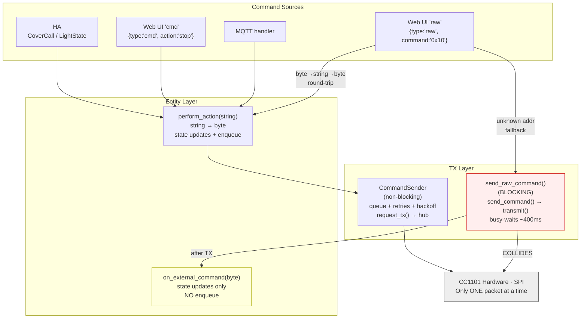
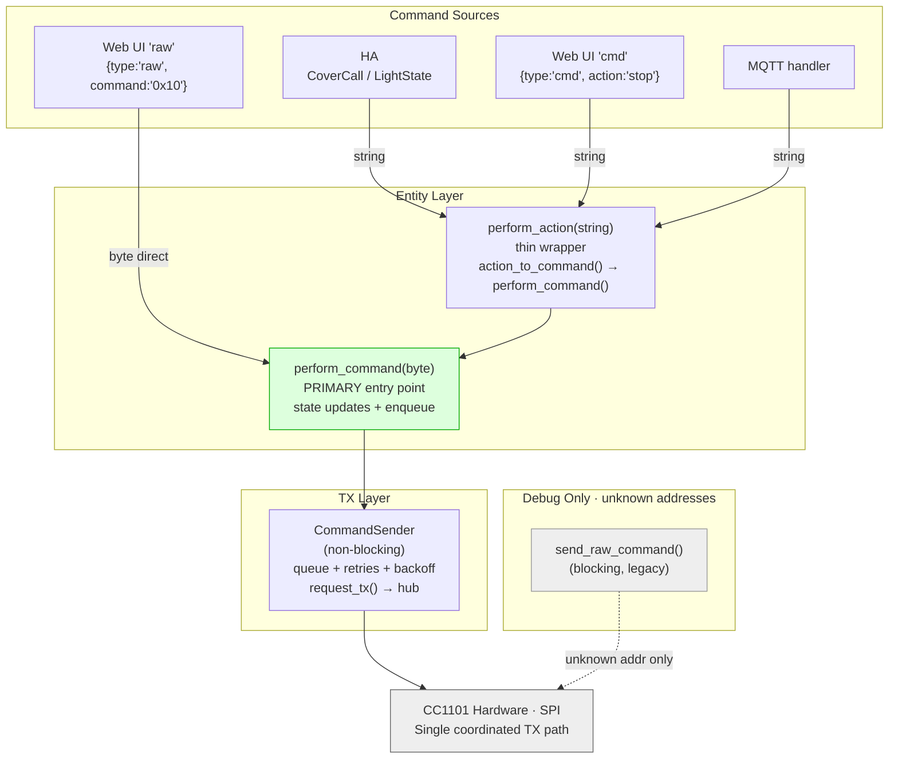

# ADR-0001: Unify TX Command Paths

**Status:** Proposed
**Date:** 2026-03-16

## Problem

The codebase has two competing TX mechanisms that access the same CC1101 radio hardware:

1. **Non-blocking** — entity's `CommandSender` queue → `request_tx()` → hub TX state machine
2. **Blocking** — `send_raw_command()` → `send_command()` → `transmit()` (busy-waits ~400ms)

When the web UI sends a command to a known device via the `raw` WebSocket message type, it uses path 2. If the entity's `CommandSender` has a TX in flight (e.g. a CHECK poll), the blocking `transmit()` forces the CC1101 to IDLE mid-transmission, corrupting both packets. This caused STOP commands to be reliably swallowed.

## Entity Class Hierarchy

```
EleroBlindBase (abstract)                    EleroLightBase (abstract)
  │                                            │
  ├── EleroCover         (Native mode)         ├── EleroLight         (Native mode)
  │   cover::Cover + Component                 │   light::LightOutput + Component
  │                                            │
  ├── EleroDynamicCover  (MQTT mode)           ├── EleroDynamicLight  (MQTT mode)
  │   DynamicEntityBase                        │   DynamicEntityBase
  │                                            │
  └── NativeNvsCover     (Native+NVS mode)     └── NativeNvsLight     (Native+NVS mode)
      cover::Cover + DynamicEntityBase             light::LightOutput + DynamicEntityBase
```

Each entity owns a `CommandSender` (non-blocking TX queue) and composes a pure core (`CoverCore` / `LightCore`).

## Current State



### Problems

| # | Issue | Impact |
|---|-------|--------|
| 1 | Two TX paths to hardware — blocking `transmit()` collides with non-blocking `request_tx()` | STOP commands swallowed |
| 2 | byte→string→byte round-trip — web `raw` converts 0x10→"stop"→0x10 | Unnecessary indirection |
| 3 | `on_external_command()` band-aid — state updates without enqueue, called after blocking TX already corrupted the air | Incomplete fix |
| 4 | Duplicate mapping tables — `command_to_action_()` in web server mirrors `elero_action_to_command()` | DRY violation |

## Proposed State



### What changes

| # | Change | Removes |
|---|--------|---------|
| 1 | Add `perform_command(uint8_t)` to `EleroBlindBase` and `EleroLightBase` | — |
| 2 | Web `raw` handler calls `perform_command(byte)` directly for known entities | byte→string→byte round-trip |
| 3 | MQTT entities: `perform_action` becomes thin wrapper over `perform_command` | Duplicated logic |
| 4 | Move `command_to_action_()` to `elero_strings` as `elero_command_to_action()` | Duplicate mapping table |
| 5 | Remove `on_external_command()` from all entities and `send_raw_command()` | Band-aid (6 impls + 2 decls) |

### Why native entities keep both methods

ESPHome-native entities inherit `cover::Cover` or `light::LightOutput`. HA commands arrive via `control(CoverCall)` or `write_state(LightState*)`. `perform_action("up")` routes through `make_call().set_command_open().perform()` → `control()`, keeping ESPHome's internal state consistent.

`perform_command(byte)` bypasses the ESPHome call chain — direct state updates + enqueue. Both paths converge at the same `CommandSender`.

MQTT entities don't inherit ESPHome Cover/Light, so `perform_command` IS the only implementation.

## Consequences

- All callers converge on `perform_command(byte)` → `CommandSender` → hub non-blocking TX. No more hardware collisions.
- `send_raw_command()` kept only for debugging unknown addresses.
- Net code reduction: remove 6 `on_external_command()` implementations + 2 interface declarations + 1 private mapping function.
