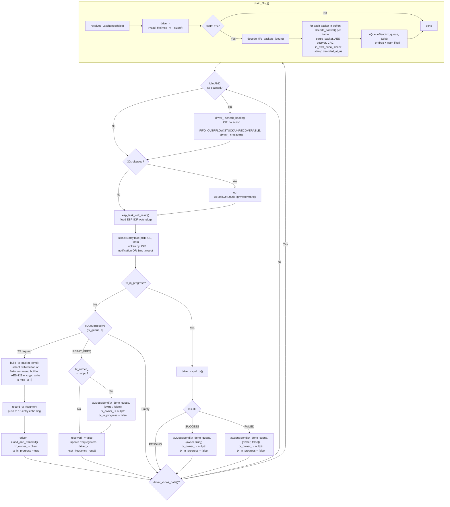
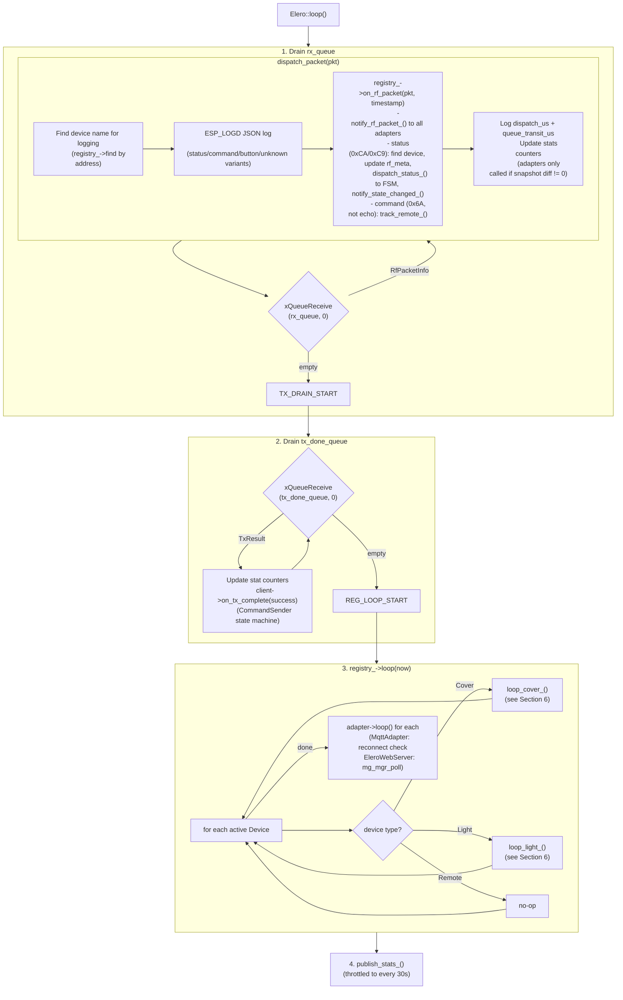
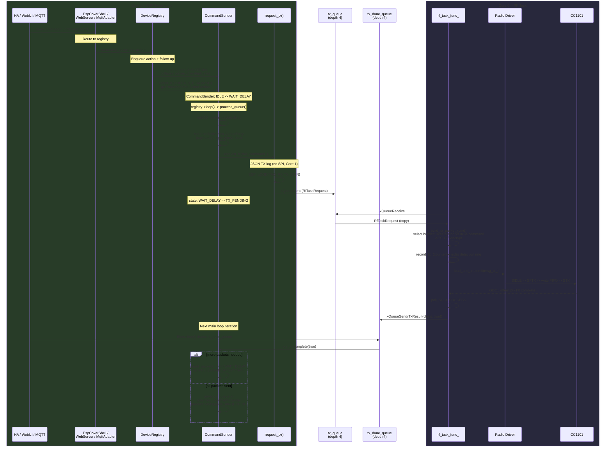
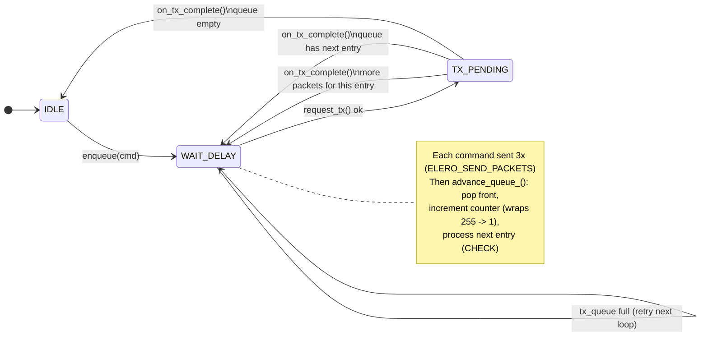
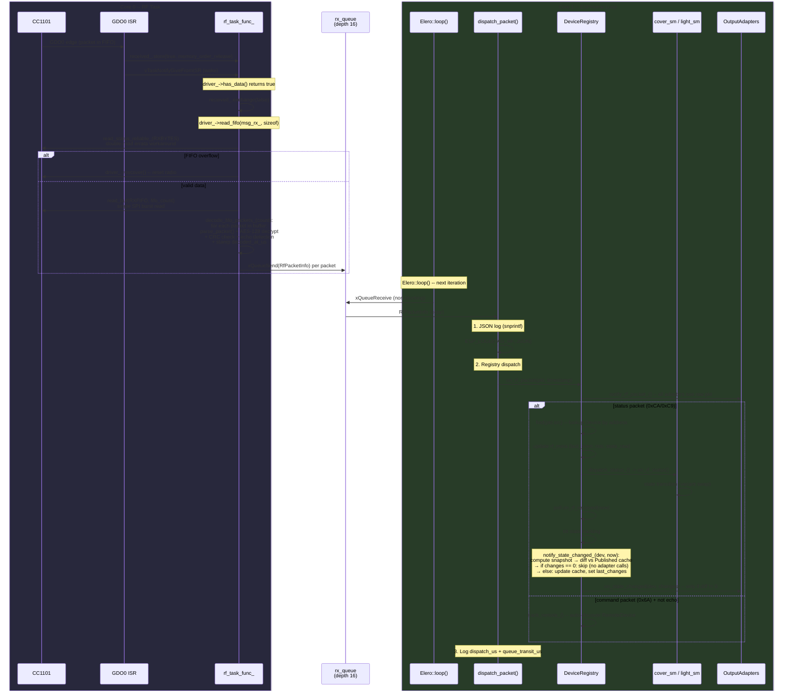
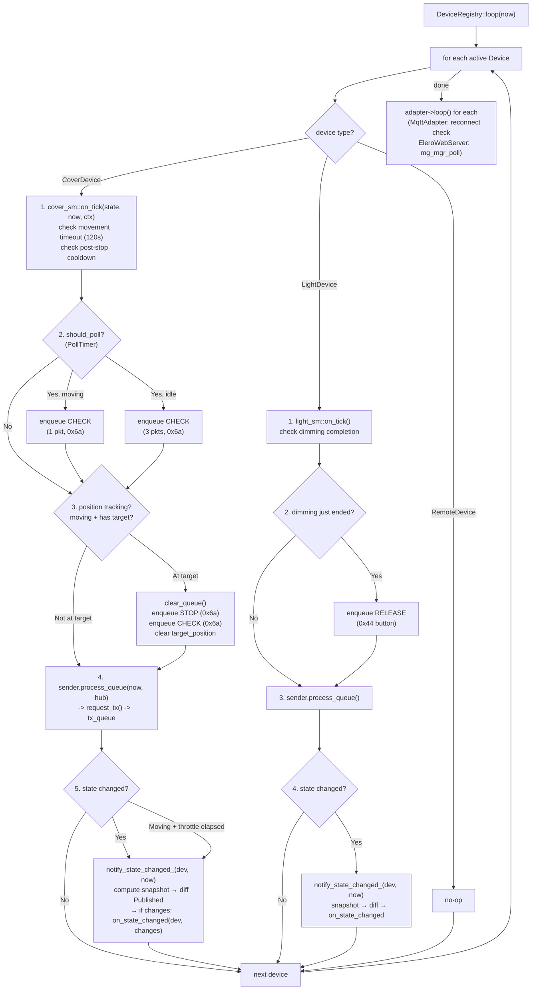

# Elero RF Protocol State Machines

This document describes the internal state machines and data flows for the esphome-elero component. The system uses a **dual-core architecture** on ESP32: a dedicated RF task on Core 0 handles all SPI/radio operations, while the ESPHome main loop on Core 1 handles dispatch, entity management, and adapter notifications. The two cores communicate exclusively via FreeRTOS queues with copy semantics -- no shared mutable state.

---

## Table of Contents

1. [CC1101 Initialization](#1-cc1101-initialization)
2. [RF Task Loop (Core 0)](#2-rf-task-loop-core-0)
3. [Main Loop (Core 1)](#3-main-loop-core-1)
4. [Sending Commands (TX Path)](#4-sending-commands-tx-path)
5. [Receiving Packets (RX Path)](#5-receiving-packets-rx-path)
6. [Registry Device Loop](#6-registry-device-loop)
7. [Key Mechanisms](#7-key-mechanisms)

---

## 1. CC1101 Initialization

Called during `Elero::setup()` on Core 1. Configures the radio driver via SPI, attaches the GDO0 interrupt, sets up the DeviceRegistry and output adapters, creates 3 FreeRTOS queues, and spawns the RF task on Core 0. After `setup()` completes, **Core 0 exclusively owns all SPI** -- Core 1 never touches hardware again.

```mermaid
stateDiagram-v2
    [*] --> DRIVER_INIT: Elero::setup()

    state DRIVER_INIT {
        [*] --> CHECK_DRIVER: driver_ != nullptr?
        CHECK_DRIVER --> INIT_DRIVER: driver_->init()

        state INIT_DRIVER {
            [*] --> RESET
            state RESET {
                [*] --> CS_ENABLE: enable()
                CS_ENABLE --> SRES: write_byte(CC1101_SRES)
                SRES --> WAIT_50US: delay_microseconds_safe(50)
                WAIT_50US --> SIDLE: write_byte(CC1101_SIDLE)
                SIDLE --> WAIT_50US_2: delay_microseconds_safe(50)
                WAIT_50US_2 --> CS_DISABLE: disable()
                CS_DISABLE --> [*]
            }

            RESET --> WRITE_REGS

            state WRITE_REGS {
                [*] --> FSCTRL
                FSCTRL --> FREQ: FSCTRL1=0x08, FSCTRL0=0x00
                FREQ --> MDMCFG: FREQ2/1/0 (868.35MHz default)
                MDMCFG --> DEVIATN: MDMCFG4-0 (modulation)
                DEVIATN --> FREND: DEVIATN=0x43
                FREND --> MCSM: FREND1=0xB6, FREND0=0x10
                MCSM --> AGCCTRL: MCSM0=0x18, MCSM1=0x3F
                AGCCTRL --> FSCAL: AGCCTRL2/1/0
                FSCAL --> IOCFG: FSCAL3/2/1/0
                IOCFG --> PKTCTRL: IOCFG0=0x06 (GDO0 config)
                PKTCTRL --> SYNC: PKTCTRL1=0x8C, PKTCTRL0=0x45
                SYNC --> PATABLE: SYNC1=0xD3, SYNC0=0x91
                PATABLE --> [*]: PATABLE[8] = 0xc0 (TX power)
            }

            WRITE_REGS --> START_RX: write_cmd(CC1101_SRX)
            START_RX --> WAIT_RX_STATE

            state WAIT_RX_STATE {
                [*] --> POLL_MARCSTATE
                POLL_MARCSTATE --> CHECK_STATE: read_status(MARCSTATE)
                CHECK_STATE --> READY: state == RX
                CHECK_STATE --> POLL_MARCSTATE: state != RX (timeout 200 loops)
                CHECK_STATE --> ERROR: timeout expired
            }

            WAIT_RX_STATE --> [*]
        }

        INIT_DRIVER --> SETUP_IRQ: irq_pin_->setup()
        SETUP_IRQ --> ATTACH_ISR: attach_interrupt(edge)
        ATTACH_ISR --> CLEAR_IRQ: received_.store(false)
        CLEAR_IRQ --> RECOVER: driver_->recover()
    }

    DRIVER_INIT --> REGISTRY_SETUP

    state REGISTRY_SETUP {
        [*] --> SETUP_ADAPTERS: registry_->setup_adapters()
        SETUP_ADAPTERS --> NVS_CHECK: is_nvs_enabled()?
        NVS_CHECK --> INIT_PREFS: init_preferences()
        INIT_PREFS --> RESTORE: restore_all()
        NVS_CHECK --> DONE: NVS disabled
        RESTORE --> DONE
    }

    REGISTRY_SETUP --> SPAWN_RF_TASK

    state SPAWN_RF_TASK {
        [*] --> CREATE_QUEUES
        note right of CREATE_QUEUES
            rx_queue: depth 16, sizeof(RfPacketInfo)
            tx_queue: depth 4, sizeof(RfTaskRequest)
            tx_done_queue: depth 4, sizeof(TxResult)
        end note
        CREATE_QUEUES --> CREATE_TASK: xTaskCreatePinnedToCore
        note right of CREATE_TASK
            func: rf_task_func_
            name: "elero_rf"
            stack: 4096 bytes
            priority: 5
            core: 0
        end note
        CREATE_TASK --> REGISTER_WDT: esp_task_wdt_add()
    }

    REGISTER_WDT --> [*]: RF task running on Core 0
```

### Key Register Settings

| Register | Value | Purpose |
|----------|-------|---------|
| `FREQ2/1/0` | `0x21/0x71/0x7a` | 868.35 MHz carrier frequency |
| `MDMCFG2` | `0x13` | 2-FSK modulation, 16/16 sync word |
| `MCSM1` | `0x3F` | Auto-calibrate, CCA mode 3 |
| `IOCFG0` | `0x06` | GDO0 = sync word sent/received |
| `SYNC1/0` | `0xD3/0x91` | Elero protocol sync word |
| `PKTLEN` | `0x3C` | Max packet length 60 bytes |

---

## 2. RF Task Loop (Core 0)

The RF task (`rf_task_func_`) runs as an infinite loop on Core 0. It exclusively owns all SPI and radio hardware. It sleeps via `ulTaskNotifyTake(pdTRUE, 1ms)` and is woken either by the GDO0 ISR (via `vTaskNotifyGiveFromISR`) or by the 1ms timeout.


```mermaid
flowchart TD
    SLEEP["ulTaskNotifyTake(pdTRUE, 1ms)
    woken by: ISR notification OR 1ms timeout"] --> TX_CHECK{tx_in_progress?}

    TX_CHECK -->|No| DEQUEUE{"xQueueReceive
    (tx_queue, 0)"}
    TX_CHECK -->|Yes| POLL_TX

    DEQUEUE -->|TX request| BUILD["build_tx_packet_(cmd)
    select 0x44 button or 0x6a command builder
    AES-128 encrypt, write to msg_tx_[]"]
    BUILD --> RECORD["record_tx_(counter)
    push to 16-entry echo ring"]
    RECORD --> START["driver_->load_and_transmit()
    tx_owner_ = client
    tx_in_progress = true"]
    START --> RX_CHECK

    DEQUEUE -->|REINIT_FREQ| ABORT_PENDING{"tx_owner_
    != nullptr?"}
    ABORT_PENDING -->|Yes| ABORT_NOTIFY["xQueueSend(tx_done_queue,
    {owner, false})
    tx_owner_ = nullptr
    tx_in_progress = false"]
    ABORT_PENDING -->|No| REINIT_DO
    ABORT_NOTIFY --> REINIT_DO["received_ = false
    update freq registers
    driver_->set_frequency_regs()"]
    REINIT_DO --> RX_CHECK

    DEQUEUE -->|Empty| RX_CHECK

    POLL_TX["driver_->poll_tx()"] --> TX_RESULT{result?}
    TX_RESULT -->|PENDING| RX_CHECK
    TX_RESULT -->|SUCCESS| TX_DONE_OK["xQueueSend(tx_done_queue,
    {owner, true})
    tx_owner_ = nullptr
    tx_in_progress = false"]
    TX_RESULT -->|FAILED| TX_DONE_FAIL["xQueueSend(tx_done_queue,
    {owner, false})
    tx_owner_ = nullptr
    tx_in_progress = false"]
    TX_DONE_OK --> RX_CHECK
    TX_DONE_FAIL --> RX_CHECK

    RX_CHECK{"driver_->has_data()?"} -->|Yes| DRAIN
    RX_CHECK -->|No| HEALTH

    subgraph DRAIN ["drain_fifo_()"]
        D1["received_.exchange(false)"]
        D1 --> D2["driver_->read_fifo(msg_rx_, sizeof)"]
        D2 --> D3{count > 0?}
        D3 -->|No| D_END[done]
        D3 -->|Yes| D4["decode_fifo_packets_(count)"]
        D4 --> D5["for each packet in buffer:
        decode_packet() per frame
        parse_packet, AES decrypt, CRC
        is_own_echo_ check
        stamp decoded_at_us"]
        D5 --> D6["xQueueSend(rx_queue, &pkt)
        or drop + warn if full"]
        D6 --> D_END
    end

    DRAIN --> HEALTH

    HEALTH{"idle AND
    5s elapsed?"} -->|Yes| HCHECK["driver_->check_health()
    OK: no action
    FIFO_OVERFLOW/STUCK/UNRECOVERABLE:
    driver_->recover()"]
    HEALTH -->|No| STACK_CHECK
    HCHECK --> STACK_CHECK

    STACK_CHECK{"30s elapsed?"} -->|Yes| HWM["log uxTaskGetStackHighWaterMark()"]
    STACK_CHECK -->|No| WDT
    HWM --> WDT

    WDT["esp_task_wdt_reset()
    (feed ESP-IDF watchdog)"] --> SLEEP
```

### IPC Structures

| Struct | Queue | Direction | Description |
|--------|-------|-----------|-------------|
| `RfTaskRequest` | `tx_queue` (depth 4) | Core 1 -> Core 0 | TX commands or frequency reinit requests |
| `TxResult` | `tx_done_queue` (depth 4) | Core 0 -> Core 1 | TX completion notifications (`{client, success}`) |
| `RfPacketInfo` | `rx_queue` (depth 16) | Core 0 -> Core 1 | Decoded RX packets with metadata |

All queues use copy semantics (`xQueueSend`/`xQueueReceive`). No pointers to shared mutable state cross the core boundary.

---

## 3. Main Loop (Core 1)

`Elero::loop()` runs every ESPHome loop iteration on Core 1. It never touches SPI or radio hardware. It drains FreeRTOS queues from the RF task and runs the registry/adapter lifecycle.


```mermaid
flowchart TD
    START["Elero::loop()"] --> RX_DRAIN

    subgraph RX_DRAIN ["1. Drain rx_queue"]
        RX1{"xQueueReceive
        (rx_queue, 0)"} -->|RfPacketInfo| DISPATCH
        RX1 -->|empty| TX_DRAIN_START

        subgraph DISPATCH ["dispatch_packet(pkt)"]
            DP1["Find device name for logging
            (registry_->find by address)"]
            DP1 --> DP2["ESP_LOGD JSON log
            (status/command/button/unknown variants)"]
            DP2 --> DP3["registry_->on_rf_packet(pkt, timestamp)
            - notify_rf_packet_() to all adapters
            - status (0xCA/0xC9): find device, update rf_meta,
              dispatch_status_() to FSM, notify_state_changed_()
            - command (0x6A, not echo): track_remote_()"]
            DP3 --> DP4["Log dispatch_us + queue_transit_us
            Update stats counters
            (adapters only called if snapshot diff != 0)"]
        end

        DISPATCH --> RX1
    end

    TX_DRAIN_START --> TX_DRAIN

    subgraph TX_DRAIN ["2. Drain tx_done_queue"]
        TX1{"xQueueReceive
        (tx_done_queue, 0)"} -->|TxResult| TX2["Update stat counters
        client->on_tx_complete(success)
        (CommandSender state machine)"]
        TX1 -->|empty| REG_LOOP_START
        TX2 --> TX1
    end

    REG_LOOP_START --> REG_LOOP

    subgraph REG_LOOP ["3. registry_->loop(now)"]
        RL1["for each active Device"] --> RL2{device type?}
        RL2 -->|Cover| RL3["loop_cover_()
        (see Section 6)"]
        RL2 -->|Light| RL4["loop_light_()
        (see Section 6)"]
        RL2 -->|Remote| RL5[no-op]
        RL3 --> RL1
        RL4 --> RL1
        RL5 --> RL1
        RL1 -->|done| RL6["adapter->loop() for each
        (MqttAdapter: reconnect check
        EleroWebServer: mg_mgr_poll)"]
    end

    REG_LOOP --> STATS["4. publish_stats_()
    (throttled to every 30s)"]
```

### dispatch_packet() Detail

The `dispatch_packet()` function is the slow-path handler for decoded RX packets. It runs entirely on Core 1 and takes approximately 13ms (JSON formatting + registry dispatch + adapter notifications).

| Step | Description |
|------|-------------|
| 1 | Look up device name from registry (for human-readable logs) |
| 2 | Format and emit JSON log via `ESP_LOGD` (status, command, button, or unknown variant) |
| 3 | Call `registry_->on_rf_packet(pkt, timestamp)` which fans out to adapters and FSMs |
| 4 | Log timing metrics (`dispatch_us`, `queue_transit_us`) and update stats counters |

While `dispatch_packet()` runs on Core 1, the RF task continues independently on Core 0, servicing the radio and buffering additional packets in the rx_queue.

---

## 4. Sending Commands (TX Path)

Commands flow from user actions through the adapter layer, into the registry, through `CommandSender`, across the `tx_queue` to the RF task on Core 0, and back via `tx_done_queue`.


```mermaid
sequenceDiagram
    box rgb(40,60,40) Core 1 -- ESPHome Loop
        participant User as HA / WebUI / MQTT
        participant Adapter as EspCoverShell /<br/>WebServer / MqttAdapter
        participant Registry as DeviceRegistry
        participant Sender as CommandSender
        participant ReqTx as request_tx()
    end
    participant TXQ as tx_queue<br/>(depth 4)
    participant DQ as tx_done_queue<br/>(depth 4)
    box rgb(40,40,60) Core 0 -- RF Task
        participant RF as rf_task_func_
        participant Driver as Radio Driver
        participant HW as CC1101
    end

    User->>Adapter: cover command (up/down/stop/tilt)

    Note over Adapter: Route to registry
    Adapter->>Registry: command_cover(dev, action)

    Note over Registry: Enqueue action + follow-up
    Registry->>Sender: enqueue(cmd, 3, BUTTON)<br/>collapse consecutive duplicates
    Registry->>Sender: enqueue(CHECK, 3, COMMAND)<br/>get "moving" status after action

    Note over Sender: CommandSender: IDLE -> WAIT_DELAY
    Note over Sender: registry->loop() -> process_queue()

    Sender->>Sender: wait 10ms inter-packet delay
    Sender->>Sender: set cmd fields from QueueEntry<br/>(payload[4], type, type2, hop)
    Sender->>ReqTx: request_tx(this, command_)

    Note over ReqTx: JSON TX log (no SPI, Core 1)
    ReqTx->>ReqTx: ESP_LOGD(TAG_RF, TX JSON)
    ReqTx->>TXQ: xQueueSend(RfTaskRequest)

    Note over Sender: state: WAIT_DELAY -> TX_PENDING

    RF->>TXQ: xQueueReceive
    TXQ->>RF: RfTaskRequest (copy)
    RF->>RF: build_tx_packet_(cmd)<br/>select builder: 0x44 button vs 0x6a command<br/>AES-128 encrypt
    RF->>RF: record_tx_(counter) -- echo detection ring

    RF->>Driver: load_and_transmit(msg_tx_)
    Driver->>HW: SIDLE -> SFTX -> write FIFO -> STX
    HW-->>RF: GDO0 interrupt (TX complete)
    RF->>RF: poll_tx() -> SUCCESS

    RF->>DQ: xQueueSend(TxResult{client, true})

    Note over Sender: Next main loop iteration
    User->>DQ: Elero::loop() drains tx_done_queue
    DQ->>Sender: on_tx_complete(true)

    alt more packets needed
        Sender->>Sender: send_packets_++ -> WAIT_DELAY<br/>repeat (3 packets per command)
    else all packets sent
        Sender->>Sender: advance_queue_()<br/>pop front, increment counter<br/>process next QueueEntry (CHECK)
    end
```

### TX Packet Structure

```
Offset  Field           Size    Description
------  -----           ----    -----------
0       length          1       Fixed 0x1d (29 bytes)
1       counter         1       Rolling counter (1-255)
2-3     pck_inf         2       Packet info bytes
4       hop             1       Hop count
5       sys_addr        1       System address (0x01)
6       channel         1       RF channel
7-9     remote_addr     3       Remote control address
10-12   bwd_addr        3       Backward address (= remote)
13-15   fwd_addr        3       Forward address (= remote)
16      dest_count      1       Destination count (0x01)
17-19   blind_addr      3       Target blind address
20-21   payload_1/2     2       Payload prefix
22-23   crypto_code     2       Encryption code
24      command         1       Command byte (UP/DOWN/STOP/etc)
25-29   payload_rest    5       Remaining payload
```

### CommandSender State Machine


```mermaid
stateDiagram-v2
    direction LR

    [*] --> IDLE

    IDLE --> WAIT_DELAY: enqueue(cmd)
    WAIT_DELAY --> WAIT_DELAY: 10ms not elapsed
    WAIT_DELAY --> TX_PENDING: request_tx() ok
    WAIT_DELAY --> WAIT_DELAY: tx_queue full (retry next loop)

    TX_PENDING --> WAIT_DELAY: on_tx_complete()\nmore packets for this entry
    TX_PENDING --> WAIT_DELAY: on_tx_complete()\nqueue has next entry
    TX_PENDING --> IDLE: on_tx_complete()\nqueue empty

    note right of WAIT_DELAY
        Each command sent 3x (ELERO_SEND_PACKETS)
        Then advance_queue_(): pop front,
        increment counter (wraps 255 -> 1),
        process next entry (CHECK)
    end note
```

---

## 5. Receiving Packets (RX Path)

Packet reception is interrupt-driven. The GDO0 pin fires on packet arrival, waking the RF task which reads the FIFO, decodes packets, and queues them for the main loop.


```mermaid
sequenceDiagram
    box rgb(40,40,60) Core 0 -- RF Task
        participant HW as CC1101
        participant ISR as GDO0 ISR
        participant RF as rf_task_func_
    end
    participant RXQ as rx_queue<br/>(depth 16)
    box rgb(40,60,40) Core 1 -- ESPHome Loop
        participant MainLoop as Elero::loop()
        participant Disp as dispatch_packet()
        participant Reg as DeviceRegistry
        participant FSM as cover_sm / light_sm
        participant Adapt as OutputAdapters
    end

    HW->>ISR: GDO0 edge (packet in FIFO)
    ISR->>RF: received_.store(true, memory_order_release)
    ISR->>RF: vTaskNotifyGiveFromISR (wake)

    Note over RF: driver_->has_data() returns true
    RF->>RF: received_.exchange(false)

    Note over RF: driver_->read_fifo(msg_rx_, sizeof)
    RF->>HW: read_status_reliable_(RXBYTES)<br/>double-read errata workaround

    alt FIFO overflow
        RF->>HW: driver_->recover() -- reset radio
    else valid data
        RF->>HW: read_buf(RXFIFO, fifo_count)<br/>single SPI burst read
        RF->>RF: decode_fifo_packets_(count):<br/>for each packet in buffer:<br/>parse_packet() + AES-128 decrypt<br/>+ CRC check + echo detection<br/>+ stamp decoded_at_us
        RF->>RXQ: xQueueSend(RfPacketInfo) per packet
    end

    Note over MainLoop: Elero::loop() -- next iteration
    MainLoop->>RXQ: xQueueReceive (non-blocking)
    RXQ->>Disp: RfPacketInfo (copy)

    Note over Disp: 1. JSON log (snprintf)
    Disp->>Disp: ESP_LOGD(TAG_RF, JSON)

    Note over Disp: 2. Registry dispatch
    Disp->>Reg: on_rf_packet(pkt, timestamp)
    Reg->>Adapt: notify_rf_packet_() -- all adapters see raw pkt

    alt status packet (0xCA/0xC9)
        Reg->>Reg: find(pkt.src) -- lookup Device by address
        Reg->>Reg: update rf_meta (last_seen, rssi, state_raw)
        Reg->>FSM: dispatch_status_() -> on_rf_status()
        FSM->>FSM: state transition (variant swap)
        Reg->>Reg: poll.on_rf_received(now)
        Reg->>Reg: tilt state tracking
        Note over Reg: notify_state_changed_(dev, now):<br/>compute snapshot → diff vs Published cache<br/>→ if changes == 0: skip (no adapter calls)<br/>→ else: update cache, set last_changes
        Reg->>Adapt: on_state_changed(dev, changes) -- only if diff != 0
    else command packet (0x6A) + not echo
        Reg->>Reg: track_remote_() -- auto-discover RemoteDevice
    end

    Note over Disp: 3. Log dispatch_us + queue_transit_us
```

### Packet Types

| Type Byte | Direction | Description |
|-----------|-----------|-------------|
| `0x44` | Remote -> Blind | Button press (short packet, different builder) |
| `0x6A` | Remote -> Blind | Command with 3-byte addressing |
| `0x69` | Remote -> Blind | Command with 1-byte addressing |
| `0xCA` | Blind -> Remote | Status response with 3-byte addressing |
| `0xC9` | Blind -> Remote | Status response with 1-byte addressing |

### Echo Detection

When transmitting, the RF task records each TX counter value in a 16-entry ring buffer (`record_tx_`). When decoding received command packets, `is_own_echo_()` checks if the counter matches any recent TX -- if so, the packet is marked `echo: true` and the registry ignores it for remote tracking.

---

## 6. Registry Device Loop

`DeviceRegistry::loop(now)` processes each active device on every main loop iteration. Cover and light devices have distinct processing flows; remote devices are passive trackers.

### Cover Processing


```mermaid
flowchart TD
    START["DeviceRegistry::loop(now)"] --> ITER["for each active Device"]
    ITER --> VARIANT{device type?}

    VARIANT -->|CoverDevice| TICK["1. cover_sm::on_tick(state, now, ctx)
    check movement timeout (120s)
    check post-stop cooldown"]
    VARIANT -->|LightDevice| LTICK["1. light_sm::on_tick()
    check dimming completion"]
    VARIANT -->|RemoteDevice| SKIP[no-op]

    TICK --> POLL{"2. should_poll?
    (PollTimer)"}
    POLL -->|Yes, moving| POLL_FAST["enqueue CHECK
    (1 pkt, 0x6a)"]
    POLL -->|Yes, idle| POLL_FULL["enqueue CHECK
    (3 pkts, 0x6a)"]
    POLL -->|No| POS_CHECK

    POLL_FAST --> POS_CHECK
    POLL_FULL --> POS_CHECK

    POS_CHECK{"3. position tracking?
    moving + has target?"}
    POS_CHECK -->|At target| POS_STOP["clear_queue()
    enqueue STOP (0x6a)
    enqueue CHECK (0x6a)
    clear target_position"]
    POS_CHECK -->|Not at target| CMD_Q
    POS_STOP --> CMD_Q

    CMD_Q["4. sender.process_queue(now, hub)
    -> request_tx() -> tx_queue"]

    CMD_Q --> NOTIFY{"5. state changed?"}
    NOTIFY -->|Yes| PUB["notify_state_changed_(dev, now)
    compute snapshot → diff Published
    → if changes: on_state_changed(dev, changes)"]
    NOTIFY -->|Moving + throttle elapsed| PUB
    NOTIFY -->|No| NEXT[next device]

    PUB --> NEXT
    NEXT --> ITER

    LTICK --> LDIM{"2. dimming just ended?"}
    LDIM -->|Yes| LRELEASE["enqueue RELEASE
    (0x44 button)"]
    LDIM -->|No| LCMD
    LRELEASE --> LCMD["3. sender.process_queue()"]
    LCMD --> LNOTIFY{"4. state changed?"}
    LNOTIFY -->|Yes| LPUB["notify_state_changed_(dev, now)
    snapshot → diff → on_state_changed"]
    LNOTIFY -->|No| NEXT
    LPUB --> NEXT

    SKIP --> NEXT

    ITER -->|done| ADAPTERS["adapter->loop() for each
    (MqttAdapter: reconnect check
    EleroWebServer: mg_mgr_poll)"]
```

### Cover State Machine (`cover_sm`)

The cover FSM uses variant-based states. Position is always **derived** from `(state, now, config)` -- never stored.

| State | Description | Transitions |
|-------|-------------|-------------|
| `Idle` | Blind is stationary | -> `Opening` on UP, -> `Closing` on DOWN |
| `Opening` | Blind is moving up | -> `Idle` on TOP/STOPPED/timeout, -> `Closing` on DOWN |
| `Closing` | Blind is moving down | -> `Idle` on BOTTOM/STOPPED/timeout, -> `Opening` on UP |
| `Stopping` | Stop command sent, awaiting confirmation | -> `Idle` on STOPPED/timeout |

Position calculation (derived on each loop tick):

```
position = start_position + direction * (elapsed_ms / duration_ms)
```

Where:
- `direction` = +1.0 for opening, -1.0 for closing
- `elapsed_ms` = `now - movement_started_at`
- `duration_ms` = `open_duration` or `close_duration` from config
- Result is clamped to [0.0, 1.0]

### Light State Machine (`light_sm`)

| State | Description | Transitions |
|-------|-------------|-------------|
| `Off` | Light is off | -> `On` on turn-on, -> `DimmingUp` on dim command |
| `On` | Light is on | -> `Off` on turn-off, -> `DimmingDown` on dim command |
| `DimmingUp` | Brightness increasing | -> `On` on completion/stop, -> `DimmingDown` on reverse |
| `DimmingDown` | Brightness decreasing | -> `Off`/`On` on completion/stop, -> `DimmingUp` on reverse |

Brightness is derived from `(state, now, config.dim_duration)` -- never stored. When dimming ends, `loop_light_()` enqueues a RELEASE command (0x44 button type) to signal the light receiver to hold the current level.

### State Byte Values (RF Status Packets)

| Byte | Constant | Meaning |
|------|----------|---------|
| `0x01` | `TOP` | Fully open |
| `0x02` | `BOTTOM` | Fully closed |
| `0x03` | `INTERMEDIATE` | Stopped at intermediate position |
| `0x04` | `TILT` | Tilted |
| `0x05` | `BLOCKING` | Mechanical blockage detected |
| `0x06` | `OVERHEATED` | Motor thermal protection |
| `0x07` | `TIMEOUT` | Movement timeout |
| `0x08` | `START_MOVING_UP` | Beginning upward movement |
| `0x09` | `START_MOVING_DOWN` | Beginning downward movement |
| `0x0A` | `MOVING_UP` | Continuing upward movement |
| `0x0B` | `MOVING_DOWN` | Continuing downward movement |
| `0x0D` | `STOPPED` | Stopped by command |
| `0x0E` | `TOP_TILT` | Fully open + tilted |
| `0x0F` | `BOTTOM_TILT` | Fully closed + tilted |

---

## 7. Key Mechanisms

### Dual-Core Isolation

The system uses strict core isolation via FreeRTOS queues with copy semantics:

| Aspect | Core 0 (RF Task) | Core 1 (ESPHome Loop) |
|--------|-------------------|----------------------|
| **Owns** | SPI bus, CC1101 hardware | DeviceRegistry, adapters, ESPHome entities |
| **Reads from** | `tx_queue` | `rx_queue`, `tx_done_queue` |
| **Writes to** | `rx_queue`, `tx_done_queue` | `tx_queue` |
| **Shared state** | None | None |
| **Atomic** | `received_` (ISR -> RF task) | Stat counters (RF task -> stats sensors) |

The RF task drains the CC1101 FIFO within approximately 1ms of packet arrival, regardless of how busy the main loop is. `dispatch_packet()` on Core 1 takes approximately 13ms (JSON formatting + registry dispatch + adapter notifications), but during this time the RF task continues to service the radio independently.

### ISR Design

The GDO0 interrupt handler (`Elero::interrupt`) is minimal and runs in IRAM:

1. `received_.store(true, memory_order_release)` -- atomic flag for RF task
2. `vTaskNotifyGiveFromISR()` -- wake RF task immediately (bypasses 1ms sleep)
3. `portYIELD_FROM_ISR()` -- context switch if RF task has higher priority

### Command Batching

| Aspect | Implementation |
|--------|----------------|
| **Command Queue** | `std::deque` per device via `CommandSender`, max 10 entries |
| **Packet Repetition** | Each command sent **3x** (`ELERO_SEND_PACKETS`) |
| **Inter-packet Delay** | 10ms between sends |
| **Counter Management** | Increments after all packets sent for an entry, wraps 255 -> 1 |
| **Duplicate Collapse** | Consecutive identical commands are collapsed in the queue |
| **Auto-append CHECK** | Cover commands auto-append a CHECK (0x6a) to get "moving" status |
| **Light RELEASE** | Dimming completion triggers RELEASE (0x44 button) to hold brightness |

### Polling Strategy

| Condition | Poll Behavior |
|-----------|--------------|
| **Moving** | 1 RF packet per CHECK (reduce TX time during movement) |
| **Idle** | 3 RF packets per CHECK (reliable delivery when blind may be asleep) |
| **Never** | `poll_interval: never` disables polling (for blinds that push status) |

Blinds only respond to received packets during movement -- they do not broadcast unsolicited status updates. The PollTimer uses a boolean `awaiting_response` flag (not time-based).

### Position and Brightness Tracking

Position and brightness are always **derived** from `(state, now, config)` -- never stored as persistent fields. This eliminates an entire class of consistency bugs:

- **Cover position**: `start_position + direction * (elapsed_ms / duration_ms)`, clamped to [0.0, 1.0]
- **Light brightness**: `start_brightness + direction * (elapsed_ms / dim_duration)`, clamped to [0.0, 1.0]
- **Target position**: When a cover has a target, `loop_cover_()` checks if the derived position has reached it and sends STOP + CHECK

### Error Recovery

| Error Type | Detection | Recovery |
|------------|-----------|----------|
| **TX failure** | `poll_tx()` returns `FAILED` | Report failure via `tx_done_queue`, CommandSender retries |
| **FIFO overflow** | `read_status_reliable_()` overflow bit | `driver_->recover()` (flush FIFOs, return to RX) |
| **Stuck radio** | Health check every 5s reads MARCSTATE | `driver_->recover()` (reset and reinit if needed) |
| **Queue full** | `xQueueSend` returns != `pdPASS` | Log warning, drop packet, increment stat counter |
| **ISR missed** | 1ms timeout wakes RF task regardless | `has_data()` checks hardware state directly |

### Timing Constants

| Constant | Value | Purpose |
|----------|-------|---------|
| RF task sleep | 1ms | `ulTaskNotifyTake` timeout (max latency without ISR) |
| Inter-packet delay | 10ms | Delay between TX packets in a command sequence |
| Packets per command | 3 | Times each command byte is transmitted |
| Radio watchdog | 5000ms | MARCSTATE health check interval |
| Stack watermark log | 30000ms | Development aid for stack usage monitoring |
| Movement timeout | 120000ms | Max time to track cover movement (2 min) |
| Position publish throttle | 1000ms | Min interval between position updates during movement |

---

## Code References

- CC1101 initialization: `elero.cpp` `Elero::setup()`
- RF task: `elero.cpp` `Elero::rf_task_func_()`
- Main loop: `elero.cpp` `Elero::loop()`
- Packet decode: `elero.cpp` `Elero::decode_fifo_packets_()`, `Elero::decode_packet()`
- Packet dispatch: `elero.cpp` `Elero::dispatch_packet()`
- TX request: `elero.cpp` `Elero::request_tx()`
- ISR: `elero.cpp` `Elero::interrupt()`
- Device registry: `device_registry.cpp` `DeviceRegistry::on_rf_packet()`, `DeviceRegistry::loop()`
- Cover FSM: `cover_sm.h` / `cover_sm.cpp`
- Light FSM: `light_sm.h` / `light_sm.cpp`
- Command sender: `command_sender.h`
- Packet encoding: `elero_packet.h` / `elero_packet.cpp`
- Protocol constants: `elero_protocol.h`
