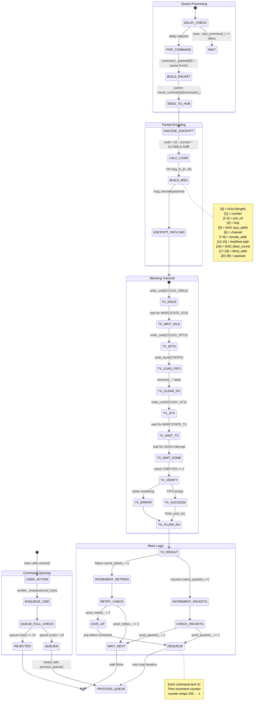

# Elero RF Protocol State Machines

This document describes the internal state machines and data flows for the esphome-elero component.

---

## Table of Contents

1. [CC1101 Initialization](#1-cc1101-initialization)
2. [Main RX/TX Loop](#2-main-rxtx-loop)
3. [Sending Commands](#3-sending-commands)
4. [Receiving Commands](#4-receiving-commands)
5. [Blind State Update](#5-blind-state-update)
6. [Position Tracking During Movement](#6-position-tracking-during-movement)
7. [Summary: Key Mechanisms](#summary-key-mechanisms)

---

## 1. CC1101 Initialization

Called during `Elero::setup()`. Configures the CC1101 RF transceiver via SPI.

```mermaid
stateDiagram-v2
    [*] --> SPI_SETUP: Elero::setup()

    SPI_SETUP --> GPIO_SETUP: spi_setup()
    GPIO_SETUP --> ATTACH_ISR: gdo0_pin_->setup()
    ATTACH_ISR --> RESET: attach_interrupt(FALLING_EDGE)

    state RESET {
        [*] --> CS_ENABLE: enable()
        CS_ENABLE --> SRES: write_byte(CC1101_SRES)
        SRES --> WAIT_50US: delay_microseconds_safe(50)
        WAIT_50US --> SIDLE: write_byte(CC1101_SIDLE)
        SIDLE --> WAIT_50US_2: delay_microseconds_safe(50)
        WAIT_50US_2 --> CS_DISABLE: disable()
        CS_DISABLE --> [*]
    }

    RESET --> INIT

    state INIT {
        [*] --> WRITE_REGS

        state WRITE_REGS {
            [*] --> FSCTRL
            FSCTRL --> FREQ: FSCTRL1=0x08, FSCTRL0=0x00
            FREQ --> MDMCFG: FREQ2/1/0 (868.35MHz default)
            MDMCFG --> DEVIATN: MDMCFG4-0 (modulation)
            DEVIATN --> FREND: DEVIATN=0x43
            FREND --> MCSM: FREND1=0xB6, FREND0=0x10
            MCSM --> AGCCTRL: MCSM0=0x18, MCSM1=0x3F
            AGCCTRL --> FSCAL: AGCCTRL2/1/0
            FSCAL --> IOCFG: FSCAL3/2/1/0
            IOCFG --> PKTCTRL: IOCFG0=0x06 (GDO0 config)
            PKTCTRL --> SYNC: PKTCTRL1=0x8C, PKTCTRL0=0x45
            SYNC --> PATABLE: SYNC1=0xD3, SYNC0=0x91
            PATABLE --> [*]: PATABLE[8] = 0xc0 (TX power)
        }

        WRITE_REGS --> START_RX: write_cmd(CC1101_SRX)
        START_RX --> WAIT_RX_STATE

        state WAIT_RX_STATE {
            [*] --> POLL_MARCSTATE
            POLL_MARCSTATE --> CHECK_STATE: read_status(MARCSTATE)
            CHECK_STATE --> READY: state == RX
            CHECK_STATE --> POLL_MARCSTATE: state != RX (timeout 200 loops)
            CHECK_STATE --> ERROR: timeout expired
        }

        WAIT_RX_STATE --> [*]
    }

    INIT --> READY: CC1101 in RX mode
    READY --> [*]
```

### Key Register Settings

| Register | Value | Purpose |
|----------|-------|---------|
| `FREQ2/1/0` | `0x21/0x71/0x7a` | 868.35 MHz carrier frequency |
| `MDMCFG2` | `0x13` | 2-FSK modulation, 16/16 sync word |
| `MCSM1` | `0x3F` | Auto-calibrate, CCA mode 3 |
| `IOCFG0` | `0x06` | GDO0 = sync word sent/received |
| `SYNC1/0` | `0xD3/0x91` | Elero protocol sync word |
| `PKTLEN` | `0x3C` | Max packet length 60 bytes |

---

## 2. Main RX/TX Loop

The `Elero::loop()` function runs every ESPHome loop iteration (~16ms).

```mermaid
stateDiagram-v2
    [*] --> LOOP_START: Elero::loop()

    LOOP_START --> TX_BUSY_CHECK

    TX_BUSY_CHECK --> HANDLE_TX_STATE: tx_ctx_.state != IDLE
    TX_BUSY_CHECK --> DRAIN_RUNTIME_QUEUES: tx_ctx_.state == IDLE

    note right of HANDLE_TX_STATE
        TX in progress - process TX state machine
        Return early (no RX processing)
    end note

    HANDLE_TX_STATE --> LOOP_END: return

    DRAIN_RUNTIME_QUEUES --> CHECK_ISR_FLAG
    note left of DRAIN_RUNTIME_QUEUES
        Process runtime_blinds_ command queues
        (web UI adopted blinds)
    end note

    CHECK_ISR_FLAG --> LOOP_END: received_ == false
    CHECK_ISR_FLAG --> CLEAR_FLAG: received_ == true

    CLEAR_FLAG --> READ_RXBYTES: received_ = false

    READ_RXBYTES --> FIFO_OVERFLOW: len & 0x80 (overflow bit)
    READ_RXBYTES --> CHECK_BYTES: len & 0x7F (byte count)

    FIFO_OVERFLOW --> FLUSH_AND_RX: flush FIFOs
    FLUSH_AND_RX --> LOOP_END

    CHECK_BYTES --> LOOP_END: no bytes available
    CHECK_BYTES --> READ_FIFO: bytes > 0

    READ_FIFO --> LOG_RAW: read_buf(RXFIFO, msg_rx_, count)
    LOG_RAW --> CAPTURE_DUMP: if packet_dump_mode_
    CAPTURE_DUMP --> SANITY_CHECK

    SANITY_CHECK --> INTERPRET_MSG: msg_rx_[0] + 3 <= fifo_count
    SANITY_CHECK --> MARK_INVALID: length mismatch
    MARK_INVALID --> LOOP_END

    INTERPRET_MSG --> LOOP_END

    LOOP_END --> [*]
```

### Loop Priority

1. **TX state machine** — If transmitting, handle TX states and return early
2. **Runtime blind queues** — Drain command queues for web-adopted blinds
3. **RX processing** — Check ISR flag, read FIFO, interpret packets

---

## 3. Sending Commands

Commands flow through `CommandSender` queue → `Elero::send_command()` → **blocking** `transmit()`.

> **Implementation Note:** A non-blocking TX state machine (`start_transmit()` / `handle_tx_state_()`)
> exists in the codebase but is not currently used. The active code path uses blocking waits.
> This works reliably but can block the ESPHome loop for up to ~40ms per transmission.



### TX Packet Structure

```
Offset  Field           Size    Description
------  -----           ----    -----------
0       length          1       Fixed 0x1d (29 bytes)
1       counter         1       Rolling counter (1-255)
2-3     pck_inf         2       Packet info bytes
4       hop             1       Hop count
5       sys_addr        1       System address (0x01)
6       channel         1       RF channel
7-9     remote_addr     3       Remote control address
10-12   bwd_addr        3       Backward address (= remote)
13-15   fwd_addr        3       Forward address (= remote)
16      dest_count      1       Destination count (0x01)
17-19   blind_addr      3       Target blind address
20-21   payload_1/2     2       Payload prefix
22-23   crypto_code     2       Encryption code
24      command         1       Command byte (UP/DOWN/STOP/etc)
25-29   payload_rest    5       Remaining payload
```

---

## 4. Receiving Commands

Packet reception is interrupt-driven via GDO0 pin.

```mermaid
stateDiagram-v2
    [*] --> GDO0_INTERRUPT: CC1101 GDO0 falls

    GDO0_INTERRUPT --> SET_FLAG: IRAM_ATTR interrupt()
    SET_FLAG --> ISR_DONE: received_ = true

    ISR_DONE --> LOOP_DETECTS: next loop() iteration

    state "FIFO Read" as FIFO_READ {
        LOOP_DETECTS --> CLEAR_FLAG: was_received = received_
        CLEAR_FLAG --> READ_STATUS: read_status(RXBYTES)
        READ_STATUS --> CHECK_OVERFLOW

        CHECK_OVERFLOW --> FLUSH: overflow bit set
        CHECK_OVERFLOW --> READ_BYTES: no overflow

        READ_BYTES --> READ_BUF: read up to 64 bytes
    }

    state "Packet Validation" as VALIDATE {
        READ_BUF --> LEN_CHECK: msg_rx_[0] = length
        LEN_CHECK --> REJECT_LONG: length > 57
        LEN_CHECK --> PARSE_HEADER: length valid

        PARSE_HEADER --> EXTRACT_FIELDS
        note right of EXTRACT_FIELDS
            cnt = [1], typ = [2], typ2 = [3]
            hop = [4], syst = [5], chl = [6]
            src = [7-9], bwd = [10-12], fwd = [13-15]
            num_dests = [16], dst = [17-19]
        end note

        EXTRACT_FIELDS --> DEST_CHECK: validate num_dests <= 20
        DEST_CHECK --> REJECT_DESTS: too many destinations
        DEST_CHECK --> BOUNDS_CHECK: valid

        BOUNDS_CHECK --> REJECT_OOB: payload out of bounds
        BOUNDS_CHECK --> DECRYPT: bounds OK
    }

    state "Decryption & RSSI" as DECRYPT_PHASE {
        DECRYPT --> MSG_DECODE: protocol::msg_decode(payload)
        MSG_DECODE --> CALC_RSSI
        note right of CALC_RSSI
            rssi_raw from [length+1]
            Two's complement decode
            rssi = raw/2 - 74 dBm
        end note
        CALC_RSSI --> LOG_PACKET
    }

    state "Packet Dispatch" as DISPATCH {
        LOG_PACKET --> UPDATE_RSSI_SENSOR: if sensor registered
        UPDATE_RSSI_SENSOR --> CHECK_SCAN_MODE

        CHECK_SCAN_MODE --> TRACK_DISCOVERED: scan_mode_ && (typ=0xCA/0xC9 or 0x6A/0x69)
        CHECK_SCAN_MODE --> CHECK_STATUS: not scanning

        TRACK_DISCOVERED --> CHECK_STATUS

        CHECK_STATUS --> STATUS_PACKET: typ == 0xCA or 0xC9
        CHECK_STATUS --> COMMAND_PACKET: typ == 0x6A or 0x69

        state "Status Response" as STATUS {
            STATUS_PACKET --> UPDATE_TEXT_SENSOR: publish state string
            UPDATE_TEXT_SENSOR --> FIND_COVER: address_to_cover_mapping_
            FIND_COVER --> NOTIFY_COVER: cover found
            FIND_COVER --> FIND_LIGHT: cover not found
            NOTIFY_COVER --> SET_RX_STATE: cover->set_rx_state(payload[6])
            FIND_LIGHT --> NOTIFY_LIGHT: light found
            NOTIFY_LIGHT --> SET_RX_STATE_LIGHT: light->set_rx_state(payload[6])
        }

        state "Remote Command" as CMD {
            COMMAND_PACKET --> ITERATE_DESTS: for each destination
            ITERATE_DESTS --> SCHEDULE_POLL: cover->schedule_immediate_poll()
            note right of SCHEDULE_POLL
                When remote commands blind,
                trigger immediate status poll
                so HA updates within ~50ms
            end note
        }
    }

    SET_RX_STATE --> [*]
    SET_RX_STATE_LIGHT --> [*]
    SCHEDULE_POLL --> [*]
    REJECT_LONG --> [*]
    REJECT_DESTS --> [*]
    REJECT_OOB --> [*]
    FLUSH --> [*]
```

### Packet Types

| Type Byte | Direction | Description |
|-----------|-----------|-------------|
| `0x6A` | Remote → Blind | Command with 3-byte addressing |
| `0x69` | Remote → Blind | Command with 1-byte addressing |
| `0xCA` | Blind → Remote | Status response with 3-byte addressing |
| `0xC9` | Blind → Remote | Status response with 1-byte addressing |

---

## 5. Blind State Update

When a status packet (`0xCA`/`0xC9`) is received, `set_rx_state()` updates the cover entity.


### State Byte Values

| Byte | Constant | Position | Operation | Tilt |
|------|----------|----------|-----------|------|
| `0x01` | `TOP` | 1.0 (open) | IDLE | 0 |
| `0x02` | `BOTTOM` | 0.0 (closed) | IDLE | 0 |
| `0x03` | `INTERMEDIATE` | unchanged | IDLE | 0 |
| `0x04` | `TILT` | unchanged | IDLE | 1.0 |
| `0x05` | `BLOCKING` | unchanged | IDLE | - |
| `0x06` | `OVERHEATED` | unchanged | IDLE | - |
| `0x07` | `TIMEOUT` | unchanged | IDLE | - |
| `0x08` | `START_MOVING_UP` | unchanged | OPENING | 0 |
| `0x09` | `START_MOVING_DOWN` | unchanged | CLOSING | 0 |
| `0x0A` | `MOVING_UP` | unchanged | OPENING | 0 |
| `0x0B` | `MOVING_DOWN` | unchanged | CLOSING | 0 |
| `0x0D` | `STOPPED` | unchanged | IDLE | 0 |
| `0x0E` | `TOP_TILT` | 1.0 (open) | IDLE | 1.0 |
| `0x0F` | `BOTTOM_TILT` | 0.0 (closed) | IDLE | 1.0 |

---

## 6. Position Tracking During Movement

Dead-reckoning position estimation based on configured open/close durations.

```mermaid
stateDiagram-v2
    [*] --> LOOP_CHECK: EleroCover::loop()

    state "Poll Timing" as POLL {
        LOOP_CHECK --> CALC_INTERVAL
        CALC_INTERVAL --> MOVING_POLL: operation != IDLE
        CALC_INTERVAL --> NORMAL_POLL: operation == IDLE

        MOVING_POLL --> INTERVAL_2S: intvl = 2000ms
        note right of INTERVAL_2S
            Poll every 2s while moving
            (max 2 min timeout)
        end note

        NORMAL_POLL --> INTERVAL_CONFIG: intvl = poll_intvl_

        INTERVAL_2S --> CHECK_POLL_DUE
        INTERVAL_CONFIG --> CHECK_POLL_DUE

        CHECK_POLL_DUE --> ENQUEUE_CHECK: time elapsed > intvl
        CHECK_POLL_DUE --> SKIP_POLL: not due yet

        ENQUEUE_CHECK --> PROCESS_QUEUE: sender_.enqueue(command_check_)
    }

    PROCESS_QUEUE --> POSITION_CHECK

    state "Position Recomputation" as RECOMPUTE {
        POSITION_CHECK --> SKIP_RECOMPUTE: operation == IDLE
        POSITION_CHECK --> CHECK_DURATION: operation != IDLE

        CHECK_DURATION --> SKIP_RECOMPUTE: open_duration_ == 0 OR close_duration_ == 0
        CHECK_DURATION --> CALC_POSITION: durations configured

        CALC_POSITION --> GET_DIRECTION
        GET_DIRECTION --> DIR_UP: OPENING → dir = +1.0
        GET_DIRECTION --> DIR_DOWN: CLOSING → dir = -1.0

        DIR_UP --> CALC_ELAPSED
        DIR_DOWN --> CALC_ELAPSED

        CALC_ELAPSED --> CALC_RATIO: elapsed_ratio = (now - movement_start_) / action_dur
        CALC_RATIO --> APPLY_DELTA: position = start_position_ + dir * elapsed_ratio
        APPLY_DELTA --> CLAMP: clamp(0.0, 1.0)
    }

    state "Target Check" as TARGET {
        CLAMP --> CHECK_TARGET: is_at_target()

        CHECK_TARGET --> AT_LIMITS: target == OPEN or CLOSED
        AT_LIMITS --> NO_STOP: let blind handle limits

        CHECK_TARGET --> COMPARE_POS: intermediate target
        COMPARE_POS --> REACHED: pos >= target (opening) OR pos <= target (closing)
        COMPARE_POS --> NOT_REACHED: still moving

        REACHED --> SEND_STOP: enqueue(command_stop_)
        SEND_STOP --> SET_IDLE: operation = IDLE
    }

    state "Periodic Publish" as PERIODIC {
        NOT_REACHED --> CHECK_PUBLISH: every 1000ms
        NO_STOP --> CHECK_PUBLISH

        CHECK_PUBLISH --> PUBLISH_STATE: (now - last_publish_) > 1000
        CHECK_PUBLISH --> SKIP_PUBLISH: too soon

        PUBLISH_STATE --> UPDATE_TS: last_publish_ = now
    }

    SKIP_RECOMPUTE --> [*]
    SKIP_POLL --> [*]
    UPDATE_TS --> [*]
    SKIP_PUBLISH --> [*]
    SET_IDLE --> [*]
```

### Position Calculation Formula

```
position = start_position + direction × (elapsed_ms / duration_ms)
```

Where:
- `direction` = +1.0 for opening, -1.0 for closing
- `elapsed_ms` = `millis() - movement_start_`
- `duration_ms` = `open_duration_` or `close_duration_`
- Result is clamped to [0.0, 1.0]

---

## Summary: Key Mechanisms

### Queuing & Batching

| Aspect | Implementation |
|--------|----------------|
| **Command Queue** | `std::queue<uint8_t>` per cover/light, max 10 commands |
| **Packet Repetition** | Each command sent **2×** (`ELERO_SEND_PACKETS`) |
| **Inter-packet Delay** | 50ms between sends (`ELERO_DELAY_SEND_PACKETS`) |
| **Counter Management** | Increments after 2 packets sent, wraps 255→1 |
| **Runtime Blinds** | Separate queue per adopted blind in `runtime_blinds_` map |

### Error Handling

| Error Type | Handling |
|------------|----------|
| **TX Timeout** | 50ms per state, then `abort_tx_()` → `flush_and_rx()` |
| **TX Retry** | Up to 3 retries per command (`ELERO_SEND_RETRIES`) |
| **FIFO Overflow** | `flush_and_rx()` clears both FIFOs, returns to RX |
| **Invalid Packet** | Logged, marked in dump buffer, silently dropped |
| **SPI Error** | Checked via CC1101 status byte (bit 7 = overflow) |

### TX State Machine States

```
IDLE → GOTO_IDLE → FLUSH_TX → LOAD_FIFO → TRIGGER_TX → WAIT_TX_DONE → VERIFY_DONE → RETURN_RX → IDLE
```

Each state has a 50ms timeout. Any failure triggers `abort_tx_()` which flushes and returns to RX.

### RX Dispatch Logic

1. **Interrupt sets flag** — ISR runs in IRAM, sets `received_ = true`
2. **loop() checks flag** — Clears flag, reads FIFO
3. **Validate packet** — Length, bounds, destination count
4. **Decrypt payload** — `protocol::msg_decode()`
5. **Dispatch by type:**
   - `0xCA`/`0xC9`: Status from blind → `set_rx_state(payload[6])`
   - `0x6A`/`0x69`: Command from remote → `schedule_immediate_poll()`

### Timing Constants

| Constant | Value | Purpose |
|----------|-------|---------|
| `ELERO_POLL_INTERVAL_MOVING` | 2000ms | Poll frequency while blind is moving |
| `ELERO_TIMEOUT_MOVEMENT` | 120000ms | Max time to track movement (2 min) |
| `ELERO_DELAY_SEND_PACKETS` | 50ms | Delay between packet repeats |
| `ELERO_SEND_PACKETS` | 2 | Times each command is transmitted |
| `ELERO_SEND_RETRIES` | 3 | Max retries on TX failure |
| `TxContext::STATE_TIMEOUT_MS` | 50ms | Timeout per TX state machine state |

---

## Code References

- CC1101 initialization: `elero.cpp:155-239`
- Main loop: `elero.cpp:66-138`
- TX state machine (unused): `elero.cpp:406-539`
- Blocking transmit (active): `elero.cpp:347-404`
- Packet interpretation: `elero.cpp:585-793`
- Command sender: `command_sender.h:21-45`
- Cover state handling: `EleroCover.cpp:110-185`
- Position tracking: `EleroCover.cpp:263-292`

---

## Blocking vs Non-Blocking TX Comparison

The implementation supports two TX modes:

### Legacy Blocking Mode (`send_command`)

Used by runtime blinds and simple use cases. Blocks the ESPHome loop during transmission.

```
┌─────────────────────────────────────────────────────────────────────────────┐
│                         BLOCKING TX FLOW                                    │
├─────────────────────────────────────────────────────────────────────────────┤
│                                                                             │
│  CommandSender                    Elero Hub                   CC1101       │
│       │                               │                          │         │
│       │  send_command(&cmd)           │                          │         │
│       │──────────────────────────────▶│                          │         │
│       │                               │  build_tx_packet_()      │         │
│       │                               │─────────┐                │         │
│       │                               │◀────────┘                │         │
│       │                               │                          │         │
│       │                               │  transmit() [BLOCKING]   │         │
│       │                               │─────────────────────────▶│         │
│       │                               │     wait_idle()          │         │
│       │                               │◀ ─ ─ ─ polling ─ ─ ─ ─ ─│         │
│       │                               │     load FIFO            │         │
│       │                               │─────────────────────────▶│         │
│       │                               │     wait_tx()            │         │
│       │                               │◀ ─ ─ ─ polling ─ ─ ─ ─ ─│         │
│       │                               │     wait_tx_done()       │         │
│       │                               │◀ ─ ─ ─ polling ─ ─ ─ ─ ─│         │
│       │                               │                          │         │
│       │◀──────────────────────────────│  return success          │         │
│       │                               │                          │         │
│  [5-40ms blocked]                                                           │
│                                                                             │
└─────────────────────────────────────────────────────────────────────────────┘
```

**Characteristics:**
- Simple, synchronous API
- Caller knows result immediately
- Blocks loop for 5-40ms per packet
- Worst case with retries: ~120ms

### Non-Blocking Mode (`request_tx` + callback)

Used by `CommandSender` (covers and lights). Returns immediately, result delivered via callback.

```
┌─────────────────────────────────────────────────────────────────────────────┐
│                       NON-BLOCKING TX FLOW                                  │
├─────────────────────────────────────────────────────────────────────────────┤
│                                                                             │
│  CommandSender                    Elero Hub                   CC1101       │
│       │                               │                          │         │
│       │  request_tx(this, cmd)        │                          │         │
│       │──────────────────────────────▶│                          │         │
│       │                               │  tx_owner_ = this        │         │
│       │                               │  build_tx_packet_()      │         │
│       │                               │  start_transmit()        │         │
│       │◀──────────────────────────────│  return true             │         │
│       │  [returns immediately]        │                          │         │
│       │                               │                          │         │
│  ═══════════════════════════════════  │  loop() iterations  ═════│═════════│
│       │                               │                          │         │
│       │                               │  handle_tx_state_()      │         │
│       │                               │─────────────────────────▶│         │
│       │                               │◀─────────────────────────│         │
│       │                               │  ...state machine...     │         │
│       │                               │                          │         │
│  ═══════════════════════════════════  │  ════════════════════════│═════════│
│       │                               │                          │         │
│       │                               │  TX complete!            │         │
│       │                               │  notify_tx_owner_(ok)    │         │
│       │  on_tx_complete(success)      │                          │         │
│       │◀──────────────────────────────│                          │         │
│       │                               │  tx_owner_ = nullptr     │         │
│       │                               │                          │         │
│                                                                             │
└─────────────────────────────────────────────────────────────────────────────┘
```

**Characteristics:**
- Asynchronous, callback-based API
- Loop never blocked (0ms)
- RX can be checked between TX operations
- State tracking required in sender

### Timing Comparison: 4 Blinds Commanded Simultaneously

**Blocking Mode:**
```
t=0ms     Cover1 loop → send_command() ─────────────[BLOCKS 10ms]
t=10ms    Cover2 loop → send_command() ─────────────[BLOCKS 10ms]
t=20ms    Cover3 loop → send_command() ─────────────[BLOCKS 10ms]
t=30ms    Cover4 loop → send_command() ─────────────[BLOCKS 10ms]
t=40ms    Loop ends, RX check finally happens
          ↓
          Total loop block: 40ms
          RX checks during burst: 0
```

**Non-Blocking Mode:**
```
t=0ms     Cover1 loop → request_tx() → returns immediately
t=0ms     Cover2 loop → request_tx() → busy, will retry
t=0ms     Cover3 loop → request_tx() → busy, will retry
t=0ms     Cover4 loop → request_tx() → busy, will retry
t=0ms     Loop ends (not blocked!)
          ↓
t=1ms     Next loop: handle_tx_state_() progresses TX
t=10ms    TX complete, on_tx_complete() to Cover1
t=10ms    RX check (could catch responses!)
t=10ms    Cover2 request_tx() → granted
          ...continues...
          ↓
          Total loop block: 0ms
          RX checks during burst: 4
```

### State Machine Integration


### Ownership Guarantees

| Invariant | How Enforced |
|-----------|--------------|
| Single owner | `request_tx()` checks `tx_owner_ != nullptr` |
| Callback guaranteed | All exit paths call `notify_tx_owner_()` |
| No double callback | Owner cleared before callback |
| Re-entrancy safe | Owner cleared before callback |
| Cancellation safe | `cancelled_` flag checked first in callback |

### When to Use Each Mode

| Use Case | Recommended Mode |
|----------|------------------|
| EleroCover / EleroLight | Non-blocking (`CommandSender`) |
| Runtime adopted blinds | Blocking (`send_command`) |
| Simple scripts | Blocking (`send_command`) |
| High-traffic scenarios | Non-blocking |

---

## Implementation Review Notes

### Protocol Compliance

| Aspect | Spec | Implementation | Status |
|--------|------|----------------|--------|
| Packet repetition | 3× with 10ms delay | 2× with 50ms delay | ⚠️ Deviation (works) |
| Rolling counter | Increment per TX | Wraps 255→1 | ✅ Correct |
| Encryption | nibble + XOR + r20 | Matches exactly | ✅ Correct |
| Message type | 0x6A for commands | Used correctly | ✅ Correct |

### ESP32 Best Practices

| Practice | Status | Notes |
|----------|--------|-------|
| IRAM_ATTR on ISR | ✅ | `interrupt()` and `set_received()` |
| Minimal ISR work | ✅ | Sets flag only |
| RAII for SPI | ✅ | `SpiTransaction` class |
| Bounded queues | ✅ | Max 10 commands |
| Timeouts | ✅ | 200 × 200µs = 40ms max per state |
| Non-blocking loop | ✅ | Via `request_tx()` + callback |

### Known Limitations

1. **Volatile vs Atomic:** The `received_` flag uses `volatile` which is sufficient
   for single-reader/single-writer but `std::atomic<bool>` would be more robust.

2. **CCA Bypass:** Clear Channel Assessment is intentionally bypassed (go to IDLE
   before STX) because Elero motors transmit continuously during status updates.

3. **FIFO Flush:** `flush_and_rx()` discards pending RX data. With non-blocking TX,
   we check RX between transmissions, reducing (but not eliminating) this window.
